## 1. Decimal to Binary (short way)

Divide the number by **2** repeatedly, note down the remainders, then read them **bottom to top**.

Example: `13 → binary?`

```
13 ÷ 2 = 6 remainder 1
 6 ÷ 2 = 3 remainder 0
 3 ÷ 2 = 1 remainder 1
 1 ÷ 2 = 0 remainder 1
```

Read bottom to top → `1101`.

So:

* **Divide by 2, note remainders, reverse them.**

---

## 2. Right Shift Operator (`>>`)

* Shifts all bits **to the right** by the given number.
* Each right shift **divides the number by 2** (ignoring remainder).

### Short way to remember:

👉 **Right shift = Divide by 2**

Example:

```
12 (1100 in binary)
12 >> 1 → 0110 = 6
12 >> 2 → 0011 = 3
```

---

## 3. Left Shift Operator (`<<`)

* Shifts all bits **to the left** by the given number.
* Each left shift **multiplies the number by 2**.

### Short way to remember:

👉 **Left shift = Multiply by 2**

Example:

```
3 (0011 in binary)
3 << 1 → 0110 = 6
3 << 2 → 1100 = 12
```

---

## 4. Visual Representation

### Left Shift (`<<`)

```
Number:   0000 0011   (decimal 3)
Shift <<1 0000 0110   (decimal 6)
Shift <<2 0000 1100   (decimal 12)
```

### Right Shift (`>>`)

```
Number:   0000 1100   (decimal 12)
Shift >>1 0000 0110   (decimal 6)
Shift >>2 0000 0011   (decimal 3)
```

---

## 1. `swapNumbers` using XOR

```js
function swapNumbers(a, b) {
    a = a ^ b;  
    b = a ^ b;  
    a = a ^ b;  
    return [a, b];
}
```

### Logic:

* XOR has a special property:
  `x ^ x = 0` and `x ^ 0 = x`.
* By doing XOR in sequence, we swap values without needing a temporary variable.

Step-by-step for `a = 5, b = 3`:

```
a = 5 (0101), b = 3 (0011)

1) a = a ^ b = 0101 ^ 0011 = 0110 (6)
2) b = a ^ b = 0110 ^ 0011 = 0101 (5)   → b becomes original a
3) a = a ^ b = 0110 ^ 0101 = 0011 (3)   → a becomes original b
```

Result: `a=3, b=5`.

---

## 2. `checkEvenOdd` using bitwise AND

```js
function checkEvenOdd(n) {
   return ((n & 1) == 0) ? "Even" : "Odd";
}
```

### Logic:

* Binary of even numbers always ends in `0`.
* Binary of odd numbers always ends in `1`.
* `(n & 1)` checks the **last bit**:

  * If last bit = 0 → number is **even**.
  * If last bit = 1 → number is **odd**.

Examples:

```
n = 4 → binary 100 → (4 & 1) = 0 → Even
n = 7 → binary 111 → (7 & 1) = 1 → Odd
```

---

## 3. `isPowerOfTwo` using bitwise trick

```js
function isPowerOfTwo(n) {
    return n > 0 && (n & (n - 1)) == 0;
}
```

### Logic:

* A power of two in binary has **only one `1` bit**.
  Examples:

  ```
  1 → 0001
  2 → 0010
  4 → 0100
  8 → 1000
  ```
* Subtracting 1 flips all bits **from the rightmost `1` onwards**.

  ```
  8 (1000)
  7 (0111)
  ```
* `(n & (n-1))` removes the rightmost `1`.

  * If result = 0 → `n` had exactly one `1` → it’s a power of two.
* Extra check `n > 0` prevents `0` or negatives from being counted.

---


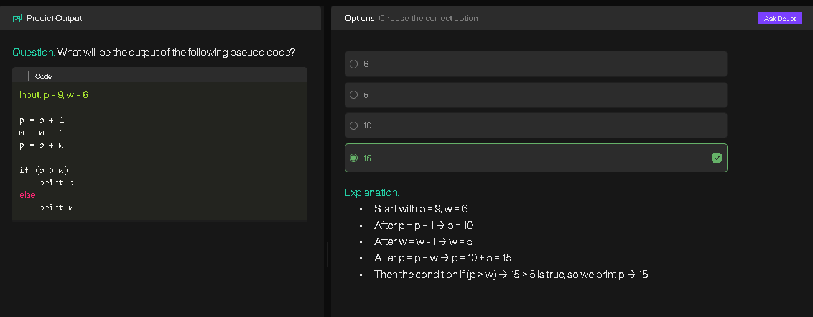
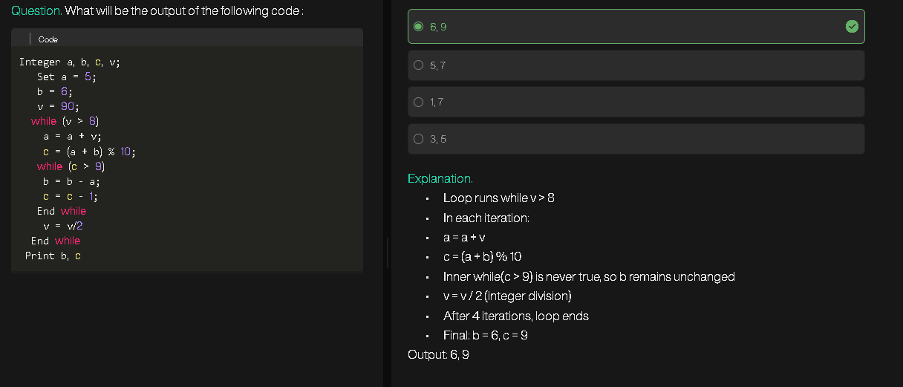
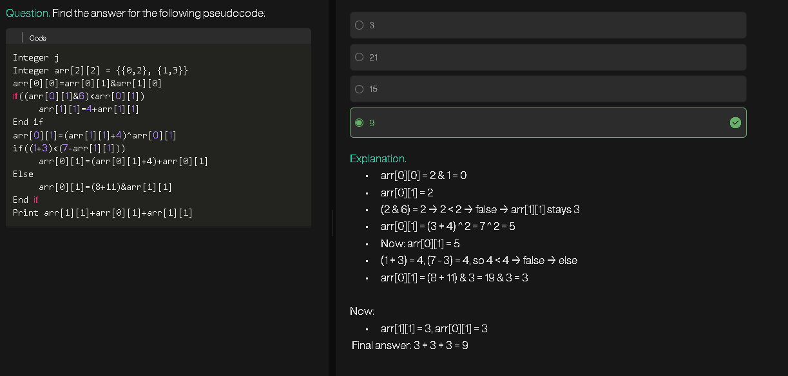
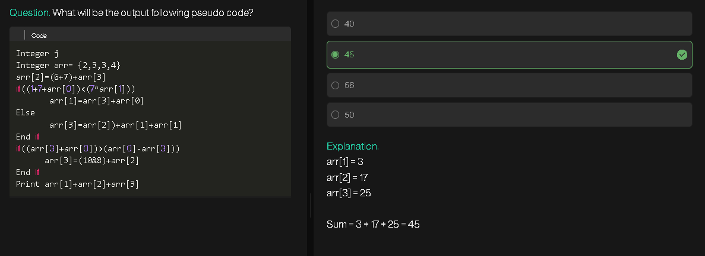
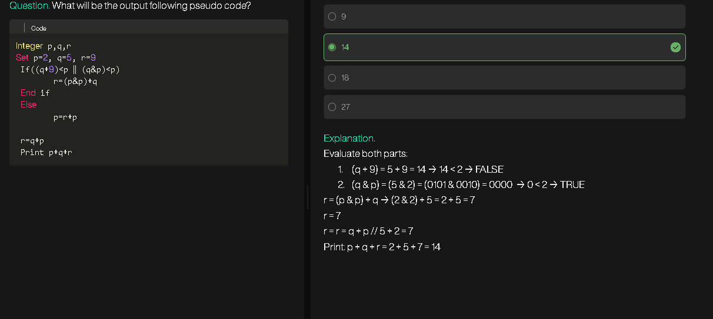
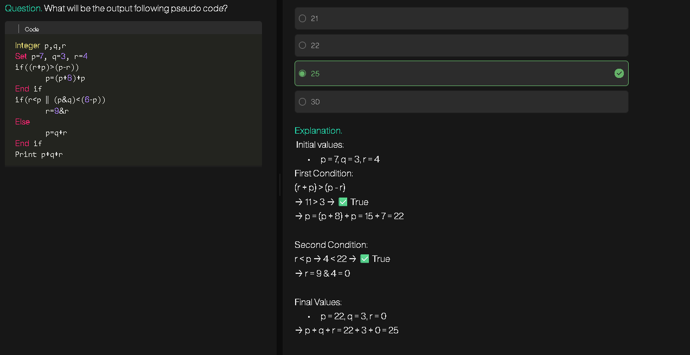
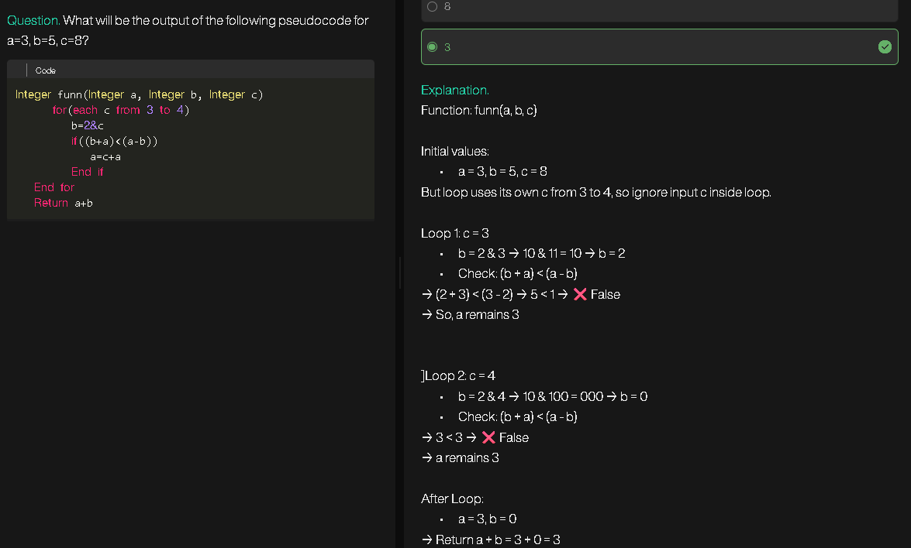
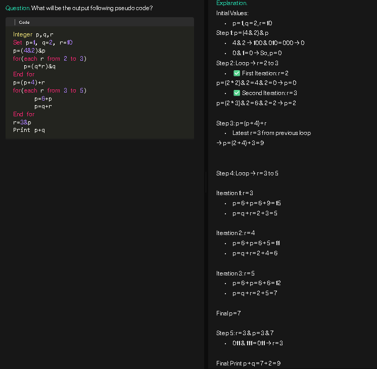
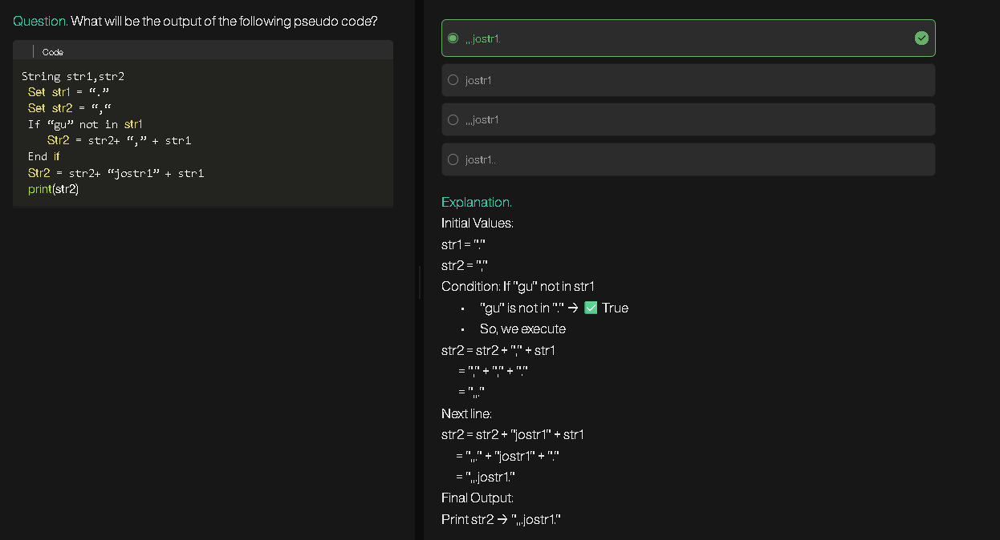
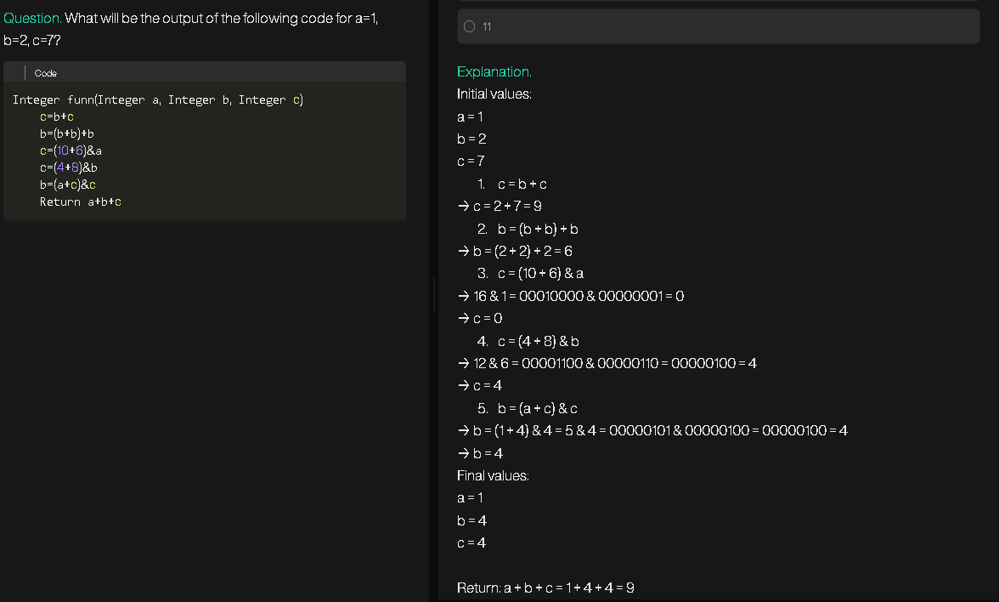
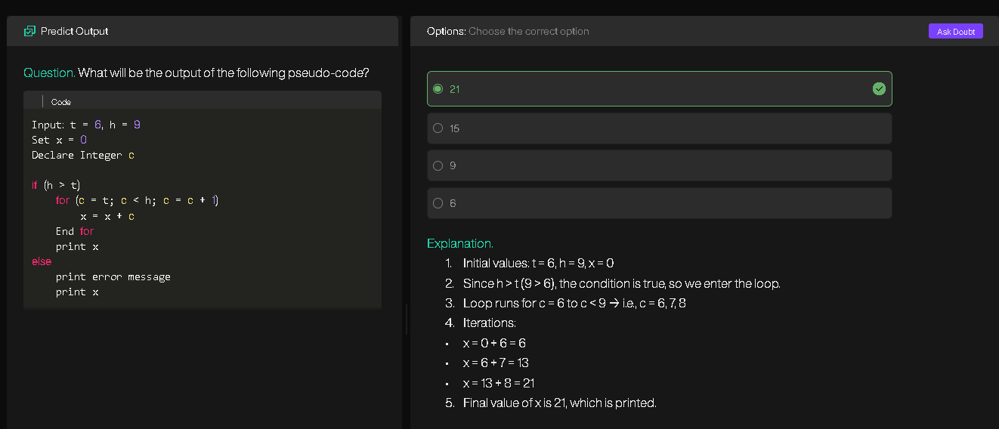
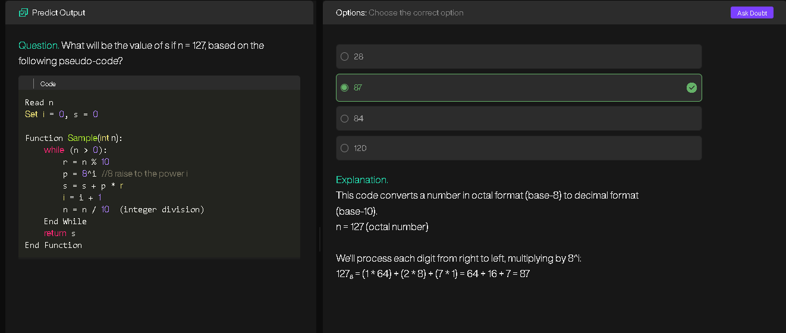
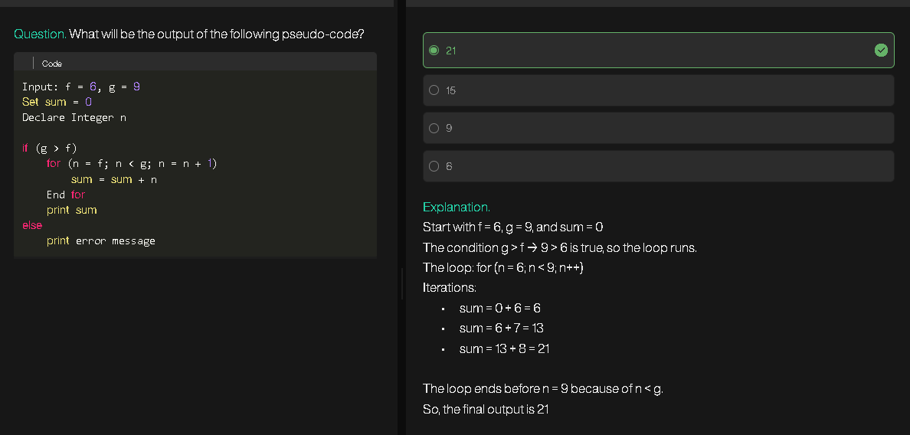
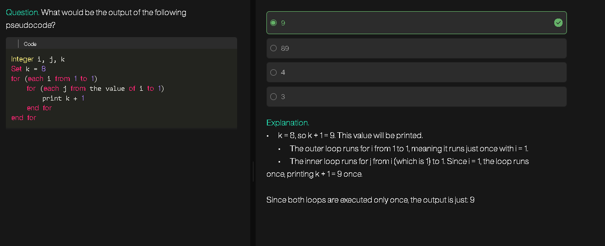
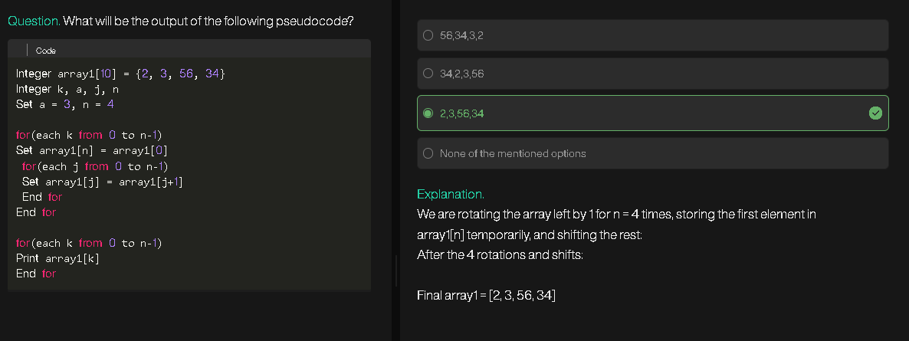
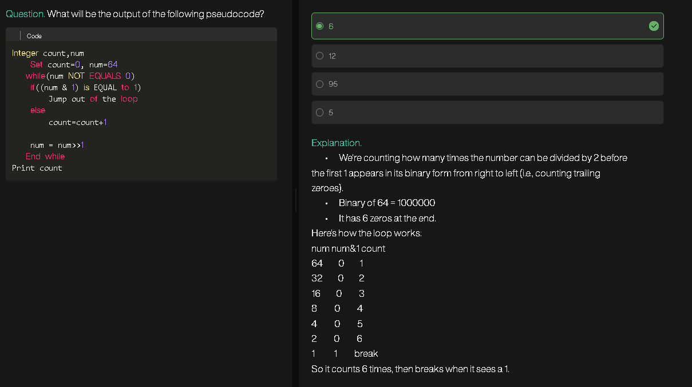
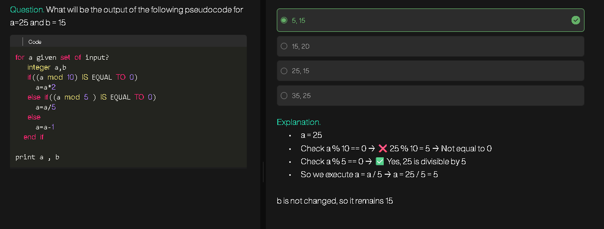
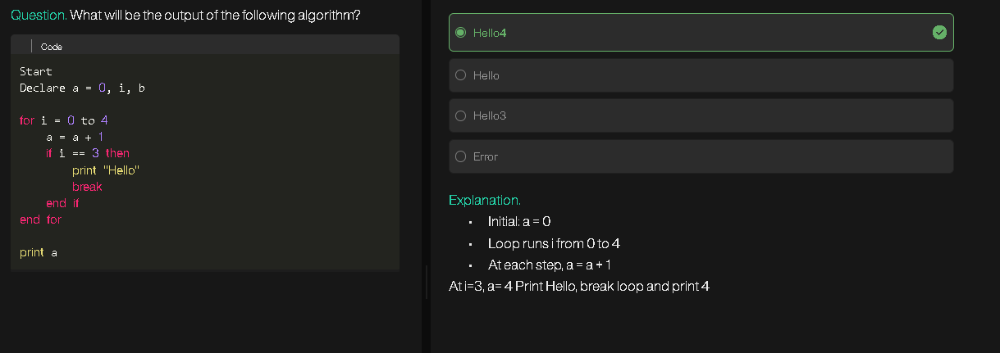
