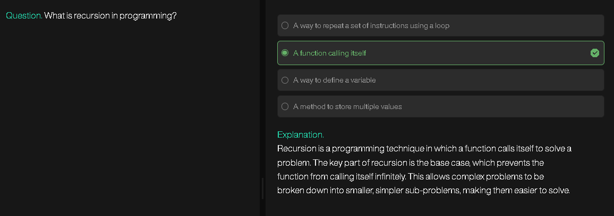
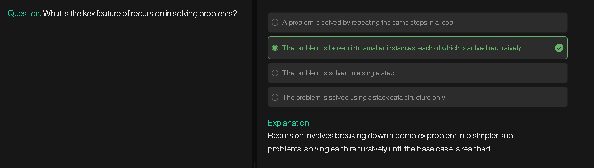
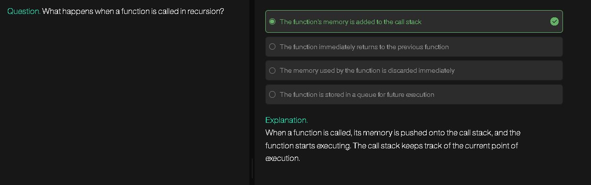
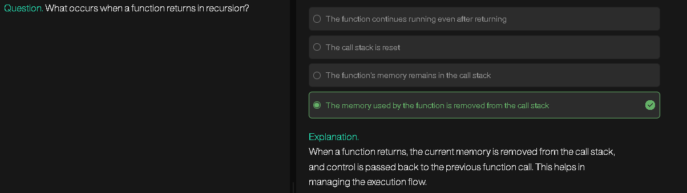
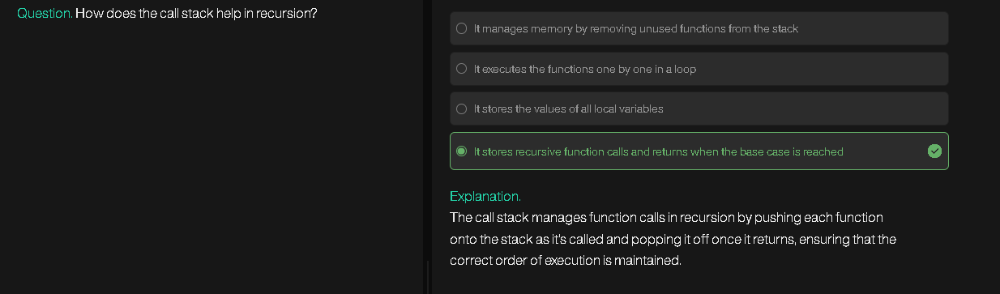

# stack and heap..what are the things that are stored in each , when,how? function call stack

## 1. Stack vs Heap (High-level Difference)

| Aspect                | **Stack**                                                          | **Heap**                                                                  |
| --------------------- | ------------------------------------------------------------------ | ------------------------------------------------------------------------- |
| **Purpose**           | Stores function calls, local variables, return addresses           | Stores dynamically allocated data (lifetime controlled manually or by GC) |
| **Memory management** | Automatic (pushed/popped on function call/return)                  | Manual (`malloc/free`, `new/delete`) or automatic (garbage collected)     |
| **Size**              | Limited, fixed size per thread                                     | Much larger, limited by system memory                                     |
| **Access speed**      | Very fast (LIFO structure, CPU directly supports stack operations) | Slower (requires pointer dereferencing, fragmentation possible)           |
| **Lifetime**          | Tied to function scope                                             | Tied to allocation/deallocation                                           |
| **Errors**            | Stack overflow (too many calls, large local arrays)                | Memory leaks, dangling pointers, fragmentation                            |

---

## 2. What is Stored in **Stack**

When a function is called, a **stack frame** (also called an activation record) is created.
A typical stack frame contains:

1. **Return Address** → Where to go after function finishes.
2. **Function Parameters** → Arguments passed into the function.
3. **Saved Registers** → To restore CPU state.
4. **Local Variables** → Variables declared inside the function.
5. **Bookkeeping Data** → Frame pointer, alignment padding, etc.

### Example (C-like pseudo-code):

```c
int sum(int a, int b) {
    int result = a + b;   // stored on stack
    return result;        // result returned, frame popped
}

int main() {
    int x = 5;  // on stack
    int y = 10; // on stack
    int z = sum(x, y); // pushes new frame for sum
}
```

**Flow:**

* `main` frame is created → stores `x`, `y`, `z`.
* When `sum(x, y)` is called:

  * A new frame is pushed → stores parameters `a`, `b`, local `result`.
  * On return → frame popped, control returns to `main`.

---

## 3. What is Stored in **Heap**

* Objects/arrays allocated dynamically with `malloc`, `calloc`, `realloc` (C) or `new` (C++/Java).
* Memory is not tied to function scope; it lives until explicitly freed (C/C++) or garbage collected (Java, Python, etc.).
* Only the **pointer to the heap object** is stored in the stack.

### Example:

```c
int main() {
    int *p = malloc(sizeof(int)); // pointer on stack, int on heap
    *p = 42; // heap-stored data
    free(p); // must be freed manually
}
```

Here:

* `p` (the pointer) is stored on **stack**.
* The integer (`42`) is stored on **heap**.

---

## 4. Function Call Stack (Detailed)

The **function call stack** is the sequence of stack frames created during nested function calls.

```
High Memory
+------------------------+
| Previous frames        |
+------------------------+
| main() frame           |
|  - local variables     |
|  - return address      |
+------------------------+
| sum() frame            |
|  - parameters a, b     |
|  - local result        |
|  - return address      |
+------------------------+
Low Memory
```

### How it works step by step:

1. **Function call** → Push frame (parameters, return address).
2. **Function executes** → Local variables created inside frame.
3. **Function returns** → Return value passed back, frame popped.

---

## 5. Diagram (Simplified Stack vs Heap)

```
Memory Layout (Typical Process)

+----------------------------+  High addresses
|       Command-line args    |
|       Environment vars     |
+----------------------------+
|           STACK            |  (grows downward)
|  - function frames         |
|  - locals, return addr     |
+----------------------------+
|         (unused)           |
+----------------------------+
|           HEAP             |  (grows upward)
|  - dynamic allocations     |
+----------------------------+
|      Global/Static Data    |
+----------------------------+
|        Program Code        |
+----------------------------+  Low addresses
```

---

## 6. Summary

* **Stack**: automatic, per-function call, stores locals/params/return addresses.
* **Heap**: manual or GC, used for dynamically allocated memory, persists beyond function scope.
* **Function call stack**: mechanism where stack frames are created/popped for function execution.

---

---


# how recursion works, recursive leap of faith, base case

## 1. How Recursion Works

Recursion is when a function calls itself to solve a smaller version of the same problem.

### Steps of Execution:

1. **Function call** creates a new stack frame (parameters + locals).
2. If the **base case** (smallest solvable input) is met, recursion stops.
3. If not, the function **calls itself** with a smaller/simpler input.
4. Each call waits until the recursive call finishes (stack grows).
5. Once the base case returns, functions **unwind** in reverse order (stack shrinks).

### Example: Factorial

```c
int fact(int n) {
    if (n == 0) return 1;       // base case
    return n * fact(n - 1);     // recursive case
}
```

Execution of `fact(3)`:

```
fact(3)
 -> 3 * fact(2)
       -> 2 * fact(1)
             -> 1 * fact(0)
                   -> 1 (base case reached)
```

Then the stack unwinds:

```
fact(0) = 1
fact(1) = 1 * 1 = 1
fact(2) = 2 * 1 = 2
fact(3) = 3 * 2 = 6
```

---

## 2. Recursive Leap of Faith

The **recursive leap of faith** is a reasoning strategy:

* Instead of tracing every detail, you **assume** the recursive call works correctly for smaller input.
* Then, focus only on how the current step uses the recursive result.

For example, in `fact(n)`:

* Assume `fact(n-1)` correctly gives `(n-1)!`.
* Then `fact(n)` just multiplies `n * (n-1)!`.

This mental shortcut prevents confusion when recursion goes many levels deep.

---

## 3. Base Case

The **base case** is the condition that ends recursion:

* Prevents infinite recursion (which causes stack overflow).
* Defines the smallest, simplest version of the problem.

### Properties of a Base Case:

1. Must be reachable for all inputs (else infinite recursion).
2. Must return a concrete, non-recursive answer.

### Example Base Cases:

* Factorial: `if (n==0) return 1;`
* Fibonacci: `if (n==0) return 0; if (n==1) return 1;`
* Printing 1 to n: `if (n==0) return;`

---

## 4. Visualization of Recursion in Stack

For `fact(3)`:

```
Stack Growth (Calls):
+---------------------+
| fact(3): waiting... |
| fact(2): waiting... |
| fact(1): waiting... |
| fact(0): returns 1  |
+---------------------+

Stack Unwinding (Returns):
fact(0) -> 1
fact(1) -> 1 * 1 = 1
fact(2) -> 2 * 1 = 2
fact(3) -> 3 * 2 = 6
```

---

## 5. Summary

* **Recursion** = function calls itself with smaller input.
* **Recursive leap of faith** = assume recursive call works, focus on current step.
* **Base case** = stopping condition, prevents infinite recursion.
* Recursion works by **stack growth (calls)** and **stack unwinding (returns)**.

---

---


# maximum call stack size exceeded..stack overflow\..

## 1. What It Means

A **stack overflow** happens when too many function calls are pushed onto the **call stack**, and the stack memory limit is reached.
This usually results in an error like:

* **C/C++**: segmentation fault or crash
* **Java**: `StackOverflowError`
* **JavaScript**: `RangeError: Maximum call stack size exceeded`

---

## 2. Why It Happens

The stack has a **finite size** (few MBs per thread, depends on OS). Each function call uses some stack space for:

* Parameters
* Local variables
* Return address
* Bookkeeping data

If calls keep stacking without being popped (returned), memory runs out.

### Causes:

1. **Infinite recursion (no base case)**

```js
function f() {
    return f();  // no base case → infinite recursion
}
f();  // RangeError: Maximum call stack size exceeded
```

2. **Wrong base case (never reached)**

```js
function countdown(n) {
    if (n == 0) return;
    countdown(n);  // mistake: not reducing n
}
countdown(5);  // infinite recursion → stack overflow
```

3. **Too deep recursion even with correct base case**

```js
function recurse(n) {
    if (n == 0) return;
    recurse(n - 1);
}
recurse(1000000);  // stack too deep for most languages
```

---

## 3. How the Call Stack Overflows

Visualizing with recursive calls:

```
recurse(5)
 └─ recurse(4)
      └─ recurse(3)
           └─ recurse(2)
                └─ recurse(1)
                     └─ recurse(0)  ✅ base case reached
```

If there is **no base case**:

```
recurse(5)
 └─ recurse(5)
      └─ recurse(5)
           └─ recurse(5)
                └─ recurse(5)
                     ...
   (keeps growing until stack memory exhausted)
```

---

## 4. Fixing Stack Overflow

1. **Ensure a valid base case**

   * Every recursive function must eventually stop.
   * Example: factorial → base case at `n==0`.

2. **Progress toward base case**

   * Always modify input so recursion gets closer to stopping.

3. **Convert recursion to iteration**

   * Some problems are better solved with loops to avoid deep recursion.

   Example: factorial

   ```js
   function fact(n) {
       let result = 1;
       for (let i = 1; i <= n; i++) result *= i;
       return result;
   }
   ```

4. **Use tail recursion optimization (TCO)** *(only in some languages like Scheme, Haskell, modern JS engines partially)*

   * TCO reuses the same stack frame for tail calls.
   * Example:

   ```js
   function fact(n, acc = 1) {
       if (n == 0) return acc;
       return fact(n - 1, acc * n);  // tail call
   }
   ```

---

## 5. Key Takeaways

* **Stack overflow** = too many nested function calls, stack memory exceeded.
* Common cause = infinite recursion or very deep recursion.
* Fix = correct base case, iterative solution, or tail recursion optimization.

---

---


# dont use n++ or n-- use pre increment or decrement to avoid error in recursion..why

## 1. Post-increment/Post-decrement vs Pre-increment/Pre-decrement

* **`n++` (post-increment)**
  → Return the current value of `n`, then increase `n` by 1.
* **`++n` (pre-increment)**
  → Increase `n` by 1, then return the new value.
* **`n--` (post-decrement)**
  → Return the current value of `n`, then decrease `n` by 1.
* **`--n` (pre-decrement)**
  → Decrease `n` by 1, then return the new value.

---

## 2. Why It Matters in Recursion

When you pass `n++` or `n--` into a recursive function, you’re not just passing the number — you’re also **modifying the variable in the caller’s frame**. This can cause **unexpected behavior** because:

* Recursion depends on **reducing the argument** step by step until the base case.
* If you accidentally keep the original value (due to post-increment/post-decrement returning old value), recursion may not progress correctly.
* This can lead to **infinite recursion** or wrong results.

---

## 3. Example of Problem

### Using `n--` (post-decrement):

```c
void recurse(int n) {
    if (n == 0) return;
    printf("%d ", n);
    recurse(n--);   // problem: passes old value
}
```

Execution with `n=3`:

* First call: `n=3`, prints `3`, calls `recurse(3)` again (since `n--` returns old `3`).
* Infinite recursion, stack overflow.

---

### Using `--n` (pre-decrement):

```c
void recurse(int n) {
    if (n == 0) return;
    printf("%d ", n);
    recurse(--n);   // safe: decreases before passing
}
```

Execution with `n=3`:

* First call: prints `3`, calls `recurse(2)`.
* Next: prints `2`, calls `recurse(1)`.
* Next: prints `1`, calls `recurse(0)`.
* Stops. Works correctly.

---

## 4. Rule of Thumb

* **Prefer `--n` or `++n` inside recursive calls**, because:

  1. The argument gets updated *before* being passed down.
  2. Avoids passing stale values (like `n--` or `n++` would).
  3. Keeps recursion moving toward the base case.

---

## 5. Safer Alternative

Instead of mutating `n` at all, **just use arithmetic expressions**:

```c
recurse(n - 1);   // instead of recurse(n--)
recurse(n + 1);   // instead of recurse(n++)
```

This avoids confusion and makes intent clear:

* You’re passing `n-1` without changing the caller’s local `n`.

---

## 6. Summary

* **Post-increment/decrement (`n++`, `n--`)** → returns old value, changes variable afterward → can break recursion.
* **Pre-increment/decrement (`++n`, `--n`)** → updates value first, then passes → safer in recursion.
* **Best practice**: use `n-1` or `n+1` for clarity.

---

---





