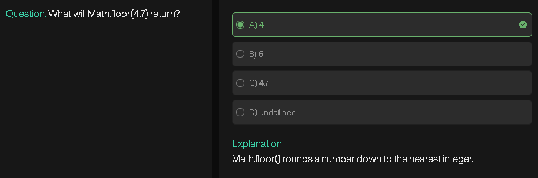
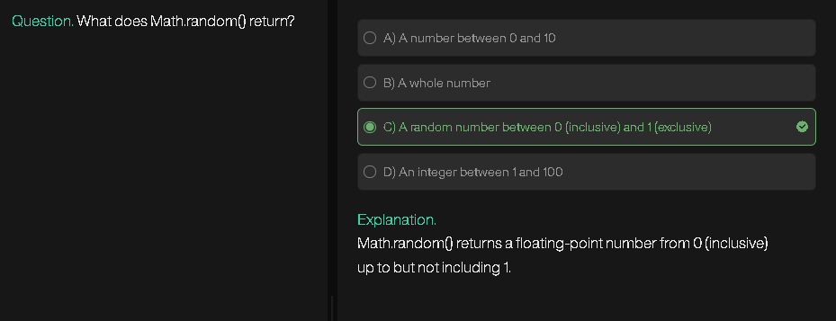
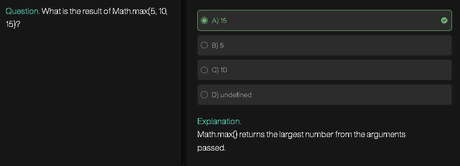
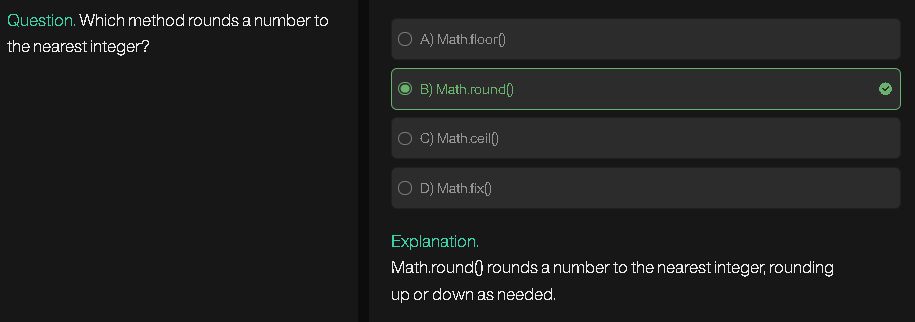
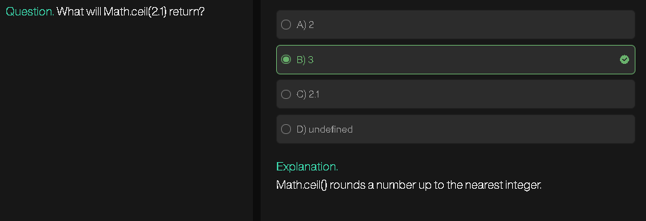

# Sieve of Eratosthenes

The **Sieve of Eratosthenes** is a classic algorithm to find all **prime numbers up to a given number `n`** efficiently.

---

## 1. Algorithm Idea

1. Create a boolean array `isPrime[0..n]` and initialize all entries as `true`.

   * `isPrime[i] = true` means `i` is considered prime.
2. Set `isPrime[0] = isPrime[1] = false` because 0 and 1 are not prime.
3. Starting from `p = 2` (first prime), mark all multiples of `p` as **not prime** (`false`).
4. Move to the next number greater than `p` which is still `true` and repeat step 3.
5. Stop when `p * p > n`.
6. All numbers `i` where `isPrime[i] = true` are prime.

---

## 2. Step-by-Step Example (`n = 10`)

Initial array:

```
index: 0 1 2 3 4 5 6 7 8 9 10
value: F F T T T T T T T T T
```

* Start with `p = 2` → mark multiples of 2 (>2) as false:

```
index: 0 1 2 3 4 5 6 7 8 9 10
value: F F T T F T F T F T F
```

* Next `p = 3` → mark multiples of 3 (>3) as false:

```
index: 0 1 2 3 4 5 6 7 8 9 10
value: F F T T F T F T F F F
```

* `p = 4` → already false, skip.
* Stop when `p*p > 10` (here, 4\*4=16 > 10).

**Primes:** 2, 3, 5, 7

---

## 3. JavaScript Implementation

```js
function sieveOfEratosthenes(n) {
    if (n < 2) return [];

    let isPrime = new Array(n + 1).fill(true);
    isPrime[0] = isPrime[1] = false;

    for (let p = 2; p * p <= n; p++) {
        if (isPrime[p]) {
            for (let multiple = p * p; multiple <= n; multiple += p) {
                isPrime[multiple] = false;
            }
        }
    }

    let primes = [];
    for (let i = 2; i <= n; i++) {
        if (isPrime[i]) primes.push(i);
    }

    return primes;
}

console.log(sieveOfEratosthenes(30));
// Output: [2, 3, 5, 7, 11, 13, 17, 19, 23, 29]
```

---

## 4. Time and Space Complexity

| Aspect     | Complexity                    |
| ---------- | ----------------------------- |
| Time       | O(n log log n)                |
| Space      | O(n)                          |
| Efficiency | Marks each multiple only once |

---

## 5. Optimizations

1. **Start inner loop from `p*p`** instead of `2*p`.
2. **Skip even numbers** after 2 to reduce iterations.
3. **Memory-efficient sieve** for large `n` using **bitsets**.

---

The Sieve of Eratosthenes is **the standard method for generating all primes up to `n` efficiently**.

---
---
---
---
---





