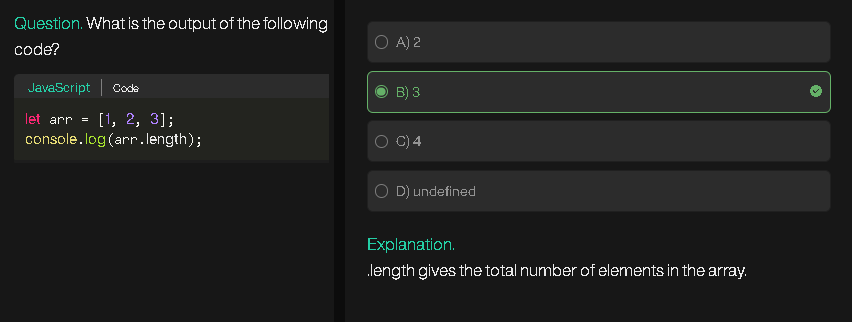
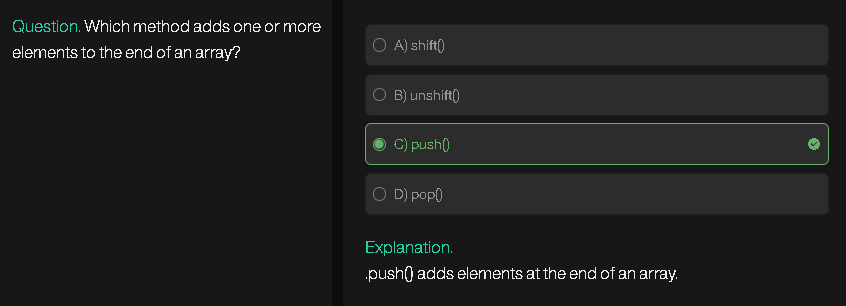
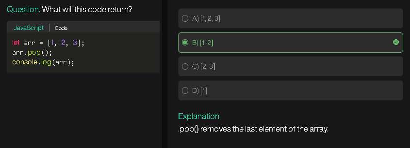

## **1. What is Merge Sort?**

* Merge Sort is a **divide and conquer** sorting algorithm.
* It **divides** an array into smaller subarrays, **sorts** them individually, and then **merges** them back together in sorted order.
* It’s **stable** (keeps relative order of equal elements) and has **O(n log n)** time complexity.

---

## **2. How Merge Sort Works (Conceptually)**

1. **Divide:** Split the array into two halves.
2. **Conquer (Sort):** Recursively apply merge sort on each half.
3. **Merge:** Combine the two sorted halves into one sorted array.

Think of it like sorting a deck of cards:

* Split the deck in half → now two smaller decks.
* Split each half again → keep splitting until each “deck” has only 1 card (1 card is already sorted).
* Merge the small decks together → always combine in order → eventually get a fully sorted deck.

---

## **3. Step-by-Step Example**

Let’s sort the array `[5, 3, 8, 4, 2]`:

**Step 1: Divide**

```
[5, 3, 8, 4, 2]
→ [5, 3, 8]  and  [4, 2]
```

**Step 2: Divide Again**

```
[5, 3, 8] → [5] and [3, 8]
[4, 2] → [4] and [2]
```

**Step 3: Divide Until Single Element**

```
[3, 8] → [3] and [8]
```

**Step 4: Merge**

```
[3] and [8] → [3, 8]
[5] and [3, 8] → merge → [3, 5, 8]
[4] and [2] → merge → [2, 4]
[3, 5, 8] and [2, 4] → merge → [2, 3, 4, 5, 8]
```

✅ Result: `[2, 3, 4, 5, 8]`

---

## **4. Merge Sort Algorithm (in code, JavaScript)**

```javascript
function mergeSort(arr) {
    if (arr.length <= 1) return arr; // Base case: 1 element is sorted

    // Divide
    const mid = Math.floor(arr.length / 2);
    const left = arr.slice(0, mid);
    const right = arr.slice(mid);

    // Conquer: sort left and right
    const sortedLeft = mergeSort(left);
    const sortedRight = mergeSort(right);

    // Merge
    return merge(sortedLeft, sortedRight);
}

function merge(left, right) {
    const result = [];
    let i = 0, j = 0;

    while (i < left.length && j < right.length) {
        if (left[i] < right[j]) {
            result.push(left[i++]);
        } else {
            result.push(right[j++]);
        }
    }

    // Add remaining elements
    while (i < left.length) result.push(left[i++]);
    while (j < right.length) result.push(right[j++]);

    return result;
}

// Example
const arr = [5, 3, 8, 4, 2];
const sortedArr = mergeSort(arr);
console.log(sortedArr); // [2, 3, 4, 5, 8]
```

---

## **5. Complexity Analysis**

| Property             | Merge Sort         |
| -------------------- | ------------------ |
| **Time Complexity**  | O(n log n)         |
| **Space Complexity** | O(n) (extra array) |
| **Stable?**          | Yes                |
| **Best, Avg, Worst** | O(n log n)         |

* `log n` comes from **splitting the array repeatedly**.
* `n` comes from **merging all elements** at each level.

---

## **1. Two-Pointer Technique**

* **Idea:** Use two pointers to traverse the array from both ends or at different speeds.
* **Common Uses:**

  * Reverse an array in-place.
  * Check for pairs with sum = target.
  * Remove duplicates in a sorted array.
  * Dutch National Flag problem (sort 0s, 1s, 2s).
  * Trapping Rain Water problem (two-pointer approach).

**Example:** Remove duplicates in sorted array

```js
let nums = [1,1,2];
let i = 0;
for (let j = 1; j < nums.length; j++) {
    if (nums[j] != nums[i]) {
        i++;
        nums[i] = nums[j];
    }
}
console.log(nums.slice(0, i+1)); // [1,2]
```

---

## **2. Sliding Window Technique**

* **Idea:** Maintain a “window” (subset) of elements and slide it over the array.
* **Common Uses:**

  * Longest substring/array with condition.
  * Subarray sum problems (fixed or variable length).
  * Maximum sum of k consecutive elements.

**Example:** Max sum of subarray of size k

```js
let arr = [1,2,3,4,5];
let k = 3;
let sum = 0;
for (let i = 0; i < k; i++) sum += arr[i];
let maxSum = sum;
for (let i = k; i < arr.length; i++) {
    sum = sum + arr[i] - arr[i-k];
    maxSum = Math.max(maxSum, sum);
}
console.log(maxSum); // 12
```

---

## **3. Prefix Sum / Cumulative Sum**

* **Idea:** Precompute sums to answer range queries efficiently.
* **Common Uses:**

  * Subarray sum problems.
  * Range sum queries.
  * Detect zero-sum subarrays.

**Example:** Prefix sum

```js
let arr = [1,2,3,4];
let prefix = [0];
for (let i=0;i<arr.length;i++){
    prefix.push(prefix[i]+arr[i]);
}
// Sum of arr[1..3] = prefix[4]-prefix[1] = 9
```

---

## **4. Hashing / Map-Based Tricks**

* **Idea:** Use object or Map to store counts, indices, or sums.
* **Common Uses:**

  * Two-sum / k-sum problems.
  * Subarray with sum = k.
  * Frequency-based problems.

**Example:** Two-sum

```js
let nums = [2,7,11,15], target = 9;
let map = new Map();
for (let i=0;i<nums.length;i++){
    if (map.has(target-nums[i])){
        console.log([map.get(target-nums[i]), i]); // [0,1]
    }
    map.set(nums[i], i);
}
```

---

## **5. Sorting + Binary Search / Greedy**

* **Idea:** Sort array to simplify comparisons, then use binary search or greedy techniques.
* **Common Uses:**

  * Find kth smallest/largest element.
  * Meeting rooms, intervals.
  * Two-pointer after sorting.

**Example:** Pair with sum closest to target

```js
let nums = [1,3,4,7], target = 8;
nums.sort((a,b)=>a-b);
let i=0, j=nums.length-1, closest=Infinity;
while(i<j){
    let sum = nums[i]+nums[j];
    if(Math.abs(target-sum)<Math.abs(target-closest)) closest=sum;
    if(sum<target) i++; else j--;
}
console.log(closest); // 8
```

---

## **6. In-Place Modification Tricks**

* **Idea:** Solve without extra space.
* **Techniques:**

  * Use two pointers for overwriting.
  * Mark visited elements with negative sign or offset tricks.
  * Rotate arrays using reversal.

**Example:** Move zeros to end

```js
let arr = [0,1,0,3,12], lastNonZero=0;
for(let i=0;i<arr.length;i++){
    if(arr[i]!==0){
        [arr[i],arr[lastNonZero]]=[arr[lastNonZero],arr[i]];
        lastNonZero++;
    }
}
console.log(arr); // [1,3,12,0,0]
```

---

## **7. Advanced Patterns / Common Problem Types**

1. **Subarray / Subsequence problems** – sliding window, prefix sum, DP.
2. **Pairs / Triplets / K-sum** – sorting + two-pointer or hashing.
3. **Matrix / 2D array problems** – treat as flattened array, or process row/column separately.
4. **Interval / Range problems** – sort by start, then merge intervals.
5. **Cyclic / Circular arrays** – use modulo indexing or duplicate array trick.
6. **Monotonic Stack / Queue** – next greater / smaller element, largest rectangle problems.

---



