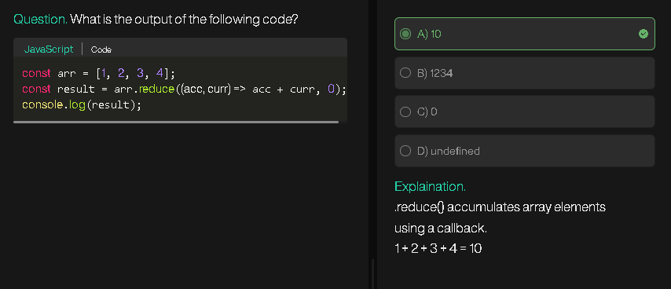
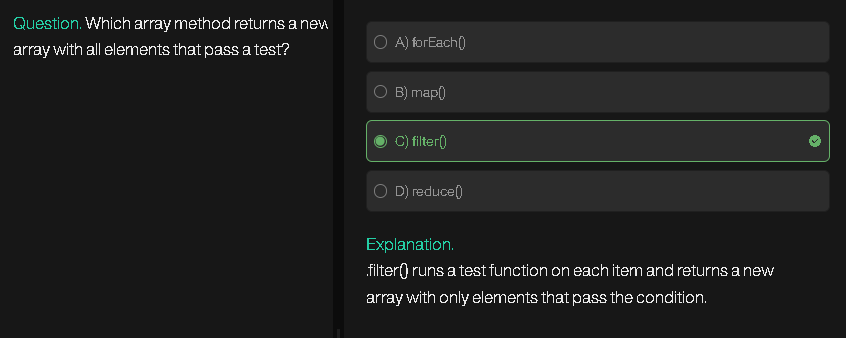
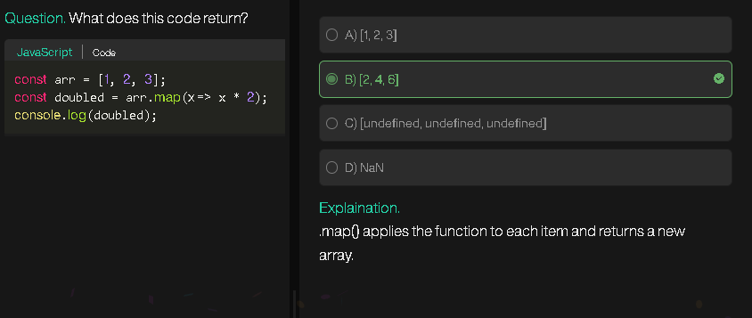

## 🔑 Rules of Kadane’s Algorithm

1. **Keep a running sum** (`currentSum`):

   * Add each element to `currentSum`.
   * If `currentSum` becomes negative, reset it to 0 (because any negative prefix will only hurt future sums).

2. **Track the maximum sum so far** (`maxSum`):

   * Update `maxSum` whenever `currentSum` is larger.

3. **Result**:

   * At the end, `maxSum` holds the maximum subarray sum.

---

## ✅ Pseudocode

```
currentSum = 0
maxSum = -∞

for each num in nums:
    currentSum = currentSum + num
    if currentSum > maxSum:
        maxSum = currentSum
    if currentSum < 0:
        currentSum = 0

return maxSum
```

---

## ⚡ Example Walkthrough

Array: `[−2,1,−3,4,−1,2,1,−5,4]`

* Start: `currentSum=0`, `maxSum=-∞`
* num = −2 → currentSum = −2 → reset to 0, maxSum = −2
* num = 1 → currentSum = 1 → maxSum = 1
* num = −3 → currentSum = −2 → reset to 0
* num = 4 → currentSum = 4 → maxSum = 4
* num = −1 → currentSum = 3 → maxSum = 4
* num = 2 → currentSum = 5 → maxSum = 5
* num = 1 → currentSum = 6 → maxSum = 6
* num = −5 → currentSum = 1 → maxSum = 6
* num = 4 → currentSum = 5 → maxSum = 6

Result = `6` (subarray `[4,−1,2,1]`).

---

## 🟢 Optimized JS Implementation

```js
var maxSubArray = function(nums) {
    let currentSum = 0;
    let maxSum = nums[0]; // important for all-negative arrays

    for (let num of nums) {
        currentSum += num;
        if (currentSum > maxSum) maxSum = currentSum;
        if (currentSum < 0) currentSum = 0;
    }
    return maxSum;
};
```

---

## 📊 Complexity

* **Time**: O(n)
* **Space**: O(1)

---

## 🔑 Problem it solves

Find the **majority element** in an array (the element that appears more than ⌊n/2⌋ times).

* LeetCode 169: *Majority Element*

---

## ⚡ Rules of Boyer–Moore’s Algorithm

1. **Keep a candidate (`ans`) and a counter (`count`).**

   * Initially `count = 0`.

2. **Iterate through the array:**

   * If `count === 0`, pick the current number as the new candidate (`ans = num`, `count = 1`).
   * Else if `num === ans`, increment `count`.
   * Else decrement `count`.

3. **Return `ans` at the end.**

   * Guaranteed to be the majority element if one exists (> ⌊n/2⌋).

---

## ✅ Pseudocode

```
ans = 0
count = 0

for num in nums:
    if count == 0:
        ans = num
        count = 1
    else if num == ans:
        count++
    else:
        count--

return ans
```

---

## 🔍 Example

Input: `[6, 5, 5]`

* Start: `ans = 0, count = 0`
* num = 6 → count=0 ⇒ ans=6, count=1
* num = 5 → num≠ans ⇒ count=0
* num = 5 → count=0 ⇒ ans=5, count=1

Result → `5`

---

## 🟢 Optimized JS Code

```js
var majorityElement = function(nums) {
    let ans = 0, count = 0;

    for (const num of nums) {
        if (count === 0) {
            ans = num;
            count = 1;
        } else if (num === ans) {
            count++;
        } else {
            count--;
        }
    }
    return ans;
};
```

---

## 📊 Complexity

* **Time:** O(n) → single pass
* **Space:** O(1) → constant memory

---

⚡ Fun fact: The "voting" name comes from the idea that every element “votes” for itself, and non-majority votes cancel each other out — leaving the majority as the final survivor.

---



