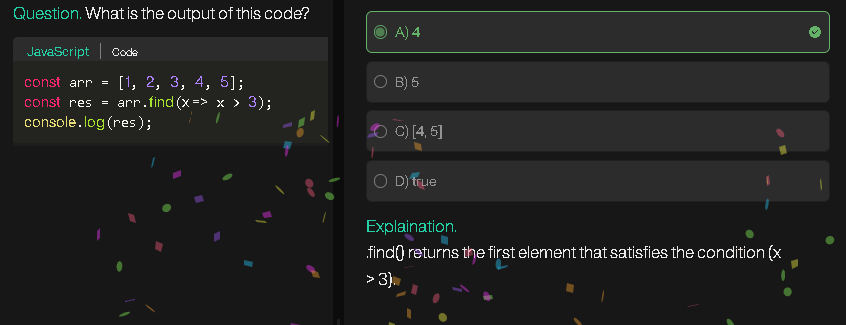
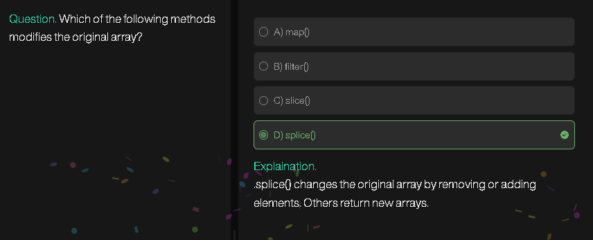
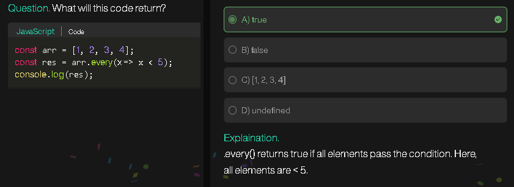

## **Problem Statement**

You are given an array `height[]` representing the elevation map, where the width of each bar is `1`. Compute how much water it can trap after raining.

Example:

```
height = [0,1,0,2,1,0,1,3,2,1,2,1]
Output: 6
```

---

## **Theoretical Part**

Water trapped above a bar depends on the **tallest bars on its left and right**.

* For each bar at index `i`, water trapped = `min(maxLeft[i], maxRight[i]) - height[i]`
* `maxLeft[i]` = highest bar to the **left** of `i` (including `i`)
* `maxRight[i]` = highest bar to the **right** of `i` (including `i`)

**Idea:**

1. Precompute `maxLeft` and `maxRight` arrays.
2. For each bar, calculate water trapped using the formula above.
3. Sum it up for all bars.

---

## **Algorithm (Step by Step)**

### **Step 1: Initialize**

* Let `n = height.length`
* Create two arrays: `leftMax[n]` and `rightMax[n]`
* Initialize `water = 0`

### **Step 2: Fill leftMax array**

```
leftMax[0] = height[0]
for i = 1 to n-1:
    leftMax[i] = max(leftMax[i-1], height[i])
```

### **Step 3: Fill rightMax array**

```
rightMax[n-1] = height[n-1]
for i = n-2 down to 0:
    rightMax[i] = max(rightMax[i+1], height[i])
```

### **Step 4: Calculate trapped water**

```
for i = 0 to n-1:
    water += min(leftMax[i], rightMax[i]) - height[i]
```

### **Step 5: Return result**

```
return water
```

---

## **Time Complexity**

* O(n) — each array is traversed once
* Space Complexity: O(n) — for `leftMax` and `rightMax` arrays

---

## **Optimized Two-Pointer Approach (O(1) space)**

Instead of extra arrays, use two pointers:

1. Initialize `left = 0`, `right = n-1`
2. `leftMax = 0`, `rightMax = 0`
3. While `left <= right`:

   * If `height[left] < height[right]`:

     * If `height[left] >= leftMax`, update `leftMax`
     * Else, water += `leftMax - height[left]`
     * Move `left++`
   * Else:

     * If `height[right] >= rightMax`, update `rightMax`
     * Else, water += `rightMax - height[right]`
     * Move `right--`
4. Return `water`

This method reduces space from O(n) → O(1).

---

## **1️⃣ Two-Pointer Technique**

### **What it is**

* You maintain **two pointers** (usually `left` and `right`) that traverse the array from **both ends**.
* Decision of which pointer to move depends on **some condition**, often related to min/max, sum, or comparison.

### **Common Use Cases**

1. **Array problems with sorted elements**

   * Example: Two-sum in sorted array

     ```
     Given arr = [1,2,3,4,6], target = 6
     Pointers: left = 0, right = n-1
     ```

     * Check sum = arr\[left] + arr\[right]
     * If sum < target → move left++
     * If sum > target → move right--
     * If sum == target → answer found

2. **Trapping Rain Water**

   * Already discussed: use `leftMax` and `rightMax` with two pointers instead of arrays.

3. **Container With Most Water**

   * Same as rain water: move pointer with smaller height.

4. **Palindrome checking or reversing a string/array**

   * Compare elements from start and end.

---

### **Why it works**

* Works best when **the problem has constraints from both ends** or is **sorted**, because moving one pointer reduces search space in a predictable way.

---

## **2️⃣ Three-Pointer Technique**

### **What it is**

* Similar to two-pointer, but **one extra pointer** is used for cases where one “middle” element matters.

### **Common Use Cases**

1. **3-Sum problem**

   ```
   Given nums = [-1,0,1,2,-1,-4], target = 0
   Sort array → [-4,-1,-1,0,1,2]
   Fix first pointer (i), use left & right for remaining two
   ```

   * i = 0 → left = i+1, right = n-1
   * Check sum = nums\[i] + nums\[left] + nums\[right]
   * Adjust left/right based on sum < target or sum > target

2. **Partitioning problems**

   * Example: Dutch National Flag problem

     * Use low, mid, high pointers to sort array of 0,1,2 in one pass.

3. **Sliding window or interval merge with extra condition**

   * Sometimes you need **three indices** to track intervals or ranges simultaneously.

---

## **3️⃣ How to Get Comfortable With These Techniques**

1. **Start with sorted arrays**

   * Two-pointer feels natural when the array is sorted because you can predict behavior.

2. **Visualize with a diagram**

   * Draw the array, place the pointers, mark how they move step by step.

3. **Trace by hand**

   * Take small arrays (length ≤ 6) and **simulate pointer moves**.

4. **Solve classical problems repeatedly**

   * Two-pointer: Two Sum, Container With Most Water, Trapping Rain Water
   * Three-pointer: 3-Sum, Dutch National Flag, Triplet problems

5. **Understand the invariant**

   * Two-pointer: “Elements outside pointers are already processed”
   * Three-pointer: “Middle pointer handles remaining unprocessed elements”

6. **Convert brute-force to pointer approach**

   * Brute-force = O(n²)
   * Think: can we replace one loop with a pointer to reduce complexity?

---

💡 **Tip:**
Once you see the **pattern** (fixed pointer + moving pointer(s)), these techniques start appearing naturally. They are just **smart ways to shrink search space**.

---

# **Advanced Array Techniques for DSA**

## **1️⃣ Prefix Sum / Cumulative Sum**

* **Idea:** Precompute sums to answer range queries in O(1).
* **Use cases:** Subarray sum, range sum queries, 2D prefix sums.

```python
arr = [1,2,3,4]
prefix = [0]*(len(arr)+1)
for i in range(len(arr)):
    prefix[i+1] = prefix[i] + arr[i]

# sum of subarray arr[l:r] = prefix[r] - prefix[l]
```

* **Advanced:** Prefix XOR for subarray XOR problems.

---

## **2️⃣ Sliding Window**

* **Idea:** Keep a dynamic “window” over the array to calculate sums, max, min, etc. efficiently.
* **Patterns:**

  1. Fixed window size → moving sum/average
  2. Variable window → longest/shortest subarray with constraints

```python
# Example: max sum subarray of size k
k = 3
arr = [1,2,3,4,5]
window_sum = sum(arr[:k])
max_sum = window_sum
for i in range(k, len(arr)):
    window_sum += arr[i] - arr[i-k]
    max_sum = max(max_sum, window_sum)
```

---

## **3️⃣ Two-Pointer Technique**

* Already discussed: reduce O(n²) loops to O(n) by using **two pointers** for sorted arrays or interval problems.
* Variants: left/right pointer, start/end pointer, shrinking window.

---

## **4️⃣ Binary Search on Arrays**

* **Not just for search!**
* **Advanced usage:**

  * Find first/last occurrence
  * Count of elements ≤ X
  * Smallest/largest element satisfying a condition
* Often used in **“search space reduction” patterns**.

```python
# Example: smallest index i such that arr[i] >= target
l, r = 0, len(arr)-1
ans = -1
while l <= r:
    m = (l+r)//2
    if arr[m] >= target:
        ans = m
        r = m-1
    else:
        l = m+1
```

---

## **5️⃣ Hashing + Arrays**

* **Idea:** Use dictionaries or arrays to store frequencies / indexes.
* **Use cases:**

  * Subarray sum problems
  * Two sum variations
  * Count pairs with given difference/sum
  * Detect duplicates

```python
# Count subarrays with sum = k
from collections import defaultdict
count, cum_sum = 0, 0
freq = defaultdict(int)
freq[0] = 1
for num in arr:
    cum_sum += num
    count += freq[cum_sum - k]
    freq[cum_sum] += 1
```

---

## **6️⃣ Monotonic Stack / Deque**

* **Idea:** Keep elements in **increasing or decreasing order** to answer “next greater / smaller” efficiently.
* **Use cases:**

  * Next greater element (NGE)
  * Largest rectangle in histogram
  * Sliding window max/min

```python
stack = []
res = [0]*len(arr)
for i in range(len(arr)-1, -1, -1):
    while stack and arr[stack[-1]] <= arr[i]:
        stack.pop()
    res[i] = stack[-1] if stack else -1
    stack.append(i)
```

---

## **7️⃣ Bit Manipulation in Arrays**

* **Advanced tricks:**

  * Subset XOR, XOR of all elements, find missing numbers
  * Use bits to represent **subset state**
* Example: Find single element appearing once when all others appear twice

```python
res = 0
for num in arr:
    res ^= num
```

---

## **8️⃣ Divide & Conquer on Arrays**

* **Idea:** Split array, solve smaller subarrays, merge results.
* **Use cases:**

  * Maximum subarray sum (Kadane vs Divide & Conquer)
  * Counting inversions in O(n log n)
  * Merge sort variations

---

## **9️⃣ Advanced Sorting Tricks**

* **Beyond built-in sort:**

  * Counting sort / radix sort (O(n))
  * Sort by frequency, index, or custom comparator
  * Partial sort or k-th element selection

---

## **🔟 Sparse / Circular / Rotated Arrays**

* **Patterns:**

  * Find min/max in rotated sorted array
  * Search in rotated array
  * Circular subarray sum / maximum
* Often combined with **binary search or prefix sums**

---

## **Tips to Get Comfortable**

1. **Solve patterns, not problems**: Focus on 10–15 classic patterns like sliding window, prefix sum, monotonic stack.
2. **Simulate by hand**: Small arrays, track variables and pointer movements.
3. **Combine techniques**: Many advanced problems use 2–3 techniques together.
4. **Practice “why O(n) works”**: Understand invariant and reasoning behind pointer or stack moves.
5. **Gradually increase constraints**: Start small arrays → 10⁵ size → optimize with hashing/stack/binary search.

---




