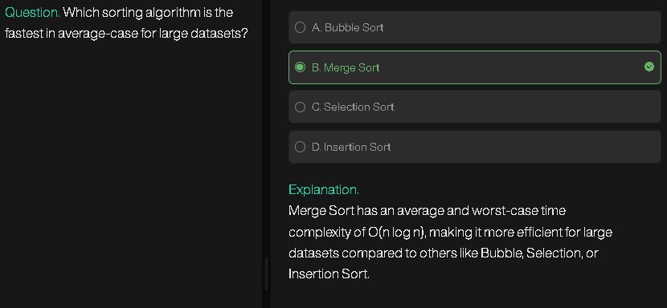
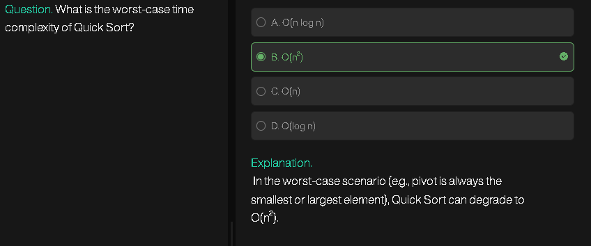
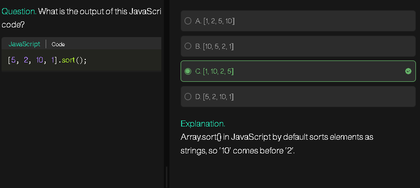

# 🔹 Quick Sort Overview

* **Type:** Divide and Conquer algorithm (like Merge Sort).
* **Idea:**

  1. Pick a **pivot** element.
  2. Rearrange (partition) the array so that:

     * All elements smaller than pivot go left.
     * All elements larger than pivot go right.
  3. Recursively quick sort the left and right parts.

---

# 🔹 Pivot & Partition

### Pivot Element

* The **actual value** chosen to compare others against.
* Example: If pivot = `arr[right] = 12`, then 12 is the pivot **element**.

### Pivot Index

* The **final position** of the pivot element after partitioning.
* Example: After rearranging, pivot (12) might land at index `5`. That’s its pivot **index**.

👉 So:

* **Pivot element** = value
* **Pivot index** = position after partition

---

# 🔹 Partitioning (Last Element Pivot)

We’ll use **Lomuto Partition Scheme** (easiest to learn).
Here:

* Pivot = last element (`arr[right]`)
* Goal: Place pivot in correct sorted position.

---

## 📌 Pointers Used in Partition

1. **`i` pointer (boundary of smaller elements)**

   * Starts from `left - 1`
   * Tracks the region where all numbers ≤ pivot.

2. **`j` pointer (scanning pointer)**

   * Moves from `left` to `right - 1`
   * Checks each element and expands the array.

3. **`pivot` (fixed at right)**

   * Element used for comparison.

---

## 🔹 Partition Algorithm (in English)

1. Choose pivot = last element.
2. Start `i` at `left - 1`.
3. Loop `j` from `left` to `right - 1`:

   * If `arr[j] <= pivot`:

     * Move boundary (`i++`)
     * Swap `arr[i]` with `arr[j]`.
4. After loop, swap `arr[i+1]` with `pivot`.
5. Return `i+1` (pivot’s final index).

---

# 🔹 Quick Sort Algorithm (in English)

1. If array has **1 or 0 elements**, it’s already sorted → stop.
2. Otherwise:

   * Pick a pivot (last element).
   * Partition array → pivot gets correct place.
   * Recursively sort left and right subarrays.

---

# 🔹 Pseudocode (Lomuto Partition)

```
QUICKSORT(arr, left, right):
    if left < right:
        pivotIndex = PARTITION(arr, left, right)
        QUICKSORT(arr, left, pivotIndex - 1)
        QUICKSORT(arr, pivotIndex + 1, right)

PARTITION(arr, left, right):
    pivot = arr[right]            // pivot element
    i = left - 1                  // boundary of small elements
    for j = left to right - 1:
        if arr[j] <= pivot:
            i = i + 1
            swap arr[i] and arr[j]
    swap arr[i + 1] and arr[right]
    return i + 1                  // pivot index
```

---

# 🔹 Step-by-Step Example

Array:

```
arr = [10, 80, 30, 90, 40, 50, 70]
left = 0, right = 6
```

1. **Pick pivot = arr[6] = 70**
   i = -1

2. Loop j = 0 → 5

   * j=0: arr[0]=10 ≤ 70 → i=0 → swap(arr[0], arr[0])
     → [10, 80, 30, 90, 40, 50, 70]
   * j=1: arr[1]=80 > 70 → skip
   * j=2: arr[2]=30 ≤ 70 → i=1 → swap(arr[1], arr[2])
     → [10, 30, 80, 90, 40, 50, 70]
   * j=3: arr[3]=90 > 70 → skip
   * j=4: arr[4]=40 ≤ 70 → i=2 → swap(arr[2], arr[4])
     → [10, 30, 40, 90, 80, 50, 70]
   * j=5: arr[5]=50 ≤ 70 → i=3 → swap(arr[3], arr[5])
     → [10, 30, 40, 50, 80, 90, 70]

3. After loop, swap pivot with arr[i+1]
   Swap arr[4] and arr[6] → [10, 30, 40, 50, 70, 90, 80]

👉 Pivot (70) is at index 4 → pivot index = 4

4. Recursively sort:

   * Left: [10, 30, 40, 50]
   * Right: [90, 80]

Continue same process until fully sorted:

```
[10, 30, 40, 50, 70, 80, 90]
```

---

# 🔹 Complexity

* **Best/Average case:** O(n log n)
* **Worst case:** O(n²) (if pivot always chosen poorly, like already sorted array with last element pivot).
* **Space complexity:** O(log n) (recursion stack).

---

# 🔹 **Quick Sort vs Merge Sort**

### 1. **Basic Idea**

* **Merge Sort**:

  * Divide the array into halves until each subarray has one element.
  * Merge them back in sorted order.
  * Uses extra space for merging.

* **Quick Sort**:

  * Choose a **pivot element**.
  * Partition the array so elements `< pivot` go left, elements `> pivot` go right.
  * Recursively sort left and right partitions.
  * Works in place (less extra space).

---

### 2. **Comparison Table**

| Feature                     | **Merge Sort**                                  | **Quick Sort**                                         |
| --------------------------- | ----------------------------------------------- | ------------------------------------------------------ |
| **Time Complexity (Best)**  | O(n log n)                                      | O(n log n)                                             |
| **Time Complexity (Worst)** | O(n log n)                                      | O(n²) (if pivot choice is poor, e.g. sorted array)     |
| **Time Complexity (Avg)**   | O(n log n)                                      | O(n log n)                                             |
| **Space Complexity**        | O(n) (needs temp arrays for merging)            | O(log n) (recursion stack only)                        |
| **Algorithm Type**          | Stable sort (keeps equal elements in order)     | Not stable by default (can be made stable with tweaks) |
| **Divide and Conquer**      | Divide → Conquer → Combine                      | Divide → Partition → Conquer (no combine step)         |
| **Cache Performance**       | Worse (due to extra arrays, not cache-friendly) | Better (works in place, good locality of reference)    |
| **Recursion Depth**         | Always balanced (log n depth)                   | May be unbalanced if pivot choice is bad               |
| **Implementation**          | Slightly more code, needs `merge()`             | Simpler, just needs partition logic                    |

---

### 3. **Use Cases**

#### 📌 **Use Merge Sort When:**

* Stability matters (e.g., sorting **records by name** while preserving age order).
* Linked lists (easy to merge without extra space).
* External sorting (huge datasets that don’t fit into RAM, e.g., sorting data on disk).

#### 📌 **Use Quick Sort When:**

* You need **in-place sorting** (low extra memory).
* Data fits in memory.
* Average case performance matters more than worst case.
* Competitive programming / systems where **cache performance** is important.

---

### 4. **Summary in Simple Words**

* **Merge Sort**: Safe, always O(n log n), but uses extra memory.
* **Quick Sort**: Usually faster in practice, but risky if pivot choice is bad (can degrade to O(n²)).

---




