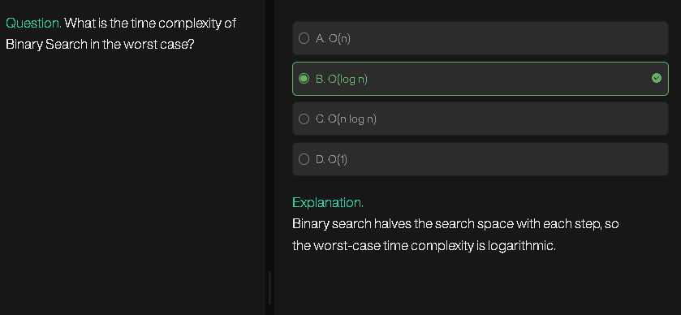
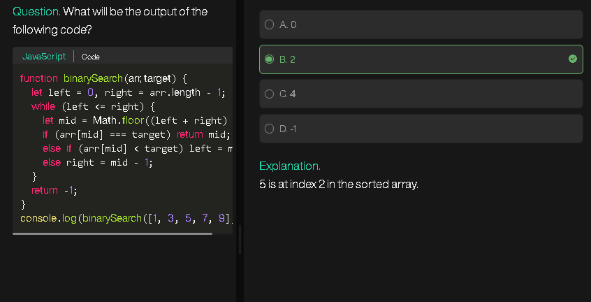
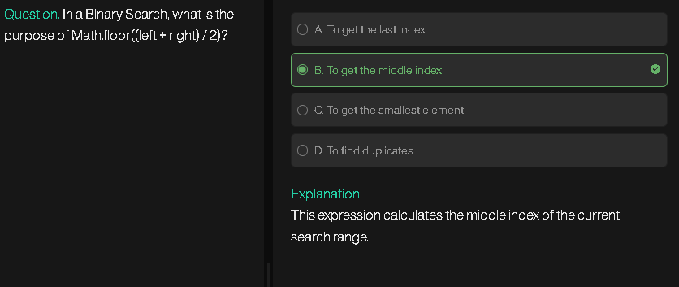
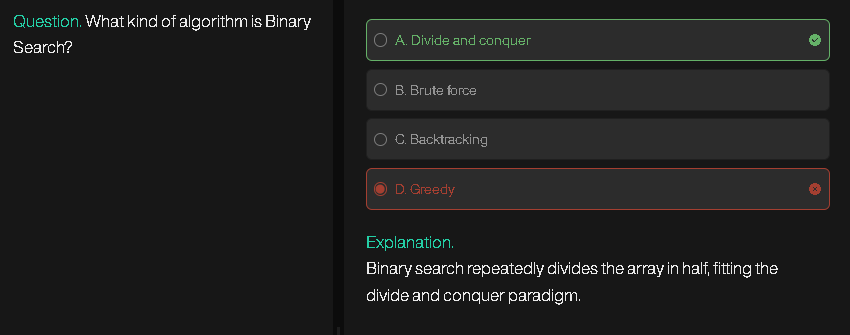
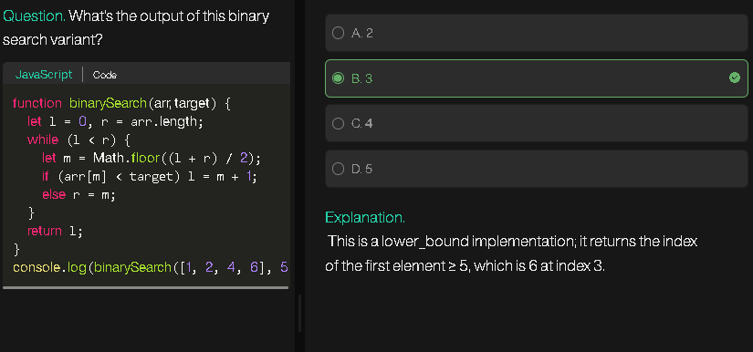

# **Monotonic Array**

A **monotonic array** is an array that is either **entirely non-increasing** or **entirely non-decreasing**.

### Types:

1. **Monotonically Increasing:**

   ```
   arr[i] <= arr[i+1] for all i
   ```

   Example: `[1, 2, 2, 3, 4]`

2. **Strictly Increasing:**

   ```
   arr[i] < arr[i+1] for all i
   ```

   Example: `[1, 2, 3, 4, 5]`

3. **Monotonically Decreasing:**

   ```
   arr[i] >= arr[i+1] for all i
   ```

   Example: `[5, 4, 4, 3, 1]`

4. **Strictly Decreasing:**

   ```
   arr[i] > arr[i+1] for all i
   ```

   Example: `[9, 7, 5, 3]`

**Key point:** The array never “changes direction” in its trend.

---

# **Bitonic Array**

A **bitonic array** is an array that **first strictly increases, then strictly decreases**.

* There is **exactly one peak**.
* Could be considered a “mountain array” in some contexts.

### Example:

```
[1, 3, 8, 12, 4, 2]
```

* Increasing part: `[1, 3, 8, 12]`
* Decreasing part: `[12, 4, 2]`
* Peak: `12` at index 3

**Note:** Some definitions allow **non-strict increasing/decreasing**, but in competitive programming usually **strict** is assumed.

---

### **Difference Table**

| Feature                    | Monotonic Array               | Bitonic Array                  |
| -------------------------- | ----------------------------- | ------------------------------ |
| Trend                      | Single direction (up or down) | First up, then down (one peak) |
| Peak                       | Not required                  | Required (exactly one)         |
| Examples                   | `[1,2,2,3]`, `[5,4,4,1]`      | `[1,3,8,12,4,2]`               |
| Can have direction change? | No                            | Yes, only once (at peak)       |

---
---
---
---
---

# **LeetCode 852 – Peak Index in a Mountain Array**

## **Problem Explanation**

A **mountain array** is an array where:

1. `arr.length >= 3`
2. There exists an index `i` (0 < i < arr.length - 1) such that:

   * `arr[0] < arr[1] < ... < arr[i]` (strictly increasing to the peak)
   * `arr[i] > arr[i+1] > ... > arr[arr.length - 1]` (strictly decreasing after the peak)

**Task:** Find the index of the **peak element**.

---

## **Rules / Observations**

1. The peak is **greater than its neighbors**:
   `arr[i-1] < arr[i] > arr[i+1]`
2. The array always increases to a peak and then decreases.
3. Binary search can be used since there’s a **monotonic behavior on both sides of the peak**.

---

## **Examples**

**Example 1:**

```
Input: arr = [0,2,1,0]
Output: 1
Explanation: arr[1] = 2 is the peak
```

**Example 2:**

```
Input: arr = [0,10,5,2]
Output: 1
```

**Example 3:**

```
Input: arr = [0,1,0]
Output: 1
```

---

## **Intuition / Approach**

We can use **binary search**:

1. Pick `mid = (first + last) // 2`.
2. Compare `arr[mid]` with `arr[mid+1]`:

   * If `arr[mid] < arr[mid+1]`, we are on the **increasing slope**, so move `first = mid + 1`.
   * Else, we are on the **decreasing slope** or at peak, so move `last = mid`.
3. Stop when `first == last`. That index is the peak.

**Why it works:** The slope property ensures that binary search **never misses the peak**.

---

## **Pseudocode**

```
function peakIndexInMountainArray(arr):
    first = 0
    last = length(arr) - 1
    
    while first < last:
        mid = (first + last) // 2
        if arr[mid] < arr[mid + 1]:
            first = mid + 1       # move right
        else:
            last = mid            # move left or stay
    
    return first                 # or last, both same
```

---

## **Flowchart**

```
Start
   |
   v
Initialize first=0, last=arr.length-1
   |
   v
While first < last:
   |
   v
   Compute mid = (first+last)//2
   |
   v
   Is arr[mid] < arr[mid+1] ?
    /       \
   Yes       No
   /          \
first=mid+1   last=mid
   \          /
    \        /
     v      v
   Loop back to "While first<last"
   |
   v
Return first (peak index)
   |
   v
End
```

---

This binary search runs in **O(log n)** time and **O(1)** space.

---
---
---
---
---

# **Search in Rotated Sorted Array**

## **Problem Explanation**

You are given a **rotated sorted array** `nums` (ascending order, rotated at some unknown pivot) and a `target`.
You need to **find the index of `target`**, or return `-1` if it’s not present.

**Rotated sorted array example:**

```
Original sorted array: [0,1,2,4,5,6,7]
After rotation at pivot 3: [4,5,6,7,0,1,2]
```

---

## **Rules / Observations**

1. **Binary search can still be used**, but you need to consider rotation.
2. At each step, **one half is always sorted**:

   * Either `nums[first..mid]` is sorted, or `nums[mid..last]` is sorted.
3. If `target` lies within the sorted half, search that half; otherwise, search the other half.

---

## **Examples**

**Example 1:**

```
Input: nums = [4,5,6,7,0,1,2], target = 0
Output: 4
```

**Example 2:**

```
Input: nums = [4,5,6,7,0,1,2], target = 3
Output: -1
```

**Example 3:**

```
Input: nums = [1], target = 0
Output: -1
```

---

## **Intuition / Approach**

1. Use **binary search**: initialize `first=0`, `last=nums.length-1`.
2. Compute `mid = (first + last) // 2`.
3. Check if `nums[mid] == target`. If yes, return `mid`.
4. Determine which half is sorted:

   * If `nums[first] <= nums[mid]` → left half is sorted.
   * Else → right half is sorted.
5. Decide which half to search next:

   * If `target` is within the sorted half, narrow search to that half.
   * Else, search the other half.
6. Repeat until `first > last`. Return `-1` if not found.

---

## **Pseudocode**

```
function search(nums, target):
    first = 0
    last = length(nums) - 1
    
    while first <= last:
        mid = (first + last) // 2
        
        if nums[mid] == target:
            return mid
        
        if nums[first] <= nums[mid]:         # left half sorted
            if nums[first] <= target < nums[mid]:
                last = mid - 1
            else:
                first = mid + 1
        else:                               # right half sorted
            if nums[mid] < target <= nums[last]:
                first = mid + 1
            else:
                last = mid - 1
    
    return -1
```

---

## **Flowchart**

```
Start
   |
   v
Initialize first=0, last=nums.length-1
   |
   v
While first <= last:
   |
   v
Compute mid = (first+last)//2
   |
   v
Is nums[mid] == target ?
   /        \
 Yes        No
 /           \
Return mid    |
              v
Is nums[first] <= nums[mid] ?  (Left half sorted)
       /           \
     Yes             No
    /                 \
Is target in [nums[first],nums[mid]] ?   (target in right half)
   /       \                             /       \
  Yes      No                          Yes       No
  /         \                            /         \
last=mid-1  first=mid+1                 first=mid+1 last=mid-1
   \         /                            \         /
    \       /                              \       /
      Loop back to While
   |
   v
Return -1
   |
   v
End
```

---

✅ **Time Complexity:** O(log n)
✅ **Space Complexity:** O(1)

---
---
---
---
---

# **Allocate Minimum Pages**

## **Problem Explanation**

Given an array `arr[]` of `n` books where `arr[i]` represents the number of pages in the `i`-th book, and `k` students, allocate **contiguous books** to each student such that:

1. Each student gets at least one book.
2. All books are allocated.
3. **The maximum number of pages assigned to a student is minimized.**

Return that minimum possible maximum number of pages. If `k > n`, return `-1`.

---

## **Rules / Observations**

1. Books must be allocated **contiguously**.
2. A student can get **one or more books**, but each book goes to only one student.
3. The goal is to **minimize the maximum pages** assigned to a student.
4. The problem can be solved using **Binary Search on the answer**.

---

## **Examples**

**Example 1:**

```
Input: arr = [12, 34, 67, 90], k = 2
Output: 113
Explanation: 
- Student 1: [12, 34, 67] → 113 pages
- Student 2: [90] → 90 pages
Maximum pages = 113 (minimized)
```

**Example 2:**

```
Input: arr = [5, 17, 100, 11], k = 4
Output: 100
Explanation: Each student gets one book. Maximum = 100
```

---

## **Intuition / Approach**

1. **Set search boundaries**:

   * `first = max(arr)` → minimum possible max pages.
   * `last = sum(arr)` → maximum possible max pages.
2. Use binary search to find the minimum feasible `maxPages`:

   * Compute `mid = (first + last) // 2`.
   * Check if it’s possible to allocate books such that no student gets more than `mid` pages (`isValid` function).
   * If yes, search left (`last = mid - 1`) to minimize further.
   * If no, search right (`first = mid + 1`).
3. Return the minimum feasible maximum pages.

**isValid function**:

* Iterate through books, adding pages to the current student.
* If sum exceeds `mid`, allocate to next student.
* If student count exceeds `k`, return false.
* Else, return true.

---

## **Pseudocode**

```
function isValid(arr, maxPages, k):
    count = 1
    sum = 0
    for each book in arr:
        if book > maxPages:
            return false
        if sum + book > maxPages:
            count += 1
            sum = book
            if count > k:
                return false
        else:
            sum += book
    return true

function findPages(arr, k):
    if k > length(arr):
        return -1
    
    first = max(arr)
    last = sum(arr)
    ans = -1
    
    while first <= last:
        mid = (first + last) // 2
        if isValid(arr, mid, k):
            ans = mid
            last = mid - 1
        else:
            first = mid + 1
    
    return ans
```

---

## **Flowchart**

```
Start
   |
   v
If k > length(arr), return -1
   |
   v
Initialize first = max(arr), last = sum(arr), ans = -1
   |
   v
While first <= last:
   |
   v
   mid = (first + last) // 2
   |
   v
   Is isValid(arr, mid, k) True?
       /        \
     Yes         No
     /            \
 ans = mid         first = mid + 1
 last = mid - 1
   \            /
    \          /
     Loop back
   |
   v
Return ans
   |
   v
End
```

---

Time Complexity: O(n × log(sum(arr)))
Space Complexity: O(1)

---
---
---
---
---

# **Capacity To Ship Packages Within D Days**

## **Problem Explanation**

Given an array `weights[]` representing weights of packages and an integer `days`, find the **minimum ship capacity** required to ship all packages within `days` days.

Rules:

1. Packages must be shipped in order.
2. Each day, ship **contiguous packages** with total weight ≤ ship capacity.
3. Goal: **minimize the ship capacity**.

---

## **Rules / Observations**

1. Minimum possible capacity = `max(weights)` (the heaviest package).
2. Maximum possible capacity = `sum(weights)` (all packages in one day).
3. Use **binary search on the answer**:

   * Check if a mid capacity can ship all packages within `days`.
   * Adjust search based on feasibility.

---

## **Examples**

**Example 1:**

```
Input: weights = [1,2,3,4,5,6,7,8,9,10], days = 5
Output: 15
Explanation:
- Day 1: [1,2,3,4,5] → 15
- Day 2: [6,7] → 13
- Day 3: [8] → 8
- Day 4: [9] → 9
- Day 5: [10] → 10
```

**Example 2:**

```
Input: weights = [3,2,2,4,1,4], days = 3
Output: 6
```

---

## **Intuition / Approach**

1. **Binary Search boundaries**:

   * `first = max(weights)`
   * `last = sum(weights)`
2. While `first <= last`:

   * `mid = (first + last) // 2` → candidate capacity.
   * Simulate shipping:

     * Add weights to current day sum.
     * If sum > mid, start a new day and increase day count.
   * If total days used ≤ `days`, reduce capacity (`last = mid - 1`).
   * Else, increase capacity (`first = mid + 1`).
3. Return `first` as the **minimum capacity**.

---

## **Pseudocode**

```
function canShip(weights, capacity, days):
    count = 1
    sum = 0
    for weight in weights:
        if sum + weight > capacity:
            count += 1
            sum = weight
        else:
            sum += weight
    return count <= days

function shipWithinDays(weights, days):
    first = max(weights)
    last = sum(weights)
    
    while first <= last:
        mid = (first + last) // 2
        if canShip(weights, mid, days):
            last = mid - 1
        else:
            first = mid + 1
    
    return first
```

---

## **Flowchart**

```
Start
   |
   v
first = max(weights), last = sum(weights)
   |
   v
While first <= last:
   |
   v
   mid = (first + last) // 2
   |
   v
Simulate shipping with capacity = mid
   |
   v
Days used <= days?
   /       \
 Yes        No
 /           \
last = mid-1  first = mid+1
   \         /
    \       /
     Loop back
   |
   v
Return first
   |
   v
End
```

---

Time Complexity: O(n × log(sum(weights)))
Space Complexity: O(1)

---
---
---
---
---

# **Koko Eating Bananas**

## **Problem Explanation**

Koko has `piles` of bananas and `h` hours to eat them. Each hour, she can choose a **banana-eating speed `k`** (bananas per hour) and eat from **one pile**.

Goal: Find the **minimum integer `k`** such that she can eat all bananas within `h` hours.

---

## **Rules / Observations**

1. Koko must **eat from one pile per hour**.
2. If a pile has fewer bananas than `k`, she eats the entire pile in one hour.
3. For a pile of size `p`, the hours needed = `ceil(p / k)`.
4. Minimum speed = 1, maximum speed = `max(piles)`.
5. Use **binary search on `k`**:

   * Check if a candidate speed allows eating all bananas within `h` hours.
   * Adjust search boundaries based on feasibility.

---

## **Examples**

**Example 1:**

```
Input: piles = [3,6,7,11], h = 8
Output: 4
Explanation:
- Speed 4 works: hours = ceil(3/4)+ceil(6/4)+ceil(7/4)+ceil(11/4) = 1+2+2+3 = 8
```

**Example 2:**

```
Input: piles = [30,11,23,4,20], h = 5
Output: 30
```

---

## **Intuition / Approach**

1. **Binary Search boundaries**:

   * `first = 1` (minimum speed)
   * `last = max(piles)` (maximum speed)
2. While `first <= last`:

   * `mid = (first + last) // 2` → candidate speed.
   * Compute total hours needed for this speed:

     ```
     hours = sum(ceil(pile / mid) for each pile)
     ```
   * If `hours <= h`, try smaller speed (`last = mid - 1`) to minimize.
   * Else, increase speed (`first = mid + 1`).
3. Return `first` as the **minimum feasible speed**.

**Optimization:**

* To avoid `Math.ceil`, use:

```
ceil(pile / mid) = (pile + mid - 1) // mid
```

---

## **Pseudocode**

```
function minEatingSpeed(piles, h):
    first = 1
    last = max(piles)
    ans = last
    
    while first <= last:
        mid = (first + last) // 2
        hours = 0
        for pile in piles:
            hours += (pile + mid - 1) // mid   # ceil replacement
        
        if hours <= h:
            ans = mid
            last = mid - 1
        else:
            first = mid + 1
    
    return ans
```

---

## **Flowchart**

```
Start
   |
   v
first = 1, last = max(piles), ans = last
   |
   v
While first <= last:
   |
   v
   mid = (first + last) // 2
   |
   v
   Compute hours needed at speed mid
   |
   v
Hours <= h ?
   /       \
 Yes        No
 /           \
ans = mid    first = mid + 1
last = mid-1
   \         /
    \       /
     Loop back
   |
   v
Return ans
   |
   v
End
```

---

Time Complexity: O(n × log(max(piles)))
Space Complexity: O(1)

---





