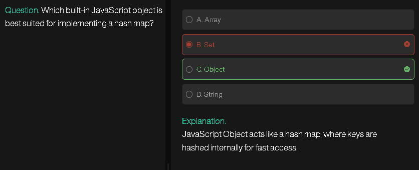
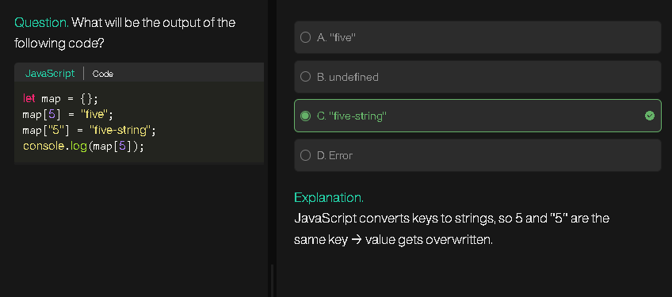
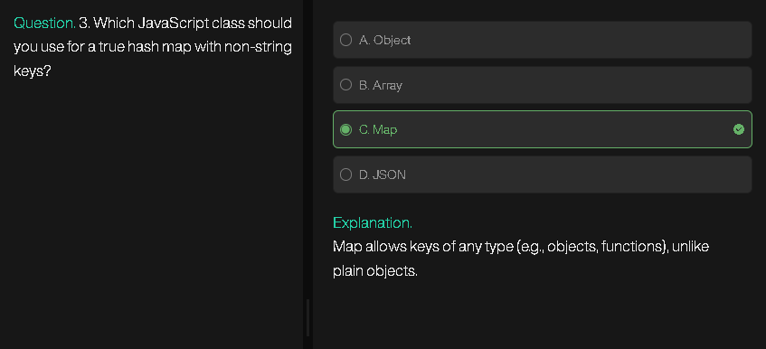
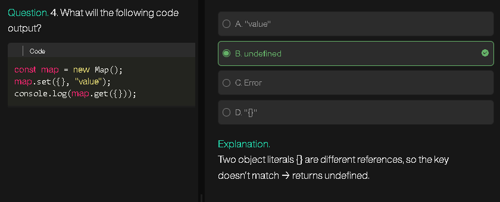
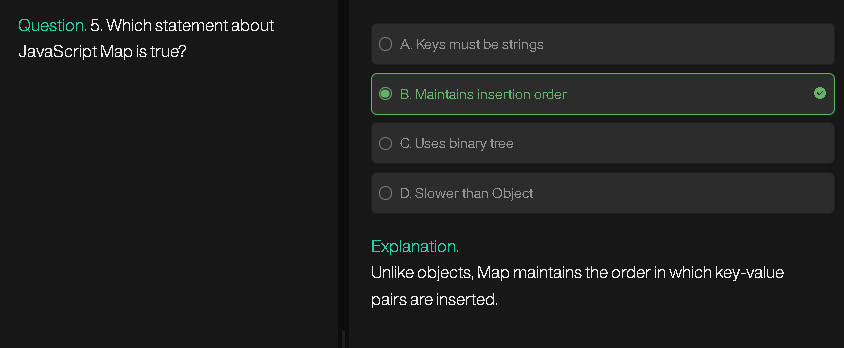

# **Problem: Contiguous Array (LeetCode 525)**

**Description:**
Given a binary array `nums` (elements are 0 or 1), find the **maximum length of a contiguous subarray** with **equal number of 0s and 1s**.

**Example:**

```
Input: nums = [0,1]
Output: 2
Explanation: The whole array has one 0 and one 1.
```

```
Input: nums = [0,1,0]
Output: 2
Explanation: [0,1] or [1,0] are valid subarrays.
```

**Constraints:**

* 1 ≤ nums.length ≤ 10^5
* nums[i] is 0 or 1

---

## **Efficient Approach**

**Idea:**

* Replace all `0`s with `-1`.
* Now the problem reduces to **finding the longest subarray with sum = 0**.
* Use a **prefix sum + hash map** approach:

  * Key: prefix sum
  * Value: first index where this sum appeared
* If the same prefix sum occurs again, the subarray between the two indices has **sum = 0**, which means **equal number of 1s and 0s**.

**Why efficient?**

* Single pass over the array → O(n) time
* Hash map lookup → O(1) average time
* Space → O(n) for hash map

---

## **Step-by-Step Algorithm / Pseudocode**

**Algorithm:**

1. Convert all 0s in `nums` to -1.
2. Initialize `sum = 0` (current prefix sum), `longest = 0`.
3. Initialize `map = {0: -1}` to handle the sum=0 case.
4. Loop over `nums` with index `i`:

   * Add `nums[i]` to `sum`.
   * If `sum` exists in `map`:

     * Update `longest = max(longest, i - map[sum])`
   * Else:

     * Add `sum` to `map` with value `i`
5. Return `longest`.

**Pseudocode:**

```
function findMaxLength(nums):
    for i in 0 to nums.length-1:
        if nums[i] == 0:
            nums[i] = -1

    sum = 0
    longest = 0
    map = {0: -1}

    for i in 0 to nums.length-1:
        sum += nums[i]
        if sum in map:
            longest = max(longest, i - map[sum])
        else:
            map[sum] = i

    return longest
```

---

## **Flowchart Diagram**

```
Start
  |
  v
Replace 0s with -1 in nums
  |
  v
Initialize sum = 0, longest = 0
Initialize map with {0: -1}
  |
  v
For each index i in nums:
  |
  +--> sum += nums[i]
  |
  +--> if sum in map:
  |       longest = max(longest, i - map[sum])
  |    else:
  |       map[sum] = i
  |
  v
Return longest
  |
  v
End
```

---

## **Example Walkthrough**

**Input:** `nums = [0,1,0,1,1,0,0]`

1. Convert 0 → -1: `[-1,1,-1,1,1,-1,-1]`
2. Initialize `sum=0`, `longest=0`, `map={0:-1}`

| i | nums[i] | sum | map              | longest            |
| - | ------- | --- | ---------------- | ------------------ |
| 0 | -1      | -1  | {0:-1, -1:0}     | 0                  |
| 1 | 1       | 0   | {0:-1, -1:0}     | 2 (`1 - (-1) = 2`) |
| 2 | -1      | -1  | {0:-1, -1:0}     | 2 (`2-0=2`)        |
| 3 | 1       | 0   | {0:-1, -1:0}     | 4 (`3 - (-1) = 4`) |
| 4 | 1       | 1   | {0:-1, -1:0,1:4} | 4                  |
| 5 | -1      | 0   | {0:-1, -1:0,1:4} | 6 (`5 - (-1)=6`)   |
| 6 | -1      | -1  | {0:-1, -1:0,1:4} | 6 (`6 - 0 = 6`)    |

**Output:** `6` → longest subarray `[0,1,0,1,1,0]` (index 0 to 5)

---

This is the **most efficient approach**: O(n) time and O(n) space.

---
---
---
---
---

# **Problem: Longest Consecutive Sequence (LeetCode 128)**

**Description:**
Given an unsorted array of integers `nums`, return the length of the **longest consecutive elements sequence**.

**Important:**

* Must be solved in **O(n)** time.
* Consecutive means numbers that follow each other without gaps, e.g., `[100,101,102]` → length 3.

**Example:**

```
Input: nums = [100, 4, 200, 1, 3, 2]
Output: 4
Explanation: The longest consecutive sequence is [1,2,3,4].
```

```
Input: nums = [0,3,7,2,5,8,4,6,0,1]
Output: 9
Explanation: The longest consecutive sequence is [0,1,2,3,4,5,6,7,8].
```

---

## **Efficient Approach**

**Idea:**

* Use a **HashSet** to store all numbers → O(1) lookup.
* For each number `n`, check if it is the **start of a sequence** (`n-1` is not in the set).

  * If yes, start counting consecutive numbers (`n, n+1, n+2,...`)
  * Update `longest` sequence length.

**Why efficient?**

* Each number is checked **at most twice** (once as potential start, once while counting) → O(n) time
* HashSet gives O(1) lookup → O(n) space

---

## **Step-by-Step Algorithm / Pseudocode**

**Algorithm:**

1. Convert array to set for O(1) lookups.
2. Initialize `longest = 0`.
3. For each number `num` in the set:

   * If `num-1` is **not** in set → start of a sequence

     * Initialize `current_num = num`, `count = 1`
     * While `current_num + 1` is in set:

       * `current_num += 1`, `count += 1`
     * Update `longest = max(longest, count)`
4. Return `longest`.

**Pseudocode:**

```
function longestConsecutive(nums):
    num_set = set(nums)
    longest = 0

    for num in num_set:
        if (num - 1) not in num_set:  // start of a sequence
            current_num = num
            count = 1
            while (current_num + 1) in num_set:
                current_num += 1
                count += 1
            longest = max(longest, count)

    return longest
```

---

## **Flowchart Diagram**

```
Start
  |
  v
Convert nums array to set
Initialize longest = 0
  |
  v
For each num in set:
  |
  +--> if num-1 not in set (start of sequence):
  |       current_num = num
  |       count = 1
  |       while current_num+1 in set:
  |            current_num += 1
  |            count += 1
  |       longest = max(longest, count)
  |
  v
Return longest
  |
  v
End
```

---

## **Example Walkthrough**

**Input:** `nums = [100, 4, 200, 1, 3, 2]`
**Set:** `{1,2,3,4,100,200}`

| num | num-1 in set? | sequence counted | longest |
| --- | ------------- | ---------------- | ------- |
| 1   | No            | 1,2,3,4 → 4      | 4       |
| 2   | Yes           | skipped          | 4       |
| 3   | Yes           | skipped          | 4       |
| 4   | Yes           | skipped          | 4       |
| 100 | No            | 100 → 1          | 4       |
| 200 | No            | 200 → 1          | 4       |

**Output:** 4 → sequence `[1,2,3,4]`

---

This approach ensures **O(n) time** and **O(n) space**, ideal for large arrays.

---
---
---
---
---

# **Problem: Count Distinct Elements in Every Window**

**Description:**
Given an array `arr[]` of size `n` and an integer `k`, for **every window of size `k`** in the array, find the **count of distinct elements**.

**Example:**

```
Input: arr = [1, 2, 1, 3, 4, 2, 3], k = 4
Output: [3, 4, 4, 3]
Explanation:
Window [1,2,1,3] → distinct elements = {1,2,3} → 3
Window [2,1,3,4] → distinct elements = {1,2,3,4} → 4
Window [1,3,4,2] → distinct elements = {1,2,3,4} → 4
Window [3,4,2,3] → distinct elements = {2,3,4} → 3
```

---

## **Efficient Approach**

**Idea:**

* Use a **hash map** to store **frequency of elements** in the current window.
* Slide the window one element at a time:

  * Remove the first element of the previous window (decrement count or delete if count becomes 0).
  * Add the new element at the end of the window (increment count or add if new).
* At each step, the **size of the map** gives the **count of distinct elements**.

**Why efficient?**

* Each element is **added and removed exactly once** → O(n) time
* Hash map gives O(1) average lookup and insertion → O(n) space

---

## **Step-by-Step Algorithm / Pseudocode**

**Algorithm:**

1. Initialize `map = {}` (element → frequency) and `ans = []`.
2. Add the first `k` elements to the map and store `map.size` in `ans`.
3. Slide the window:

   * Remove element going out of window:

     * Decrement its frequency.
     * If frequency becomes 0, delete it from map.
   * Add element coming into window:

     * Increment frequency (or add if new).
   * Append `map.size` to `ans`.
4. Return `ans`.

**Pseudocode:**

```
function countDistinct(arr, k):
    map = empty map
    ans = []

    // Initialize first window
    for i = 0 to k-1:
        map[arr[i]] = map.get(arr[i], 0) + 1
    ans.append(map.size)

    i = 0
    j = k - 1
    while j < len(arr) - 1:
        // Remove outgoing element
        map[arr[i]] -= 1
        if map[arr[i]] == 0:
            delete map[arr[i]]
        i += 1
        j += 1

        // Add incoming element
        map[arr[j]] = map.get(arr[j], 0) + 1

        ans.append(map.size)

    return ans
```

---

## **Flowchart Diagram**

```
Start
  |
  v
Initialize empty map and ans
Add first k elements to map
Append map.size to ans
  |
  v
For each window (i,j):
  |
  +--> Remove arr[i] from map:
  |        decrement count
  |        if count==0, delete element
  |
  +--> Add arr[j+1] to map:
  |        increment count or add new
  |
  +--> Append map.size to ans
  |
  v
Return ans
  |
  v
End
```

---

## **Example Walkthrough**

**Input:** `arr = [1, 2, 1, 3, 4, 2, 3], k = 4`

1. **First window [1,2,1,3]** → map `{1:2, 2:1, 3:1}` → distinct = 3
2. **Next window [2,1,3,4]**

   * Remove 1: `{1:1,2:1,3:1}`
   * Add 4: `{1:1,2:1,3:1,4:1}` → distinct = 4
3. **Next window [1,3,4,2]**

   * Remove 2: `{1:1,3:1,4:1}`
   * Add 2: `{1:1,2:1,3:1,4:1}` → distinct = 4
4. **Next window [3,4,2,3]**

   * Remove 1: `{2:1,3:1,4:1}`
   * Add 3: `{2:1,3:2,4:1}` → distinct = 3

**Output:** `[3,4,4,3]`

---

✅ This is **sliding window + hashmap** technique → **O(n) time** and **O(k) space**, optimal for large arrays.

---






