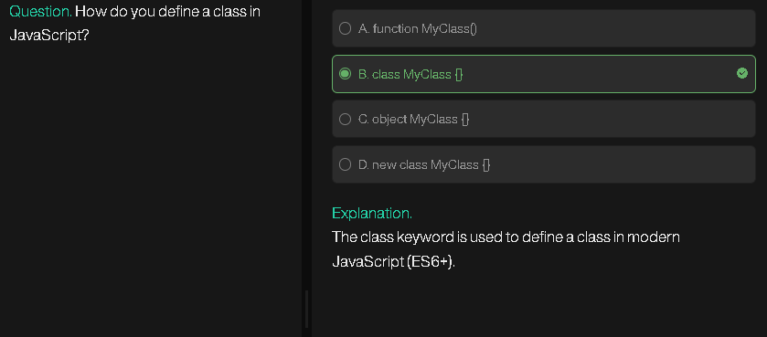
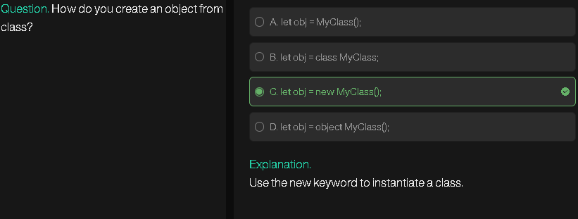
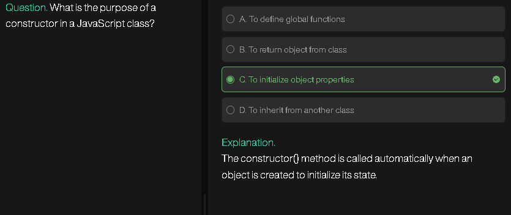
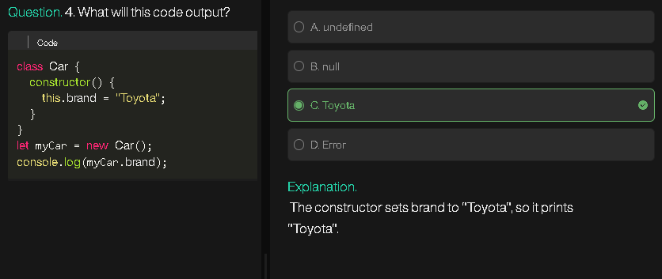

# **JavaScript OOP (Object-Oriented Programming)**

## **1. What is OOP?**

* **OOP (Object-Oriented Programming)** is a programming paradigm based on **objects**, which contain **data** (properties) and **behavior** (methods/functions).
* Focus: **model real-world things** in code using objects.

**Example:**

```javascript
let car = {
    brand: "Toyota",
    color: "Red",
    drive: function() { console.log("Driving"); }
};
```

Here, `car` is an object with properties and a method.

---

## **2. Why do we need OOP?**

* Organize code in a **modular** way.
* Reuse code through **inheritance**.
* Model real-world entities easily.
* Easier to maintain and scale large programs.

**Example:**
Without OOP: lots of independent functions and variables → hard to maintain.
With OOP: everything grouped logically in objects/classes.

---

## **3. OOP vs Other Programming Models**

| Feature             | Procedural / Functional | Object-Oriented                  |
| ------------------- | ----------------------- | -------------------------------- |
| Focus               | Functions / Procedures  | Objects (data + behavior)        |
| Data                | Separate from functions | Encapsulated inside objects      |
| Reusability         | Limited (functions)     | High (inheritance, polymorphism) |
| Real-world modeling | Harder                  | Easy and natural                 |
| Example             | C, old JavaScript       | Java, JS with classes            |

---

## **4. Class and Object**

* **Class:** Blueprint for objects.
* **Object:** Instance of a class.

**Example in JS:**

```javascript
class Car {
    constructor(brand, color) {
        this.brand = brand;
        this.color = color;
    }

    drive() {
        console.log(`${this.brand} is driving`);
    }
}

let myCar = new Car("Toyota", "Red"); // object
myCar.drive(); // Toyota is driving
```

---

## **5. Literal Object**

* Directly create object without a class or constructor.

```javascript
let person = {
    name: "Sayantan",
    age: 26,
    greet: function() { console.log("Hello"); }
};

person.greet(); // Hello
```

* Simple and quick, but **not reusable**.

---

## **6. Constructor & Constructor Function**

* **Constructor**: special function used to create **objects of a class**.
* **Constructor Function (pre-ES6)**: function that acts like a class.

**Example:**

```javascript
function Person(name, age) {
    this.name = name;
    this.age = age;
    this.greet = function() { console.log(`Hello, I'm ${this.name}`); };
}

let p1 = new Person("Sayantan", 26);
p1.greet(); // Hello, I'm Sayantan
```

* **Note:** `new` keyword creates a new object from constructor.

---

## **7. `this` keyword**

* Refers to **current object**.
* Inside a method, `this` points to **the object calling the method**.
* Inside a constructor, `this` points to **the newly created object**.

```javascript
class Car {
    constructor(brand) {
        this.brand = brand;
    }
    showBrand() {
        console.log(this.brand);
    }
}

let car = new Car("Honda");
car.showBrand(); // Honda
```

---

## **8. Prototype Object**

* Every JS function has a **prototype** property.
* Objects inherit methods from the **prototype** of constructor function.
* Useful for **memory efficiency** (shared methods).

```javascript
function Person(name) {
    this.name = name;
}

Person.prototype.greet = function() {
    console.log(`Hello, I'm ${this.name}`);
};

let p1 = new Person("Sayantan");
let p2 = new Person("Riya");

p1.greet(); // Hello, I'm Sayantan
p2.greet(); // Hello, I'm Riya
```

* Only **one copy of greet** exists → memory optimized.

---

## **9. Design Problems OOP Solves**

* Code duplication → solved by **inheritance**.
* Hard-to-manage programs → solved by **modularity**.
* Real-world modeling → solved by **objects & classes**.
* Extending functionality → solved by **polymorphism**.

---

# **Advanced JavaScript OOP Notes**

## **1. OOP (Object-Oriented Programming)**

* **Definition:** OOP is a **programming paradigm** that models programs based on **real-world objects**, encapsulating **data (properties)** and **behavior (methods)**.
* **Focus:** Organize code into **modular, reusable, and maintainable structures**.
* **Key Advantages:**

  * Encapsulation → hides internal state.
  * Inheritance → reuse & extend functionality.
  * Polymorphism → methods can behave differently based on object context.
  * Abstraction → expose only necessary details.

**Deep point:** In JS, OOP is **prototypal**, not classical by nature. ES6 classes are **syntactic sugar** over prototypes.

---

## **2. Object**

* **Definition:** A real-world entity represented in code with **properties** (data) and **methods** (behavior).
* **Example:**

```javascript
let car = {
    brand: "Toyota",
    color: "Red",
    drive() { console.log("Driving"); }
};
```

* **Deep/Interview point:**

  * Every JS object is linked to a **prototype** object, forming the **prototype chain**.
  * Objects are **references**, not value types. Assigning an object copies the reference, not the object.

---

## **3. Class**

* **Definition:** Blueprint or template to create objects.
* **Characteristics:**

  * No memory is allocated for class itself; memory is only used when an **object** is created.
  * Defines **properties and methods**, but **does not hold real data** until instantiated.

**Deep/Hidden Point:**

* JS classes are **not hoisted** like functions. You must declare them **before use**.
* Classes support **static methods/properties** that belong to the class itself, not instances.

```javascript
class Car {
    static type = "Vehicle";
    constructor(brand) { this.brand = brand; }
}
console.log(Car.type); // Vehicle
```

---

## **4. Constructor**

* **Definition:** Special method in a class (or constructor function) that **initializes an object** when it is created.
* **Key Points:**

  * Executed automatically on `new` object creation.
  * Can assign **default values**, or validate inputs.
  * In ES6, a class can have **only one constructor**, but constructor overloading can be mimicked using **default parameters**.

```javascript
class Person {
    constructor(name="Unknown", age=0) {
        this.name = name;
        this.age = age;
    }
}
```

**Deep/Interview points:**

* `constructor` **cannot return a value** except another object explicitly.
* In **inheritance**, `super()` must be called in child class constructor **before using `this`**.
* Constructor functions pre-ES6 are just **normal functions** used with `new`. `new` creates an empty object, sets its prototype, and returns it.

---

## **5. `this` keyword**

* Refers to the **current object context**.
* Behavior differs based on **how function is called**:

  * In object method → points to the object.
  * Alone in function → in strict mode: `undefined`, else global object.
  * Inside constructor → points to the newly created object.
  * Inside arrow functions → **lexical binding** (inherits from parent scope).

```javascript
let obj = { name: "A", greet: () => console.log(this.name) };
obj.greet(); // undefined (lexical this)
```

**Deep point:** `this` is often **tricky in JS** due to dynamic binding; interviewers may ask this.

---

## **6. Prototype**

* Every JS function has a **prototype object**; objects created from constructor inherit from it.
* Methods added to **prototype** are **shared across all instances** → memory efficient.

```javascript
function Person(name) { this.name = name; }
Person.prototype.greet = function() { console.log(`Hi, I'm ${this.name}`); };
```

**Deep/Interview points:**

* Prototype chain is the **mechanism of inheritance in JS**.
* `__proto__` vs `prototype`:

  * `__proto__` → points to the **object’s prototype**.
  * `prototype` → property of constructor function.

---

## **7. Design Problems Solved by OOP**

* Avoid **code duplication** → inheritance & reusable classes.
* Better **modularity** → encapsulation & abstraction.
* Easier **maintenance** → separate concerns by objects.
* Flexible extension → polymorphism & dynamic binding.

**Hidden Insight:**

* JS OOP allows **dynamic properties**; you can add/remove properties and methods at runtime.
* But this flexibility can also lead to **bugs if not careful**.

---

## **8. Advanced/Interview-Level Points**

* Classes are just **syntactic sugar** over constructor functions & prototype chain.
* Private fields: Use `#` to make fields truly private (ES2020+).

```javascript
class Bank {
    #balance = 0;
    deposit(amount) { this.#balance += amount; }
    getBalance() { return this.#balance; }
}
```

* Memory optimization: Methods in **prototype** are shared, reducing per-object memory overhead.
* Inheritance pitfalls: Avoid modifying parent prototype inside child constructor.
* `Object.create()` allows creating objects with **custom prototype**, bypassing constructor.

```javascript
let proto = { greet() { console.log("Hello"); } };
let obj = Object.create(proto);
obj.greet(); // Hello
```

---


# **1. Why do we say “everything in JS is an object”?**

* In JavaScript: **primitives** (`number`, `string`, `boolean`) are **not objects**, but JS **wraps them temporarily** in **object wrappers** when you try to access properties/methods.

```javascript
let str = "hello";
console.log(str.length); // 5 → JS internally uses String object
```

* Most things are objects: arrays, functions, dates, regex, etc.
* **Every object has a prototype**, forming a **prototype chain**.

  * Example: `{}.__proto__ === Object.prototype` → true
  * Functions themselves are objects: `function f(){}; console.log(typeof f) // "function"`
  * Even classes are just **syntactic sugar** over constructor functions and prototypes.

✅ **So why “everything is object”?**
Because all objects (including functions, arrays) **inherit from a prototype**, and **properties/methods are stored in objects**.

---

# **2. Prototype === Object**

* **Prototype is an object**.
* When you create a function or object, JS internally links it to a **prototype object**.

```javascript
function Person(name) { this.name = name; }
Person.prototype.greet = function() { console.log("Hi " + this.name); };

let p = new Person("Sayantan");
p.greet(); // Hi Sayantan
```

* **What happens?**

  * `p` → does **not** have `greet` inside itself.
  * JS looks up the **prototype chain** → finds `greet` in `Person.prototype`.
* ✅ **Every prototype is an object**, which can have its **own properties/methods**.

**Interview insight:**

* Prototype chain always ends at `Object.prototype`, whose prototype is `null`.
* `Object.getPrototypeOf(p) === Person.prototype // true`

---

# **3. ES6 vs Pre-ES6 Object Syntax**

| Feature               | Pre-ES6 (ES5)                                            | ES6+                                                    |
| --------------------- | -------------------------------------------------------- | ------------------------------------------------------- |
| Create object literal | `var obj = {name:"A", greet:function(){}};`              | `let obj = {name:"A", greet(){}};`                      |
| Constructor Function  | `function Person(name){ this.name=name; }`               | `class Person { constructor(name){ this.name=name; } }` |
| Methods               | Defined inside constructor (per object) or via prototype | Methods inside class → automatically on **prototype**   |
| Inheritance           | `Child.prototype = Object.create(Parent.prototype)`      | `class Child extends Parent {}` + `super()`             |
| Private Properties    | Not available natively                                   | `#privateField` (ES2020+)                               |
| Static Methods        | `Person.method = function(){}`                           | `static method(){}`                                     |
| `this` behavior       | Dynamic → depends on call context                        | Same, but inside arrow functions → lexically bound      |

**Key points:**

* **ES6 class = syntactic sugar**, underlying mechanism is **prototypes**.
* Before ES6, inheritance and object creation were **messier**, manually setting prototypes.
* **Memory efficiency:** ES6 class methods live on the prototype automatically, pre-ES6 needed manual prototype assignment to save memory.

---

### **4. Conceptual Summary**

1. JS is **prototype-based**, not classical class-based.
2. **Classes are sugar**; they hide the prototype chain.
3. **Objects = containers of properties**, and most JS entities are objects.
4. **Prototype = object** that stores shared methods; chains up to `Object.prototype`.
5. **ES6 syntax** simplifies class definition, inheritance, and method sharing but doesn’t change the **core prototype-based nature** of JS.

---





