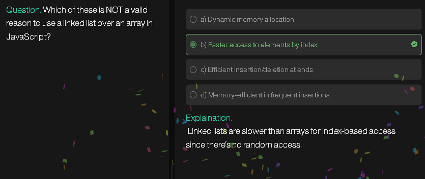
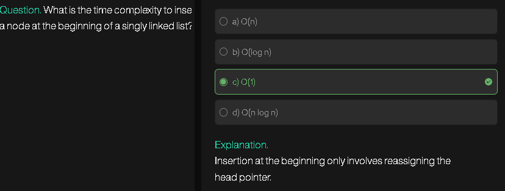
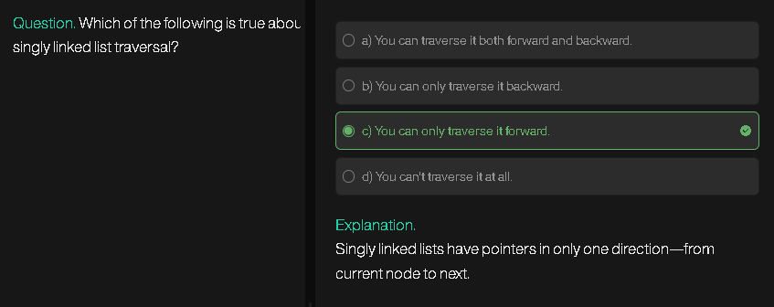
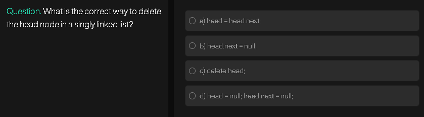
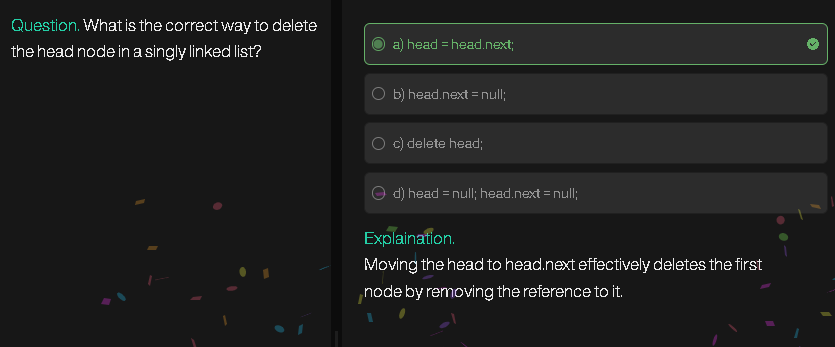

# **Linked List Basics**

### **What is a Linked List?**

* A **Linked List** is a **linear data structure** in which elements (called **nodes**) are stored at **non-contiguous memory locations**.
* Each **node** contains:

  1. **Data** → actual value
  2. **Pointer (or reference)** → address of the next node

Unlike arrays:

* Linked lists don’t have a fixed size (dynamic memory).
* Insertion/deletion is easier but accessing elements is slower (no direct indexing).

---

### **What is a Node?**

A **Node** is the building block of a linked list.
A typical node has 2 parts:

```
[ Data | Next ]
```

* **Data**: stores value (e.g., integer, string, object).
* **Next**: pointer/reference to the next node in the list.

In some types, nodes may have extra pointers (like `prev` for doubly linked list).

---

### **Basic Working with Linked List**

1. **Create a Node**

   * Allocate memory
   * Store data
   * Set `next = null` (initially)

2. **Link Nodes**

   * Connect one node’s `next` pointer to another node.

3. **Traversal**

   * Start from **head** (first node)
   * Follow `next` pointers until reaching `null`.

4. **Insertion**

   * At beginning → Change `head`.
   * At end → Traverse to last node, attach new node.
   * In middle → Adjust pointers.

5. **Deletion**

   * Find the node to delete.
   * Adjust previous node’s `next` to skip deleted node.

---

### **Types of Linked Lists**

| Type                                     | Structure                                                             | Example Representation    |
| ---------------------------------------- | --------------------------------------------------------------------- | ------------------------- |
| **Singly Linked List**                   | Each node has `data + next`. Traversal in **one direction**.          | `A → B → C → null`        |
| **Doubly Linked List**                   | Each node has `data + next + prev`. Traversal in **both directions**. | `null ← A ⇄ B ⇄ C → null` |
| **Circular Linked List (Singly/Doubly)** | Last node points back to head (no null).                              | `A → B → C → A`           |
| **Circular Doubly Linked List**          | Like DLL but last node’s `next = head` and head’s `prev = last`.      | `A ⇄ B ⇄ C ⇄ A`           |

---

### **Advantages**

* Dynamic size (no need to know size in advance).
* Easy insertion/deletion compared to arrays.

### **Disadvantages**

* More memory (extra pointer).
* Sequential access only (O(n) to search).

---

# **Linked List in JavaScript (Basic)**

### **1. Making a Node using an Object**

```js
// A node can be represented as an object
let node1 = {
    data: 10,
    next: null   // initially pointing to nothing
};
```

---

### **2. Head Node**

* The **head** is just a variable that points to the **first node**.

```js
let head = node1;   // head points to node1
```

---

### **3. Connecting Multiple Nodes**

```js
let node2 = {
    data: 20,
    next: null
};

let node3 = {
    data: 30,
    next: null
};

// connect them
node1.next = node2;   // node1 -> node2
node2.next = node3;   // node2 -> node3

// now our linked list looks like: 10 -> 20 -> 30 -> null
```

---

### **4. Traversing the Linked List**

```js
let current = head;   // start from head
while (current !== null) {
    console.log(current.data);  // print node data
    current = current.next;     // move to next node
}
```

**Output:**

```
10
20
30
```

---

✅ At this stage you have:

* A **head node** (`head`)
* **Nodes connected** (`node1 → node2 → node3`)
* A **traversal loop**

---


# Singly Linked List

```javascript
// Node class
class Node {
    constructor(value) {
        this.value = value;
        this.next = null;
    }
}

// Singly Linked List class
class LinkedList {
    constructor() {
        this.head = null;
    }

    // Insert at beginning
    insertAtBeginning(value) {
        const newNode = new Node(value);
        newNode.next = this.head;
        this.head = newNode;
    }

    // Insert at end
    insertAtEnd(value) {
        const newNode = new Node(value);
        if (!this.head) {
            this.head = newNode;
            return;
        }
        let temp = this.head;
        while (temp.next) {
            temp = temp.next;
        }
        temp.next = newNode;
    }

    // Insert at position (1-based index)
    insertAtPosition(value, position) {
        if (position < 1) return;
        if (position === 1) {
            this.insertAtBeginning(value);
            return;
        }
        let newNode = new Node(value);
        let temp = this.head;
        for (let i = 1; temp && i < position - 1; i++) {
            temp = temp.next;
        }
        if (!temp) return;
        newNode.next = temp.next;
        temp.next = newNode;
    }

    // Delete at beginning
    deleteAtBeginning() {
        if (!this.head) return;
        this.head = this.head.next;
    }

    // Delete at end
    deleteAtEnd() {
        if (!this.head) return;
        if (!this.head.next) {
            this.head = null;
            return;
        }
        let temp = this.head;
        while (temp.next.next) {
            temp = temp.next;
        }
        temp.next = null;
    }

    // Delete at position (1-based index)
    deleteAtPosition(position) {
        if (position < 1 || !this.head) return;
        if (position === 1) {
            this.deleteAtBeginning();
            return;
        }
        let temp = this.head;
        for (let i = 1; temp && i < position - 1; i++) {
            temp = temp.next;
        }
        if (!temp || !temp.next) return;
        temp.next = temp.next.next;
    }

    // Search element
    search(value) {
        let temp = this.head;
        let position = 1;
        while (temp) {
            if (temp.value === value) return position;
            temp = temp.next;
            position++;
        }
        return -1; // not found
    }

    // Traversal
    traverse() {
        let temp = this.head;
        let result = [];
        while (temp) {
            result.push(temp.value);
            temp = temp.next;
        }
        console.log(result.join(" -> "));
    }
}

// Example
let list = new LinkedList();
list.insertAtEnd(10);
list.insertAtEnd(20);
list.insertAtEnd(30);
list.insertAtPosition(15, 2);
list.traverse(); // 10 -> 15 -> 20 -> 30
list.deleteAtPosition(3);
list.traverse(); // 10 -> 15 -> 30
console.log("Search 15:", list.search(15)); // 2
```

---

### Visualization (Diagrams)

**Empty List**

```
head -> null
```

**Insert 10 at End**

```
head -> [10|next] -> null
```

**Insert 20 at End**

```
head -> [10|next] -> [20|next] -> null
```

**Insert 30 at End**

```
head -> [10|next] -> [20|next] -> [30|next] -> null
```

**Insert 15 at Position 2**

```
head -> [10|next] -> [15|next] -> [20|next] -> [30|next] -> null
```

**Delete at Position 3 (delete 20)**

```
head -> [10|next] -> [15|next] -> [30|next] -> null
```

**Traversal Output**

```
10 -> 15 -> 30
```


# Doubly Linked List

```javascript
// Node class for Doubly Linked List
class Node {
    constructor(value) {
        this.value = value;
        this.prev = null;
        this.next = null;
    }
}

// Doubly Linked List class
class DoublyLinkedList {
    constructor() {
        this.head = null;
        this.tail = null;
    }

    // Insert at beginning
    insertAtBeginning(value) {
        const newNode = new Node(value);
        if (!this.head) {
            this.head = this.tail = newNode;
        } else {
            newNode.next = this.head;
            this.head.prev = newNode;
            this.head = newNode;
        }
    }

    // Insert at end
    insertAtEnd(value) {
        const newNode = new Node(value);
        if (!this.tail) {
            this.head = this.tail = newNode;
        } else {
            this.tail.next = newNode;
            newNode.prev = this.tail;
            this.tail = newNode;
        }
    }

    // Insert at position (1-based index)
    insertAtPosition(value, position) {
        if (position < 1) return;
        if (position === 1) {
            this.insertAtBeginning(value);
            return;
        }
        let newNode = new Node(value);
        let temp = this.head;
        for (let i = 1; temp && i < position - 1; i++) {
            temp = temp.next;
        }
        if (!temp) return;
        newNode.next = temp.next;
        if (temp.next) temp.next.prev = newNode;
        temp.next = newNode;
        newNode.prev = temp;
        if (!newNode.next) this.tail = newNode;
    }

    // Delete at beginning
    deleteAtBeginning() {
        if (!this.head) return;
        if (!this.head.next) {
            this.head = this.tail = null;
        } else {
            this.head = this.head.next;
            this.head.prev = null;
        }
    }

    // Delete at end
    deleteAtEnd() {
        if (!this.tail) return;
        if (!this.tail.prev) {
            this.head = this.tail = null;
        } else {
            this.tail = this.tail.prev;
            this.tail.next = null;
        }
    }

    // Delete at position (1-based index)
    deleteAtPosition(position) {
        if (position < 1 || !this.head) return;
        if (position === 1) {
            this.deleteAtBeginning();
            return;
        }
        let temp = this.head;
        for (let i = 1; temp && i < position; i++) {
            temp = temp.next;
        }
        if (!temp) return;
        if (temp.next) temp.next.prev = temp.prev;
        if (temp.prev) temp.prev.next = temp.next;
        if (!temp.next) this.tail = temp.prev;
    }

    // Search element
    search(value) {
        let temp = this.head;
        let position = 1;
        while (temp) {
            if (temp.value === value) return position;
            temp = temp.next;
            position++;
        }
        return -1; // not found
    }

    // Forward traversal
    traverseForward() {
        let temp = this.head;
        let result = [];
        while (temp) {
            result.push(temp.value);
            temp = temp.next;
        }
        console.log("Forward:", result.join(" <-> "));
    }

    // Backward traversal
    traverseBackward() {
        let temp = this.tail;
        let result = [];
        while (temp) {
            result.push(temp.value);
            temp = temp.prev;
        }
        console.log("Backward:", result.join(" <-> "));
    }
}

// Example
let dlist = new DoublyLinkedList();
dlist.insertAtEnd(10);
dlist.insertAtEnd(20);
dlist.insertAtEnd(30);
dlist.insertAtPosition(15, 2);
dlist.traverseForward();   // Forward: 10 <-> 15 <-> 20 <-> 30
dlist.traverseBackward();  // Backward: 30 <-> 20 <-> 15 <-> 10
dlist.deleteAtPosition(3);
dlist.traverseForward();   // Forward: 10 <-> 15 <-> 30
console.log("Search 15:", dlist.search(15)); // 2
```

---

### Visualization (Diagrams)

**Empty List**

```
head -> null <- tail
```

**Insert 10 at End**

```
head/tail -> [null <- 10 -> null]
```

**Insert 20 at End**

```
head -> [null <- 10 ->] <-> [<- 20 -> null] <- tail
```

**Insert 30 at End**

```
head -> [null <- 10 ->] <-> [<- 20 ->] <-> [<- 30 -> null] <- tail
```

**Insert 15 at Position 2**

```
head -> [null <- 10 ->] <-> [<- 15 ->] <-> [<- 20 ->] <-> [<- 30 -> null] <- tail
```

**Delete at Position 3 (remove 20)**

```
head -> [null <- 10 ->] <-> [<- 15 ->] <-> [<- 30 -> null] <- tail
```

**Forward Traversal**

```
10 <-> 15 <-> 30
```

**Backward Traversal**

```
30 <-> 15 <-> 10
```


# Circular Linked List

```javascript
// Node class for Circular Linked List
class Node {
    constructor(value) {
        this.value = value;
        this.next = null;
    }
}

// Circular Linked List class
class CircularLinkedList {
    constructor() {
        this.head = null;
    }

    // Insert at beginning
    insertAtBeginning(value) {
        const newNode = new Node(value);
        if (!this.head) {
            this.head = newNode;
            newNode.next = newNode;
        } else {
            let tail = this.head;
            while (tail.next !== this.head) {
                tail = tail.next;
            }
            newNode.next = this.head;
            this.head = newNode;
            tail.next = this.head;
        }
    }

    // Insert at end
    insertAtEnd(value) {
        const newNode = new Node(value);
        if (!this.head) {
            this.head = newNode;
            newNode.next = newNode;
        } else {
            let tail = this.head;
            while (tail.next !== this.head) {
                tail = tail.next;
            }
            tail.next = newNode;
            newNode.next = this.head;
        }
    }

    // Insert at position (1-based index)
    insertAtPosition(value, position) {
        if (position < 1) return;
        if (position === 1) {
            this.insertAtBeginning(value);
            return;
        }
        const newNode = new Node(value);
        let temp = this.head;
        for (let i = 1; temp.next !== this.head && i < position - 1; i++) {
            temp = temp.next;
        }
        newNode.next = temp.next;
        temp.next = newNode;
    }

    // Delete at beginning
    deleteAtBeginning() {
        if (!this.head) return;
        if (this.head.next === this.head) {
            this.head = null;
            return;
        }
        let tail = this.head;
        while (tail.next !== this.head) {
            tail = tail.next;
        }
        this.head = this.head.next;
        tail.next = this.head;
    }

    // Delete at end
    deleteAtEnd() {
        if (!this.head) return;
        if (this.head.next === this.head) {
            this.head = null;
            return;
        }
        let temp = this.head;
        while (temp.next.next !== this.head) {
            temp = temp.next;
        }
        temp.next = this.head;
    }

    // Delete at position (1-based index)
    deleteAtPosition(position) {
        if (!this.head || position < 1) return;
        if (position === 1) {
            this.deleteAtBeginning();
            return;
        }
        let temp = this.head;
        for (let i = 1; temp.next !== this.head && i < position - 1; i++) {
            temp = temp.next;
        }
        if (temp.next === this.head) return;
        temp.next = temp.next.next;
    }

    // Search element
    search(value) {
        if (!this.head) return -1;
        let temp = this.head;
        let position = 1;
        do {
            if (temp.value === value) return position;
            temp = temp.next;
            position++;
        } while (temp !== this.head);
        return -1; // not found
    }

    // Traversal
    traverse() {
        if (!this.head) {
            console.log("List is empty");
            return;
        }
        let temp = this.head;
        let result = [];
        do {
            result.push(temp.value);
            temp = temp.next;
        } while (temp !== this.head);
        console.log(result.join(" -> ") + " -> (back to head)");
    }
}

// Example
let clist = new CircularLinkedList();
clist.insertAtEnd(10);
clist.insertAtEnd(20);
clist.insertAtEnd(30);
clist.insertAtPosition(15, 2);
clist.traverse(); // 10 -> 15 -> 20 -> 30 -> (back to head)
clist.deleteAtPosition(3);
clist.traverse(); // 10 -> 15 -> 30 -> (back to head)
console.log("Search 15:", clist.search(15)); // 2
```

---

### Visualization (Diagrams)

**Empty List**

```
head -> null
```

**Insert 10 at End**

```
head -> [10|next] --+
        ^----------+
```

**Insert 20 at End**

```
head -> [10|next] -> [20|next] -+
        ^-----------------------+
```

**Insert 30 at End**

```
head -> [10|next] -> [20|next] -> [30|next] -+
        ^-----------------------------------+
```

**Insert 15 at Position 2**

```
head -> [10|next] -> [15|next] -> [20|next] -> [30|next] -+
        ^------------------------------------------------+
```

**Delete at Position 3 (remove 20)**

```
head -> [10|next] -> [15|next] -> [30|next] -+
        ^-----------------------------------+
```

**Traversal**

```
10 -> 15 -> 30 -> (back to head)
```


# Circular Doubly Linked List

```javascript
// Node class for Circular Doubly Linked List
class Node {
    constructor(value) {
        this.value = value;
        this.next = null;
        this.prev = null;
    }
}

// Circular Doubly Linked List class
class CircularDoublyLinkedList {
    constructor() {
        this.head = null;
    }

    // Insert at beginning
    insertAtBeginning(value) {
        const newNode = new Node(value);
        if (!this.head) {
            newNode.next = newNode.prev = newNode;
            this.head = newNode;
        } else {
            const tail = this.head.prev;
            newNode.next = this.head;
            newNode.prev = tail;
            tail.next = newNode;
            this.head.prev = newNode;
            this.head = newNode;
        }
    }

    // Insert at end
    insertAtEnd(value) {
        const newNode = new Node(value);
        if (!this.head) {
            newNode.next = newNode.prev = newNode;
            this.head = newNode;
        } else {
            const tail = this.head.prev;
            tail.next = newNode;
            newNode.prev = tail;
            newNode.next = this.head;
            this.head.prev = newNode;
        }
    }

    // Insert at position (1-based index)
    insertAtPosition(value, position) {
        if (position < 1) return;
        if (position === 1) {
            this.insertAtBeginning(value);
            return;
        }
        const newNode = new Node(value);
        let temp = this.head;
        for (let i = 1; temp.next !== this.head && i < position - 1; i++) {
            temp = temp.next;
        }
        newNode.next = temp.next;
        newNode.prev = temp;
        temp.next.prev = newNode;
        temp.next = newNode;
    }

    // Delete at beginning
    deleteAtBeginning() {
        if (!this.head) return;
        if (this.head.next === this.head) {
            this.head = null;
            return;
        }
        const tail = this.head.prev;
        this.head = this.head.next;
        this.head.prev = tail;
        tail.next = this.head;
    }

    // Delete at end
    deleteAtEnd() {
        if (!this.head) return;
        if (this.head.next === this.head) {
            this.head = null;
            return;
        }
        const tail = this.head.prev;
        const newTail = tail.prev;
        newTail.next = this.head;
        this.head.prev = newTail;
    }

    // Delete at position (1-based index)
    deleteAtPosition(position) {
        if (!this.head || position < 1) return;
        if (position === 1) {
            this.deleteAtBeginning();
            return;
        }
        let temp = this.head;
        for (let i = 1; temp.next !== this.head && i < position; i++) {
            temp = temp.next;
        }
        if (temp === this.head) return;
        temp.prev.next = temp.next;
        temp.next.prev = temp.prev;
    }

    // Search element
    search(value) {
        if (!this.head) return -1;
        let temp = this.head;
        let position = 1;
        do {
            if (temp.value === value) return position;
            temp = temp.next;
            position++;
        } while (temp !== this.head);
        return -1; // not found
    }

    // Forward traversal
    traverseForward() {
        if (!this.head) {
            console.log("List is empty");
            return;
        }
        let temp = this.head;
        let result = [];
        do {
            result.push(temp.value);
            temp = temp.next;
        } while (temp !== this.head);
        console.log("Forward:", result.join(" <-> ") + " <-> (back to head)");
    }

    // Backward traversal
    traverseBackward() {
        if (!this.head) {
            console.log("List is empty");
            return;
        }
        let temp = this.head.prev;
        let result = [];
        do {
            result.push(temp.value);
            temp = temp.prev;
        } while (temp !== this.head.prev);
        console.log("Backward:", result.join(" <-> ") + " <-> (back to tail)");
    }
}

// Example
let cdlist = new CircularDoublyLinkedList();
cdlist.insertAtEnd(10);
cdlist.insertAtEnd(20);
cdlist.insertAtEnd(30);
cdlist.insertAtPosition(15, 2);
cdlist.traverseForward();   // Forward: 10 <-> 15 <-> 20 <-> 30 <-> (back to head)
cdlist.traverseBackward();  // Backward: 30 <-> 20 <-> 15 <-> 10 <-> (back to tail)
cdlist.deleteAtPosition(3);
cdlist.traverseForward();   // Forward: 10 <-> 15 <-> 30 <-> (back to head)
console.log("Search 15:", cdlist.search(15)); // 2
```

---

### Visualization (Diagrams)

**Empty List**

```
head -> null
```

**Insert 10 at End**

```
head -> [10] 
 ^       |
 |-------|
```

**Insert 20 at End**

```
head -> [10] <-> [20]
 ^                |
 |----------------|
```

**Insert 30 at End**

```
head -> [10] <-> [20] <-> [30]
 ^                          |
 |--------------------------|
```

**Insert 15 at Position 2**

```
head -> [10] <-> [15] <-> [20] <-> [30]
 ^                                    |
 |------------------------------------|
```

**Delete at Position 3 (remove 20)**

```
head -> [10] <-> [15] <-> [30]
 ^                          |
 |--------------------------|
```

**Forward Traversal**

```
10 <-> 15 <-> 30 <-> (back to head)
```

**Backward Traversal**

```
30 <-> 15 <-> 10 <-> (back to tail)
```


# Sorting a Linked List

## 1. Using Bubble Sort (Data Swapping)

```javascript
function bubbleSortLinkedList(head) {
    if (!head || !head.next) return head;
    let swapped;
    do {
        swapped = false;
        let current = head;
        while (current.next) {
            if (current.value > current.next.value) {
                let temp = current.value;
                current.value = current.next.value;
                current.next.value = temp;
                swapped = true;
            }
            current = current.next;
        }
    } while (swapped);
    return head;
}
```

---

## 2. Using Merge Sort (Efficient for Linked List)

```javascript
function mergeSort(head) {
    if (!head || !head.next) return head;

    // Split list into halves
    let middle = getMiddle(head);
    let nextOfMiddle = middle.next;
    middle.next = null;

    let left = mergeSort(head);
    let right = mergeSort(nextOfMiddle);

    return sortedMerge(left, right);
}

function getMiddle(head) {
    if (!head) return head;
    let slow = head, fast = head;
    while (fast.next && fast.next.next) {
        slow = slow.next;
        fast = fast.next.next;
    }
    return slow;
}

function sortedMerge(a, b) {
    if (!a) return b;
    if (!b) return a;
    let result;
    if (a.value <= b.value) {
        result = a;
        result.next = sortedMerge(a.next, b);
    } else {
        result = b;
        result.next = sortedMerge(a, b.next);
    }
    return result;
}
```

---

### Visualization (Example)

**Original List**

```
10 -> 3 -> 7 -> 1 -> null
```

**After Bubble Sort**

```
1 -> 3 -> 7 -> 10 -> null
```

**After Merge Sort**

```
1 -> 3 -> 7 -> 10 -> null
```

> Merge Sort is preferred for linked lists due to O(n log n) efficiency, while Bubble Sort is O(n²).

**Pseudocode for LeetCode 876 – Middle of the Linked List**

```
function middleNode(head):
    temp = head
    count = 0

    while temp is not null:
        temp = temp.next
        count = count + 1

    temp2 = head
    repeat floor(count / 2) times:
        temp2 = temp2.next

    return temp2
```

---

**Pseudocode for LeetCode 21 – Merge Two Sorted Lists**

```
function mergeTwoLists(list1, list2):
    create dummy node
    temp = dummy

    while list1 not null AND list2 not null:
        if list1.val <= list2.val:
            temp.next = list1
            list1 = list1.next
        else:
            temp.next = list2
            list2 = list2.next
        temp = temp.next

    if list1 not null:
        temp.next = list1

    if list2 not null:
        temp.next = list2

    return dummy.next
```

---

**Pseudocode for LeetCode 25 – Reverse Nodes in k-Group (version 1, with helper reverse function)**

```
function reverse(head):
    prev = null
    temp = head
    while temp not null:
        nextNode = temp.next
        temp.next = prev
        prev = temp
        temp = nextNode
    return prev

function reverseKGroup(head, k):
    dummy = new node(0)
    dummy.next = head
    tail = dummy

    loop forever:
        knode = tail
        repeat k times:
            knode = knode.next
            if knode is null:
                return dummy.next

        gHead = tail.next
        gTail = knode
        nextGroupHead = gTail.next

        gTail.next = null
        newGroupHead = reverse(gHead)

        tail.next = newGroupHead
        gHead.next = nextGroupHead

        tail = gHead
```

---

**Pseudocode for LeetCode 25 – Reverse Nodes in k-Group (version 2, inline reversal)**

```
function reverseKGroup(head, k):
    dummy = new node()
    dummy.next = head
    tail = dummy

    loop forever:
        knode = tail
        repeat k times:
            knode = knode.next
            if knode is null:
                return dummy.next

        gHead = tail.next
        gTail = knode
        nextGroupHead = gTail.next

        prev = null
        temp = gHead
        repeat k times:
            nextNode = temp.next
            temp.next = prev
            prev = temp
            temp = nextNode

        tail.next = prev
        gHead.next = nextGroupHead

        tail = gHead
```

---






