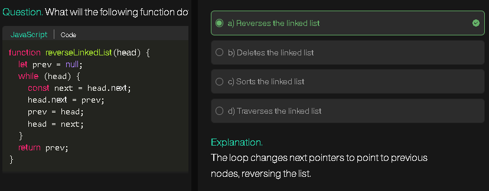
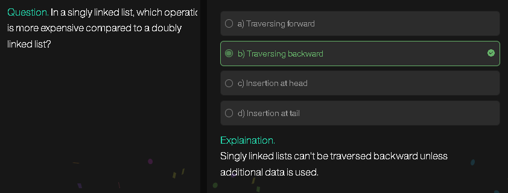
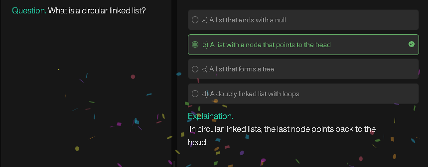
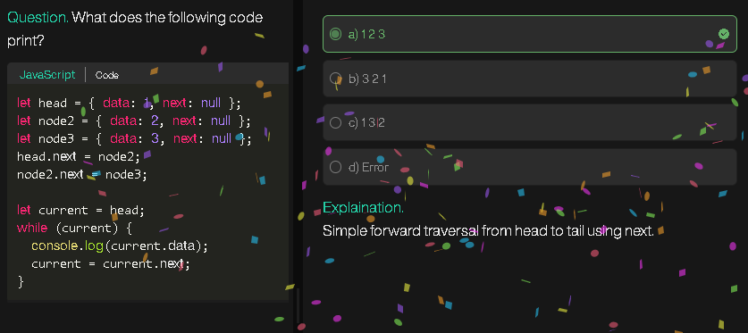
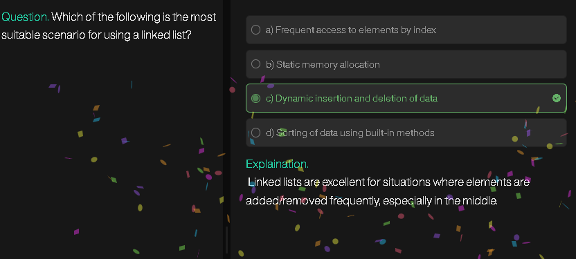

# **LeetCode 141: Linked List Cycle**

## **Problem Explanation**

You are given the `head` of a linked list. You need to determine if the linked list contains a **cycle**. A cycle occurs if a node's `next` pointer points back to a previous node in the list, creating a loop.

* **Input:** `head` of a linked list
* **Output:** `true` if there is a cycle, otherwise `false`.

**Example 1:**

```
Input: head = [3,2,0,-4], pos = 1
Output: true
Explanation: Node -4 points back to node 2, forming a cycle.
```

**Example 2:**

```
Input: head = [1,2], pos = 0
Output: true
Explanation: Node 2 points back to node 1, forming a cycle.
```

**Example 3:**

```
Input: head = [1], pos = -1
Output: false
Explanation: Single node with no cycle.
```

---

## **Algorithm / Steps**

**Approach:** Use a **Set** to track visited nodes.

1. Initialize an empty `Set` called `visited`.
2. Start from `temp = head`.
3. Traverse the list:

   * If `temp` is already in `visited`, **return true** (cycle detected).
   * Otherwise, add `temp` to `visited`.
   * Move to the next node (`temp = temp.next`).
4. If you reach the end of the list (`temp == null`), **return false** (no cycle).

---

## **Pseudocode**

```
FUNCTION hasCycle(head):
    CREATE an empty set visited
    SET temp = head
    
    WHILE temp is not null:
        IF temp exists in visited:
            RETURN true
        ADD temp to visited
        SET temp = temp.next
    
    RETURN false
```

---

## **Flowchart Diagram**

```
   Start
     |
     v
   temp = head
     |
     v
   Is temp == null? ---> Yes ---> Return false
     |
     No
     v
   Is temp in visited? ---> Yes ---> Return true
     |
     No
     v
   Add temp to visited
     |
     v
   temp = temp.next
     |
     v
   Go back to "Is temp == null?"
```

---

## **JavaScript Code**

```javascript
var hasCycle = function(head) {
    let visited = new Set();
    let temp = head;

    while(temp !== null){
        if(visited.has(temp)) return true;
        visited.add(temp);
        temp = temp.next;
    }

    return false;
};
```

---

## **Example Walkthrough**

**Input:** `head = [3,2,0,-4], pos = 1`

**Step-by-Step:**

1. `visited = {}`
2. `temp = 3` → not in `visited` → add 3 → `visited = {3}` → move next
3. `temp = 2` → not in `visited` → add 2 → `visited = {3,2}` → move next
4. `temp = 0` → not in `visited` → add 0 → `visited = {3,2,0}` → move next
5. `temp = -4` → not in `visited` → add -4 → `visited = {3,2,0,-4}` → move next
6. `temp = 2` → **already in `visited`** → return `true`

Cycle detected! ✅

---
# **LeetCode 83: Remove Duplicates from Sorted List**

## **Problem Explanation**

You are given the `head` of a **sorted linked list**. Remove all **duplicate values** such that each element appears **only once**.

* **Input:** `head` of a sorted linked list
* **Output:** `head` of the modified list with duplicates removed

**Example 1:**

```
Input: head = [1,1,2]
Output: [1,2]
```

**Example 2:**

```
Input: head = [1,1,2,3,3]
Output: [1,2,3]
```

---

## **Algorithm / Steps**

**Approach:** Use a **Set** to track values that are already added to the new list.

1. If the list is empty (`head == null`), return null.
2. Create a dummy node `finalList` with `next = head`.
3. Initialize two pointers:

   * `prev = finalList`
   * `temp = head`
4. Traverse the list:

   * If `temp.val` is already in the set:

     * Skip this node: `prev.next = temp.next`
   * Otherwise:

     * Add `temp.val` to the set
     * Move `prev = temp`
   * Move `temp = temp.next`
5. Return `finalList.next` (head of modified list)

---

## **Pseudocode**

```
FUNCTION deleteDuplicates(head):
    IF head is null:
        RETURN null
    
    CREATE an empty set visited
    CREATE dummy node finalList with next = head
    SET prev = finalList
    SET temp = head
    
    WHILE temp is not null:
        IF temp.val in visited:
            prev.next = temp.next
        ELSE:
            ADD temp.val to visited
            prev = temp
        temp = temp.next
    
    RETURN finalList.next
```

---

## **Flowchart Diagram**

```
   Start
     |
     v
   Is head == null? ---> Yes ---> Return null
     |
     No
     v
   finalList = dummy node with next=head
   prev = finalList
   temp = head
     |
     v
   Is temp == null? ---> Yes ---> Return finalList.next
     |
     No
     v
   Is temp.val in visited? ---> Yes ---> prev.next = temp.next
     | No
     v
   Add temp.val to visited
   prev = temp
     |
     v
   temp = temp.next
     |
     v
   Go back to "Is temp == null?"
```

---

## **JavaScript Code**

```javascript
var deleteDuplicates = function(head) {
    if(!head) return null;

    let visited = new Set();
    let finalList = { next: head };
    let prev = finalList;
    let temp = head;

    while(temp !== null){
        if(visited.has(temp.val)){
            prev.next = temp.next;
        } else {
            visited.add(temp.val);
            prev = temp;
        }
        temp = temp.next;
    }

    return finalList.next;
};
```

---

## **Example Walkthrough**

**Input:** `[1,1,2,3,3]`

1. `visited = {}`
2. `temp = 1` → not in `visited` → add 1 → `visited = {1}` → prev = 1 → move next
3. `temp = 1` → already in `visited` → skip → prev.next = temp.next → move next
4. `temp = 2` → not in `visited` → add 2 → `visited = {1,2}` → prev = 2 → move next
5. `temp = 3` → not in `visited` → add 3 → `visited = {1,2,3}` → prev = 3 → move next
6. `temp = 3` → already in `visited` → skip → prev.next = temp.next → move next

**Output:** `[1,2,3]` ✅

---

# **LeetCode 2: Add Two Numbers**

## **Problem Explanation**

You are given **two non-empty linked lists** representing two non-negative integers. The digits are stored in **reverse order**, and each node contains a single digit. Add the two numbers and return the sum as a linked list in the **same reverse order**.

* **Input:** `l1` and `l2` (linked lists)
* **Output:** `head` of the linked list representing the sum

**Example 1:**

```
Input: l1 = [2,4,3], l2 = [5,6,4]
Output: [7,0,8]
Explanation: 342 + 465 = 807 (reversed: 7->0->8)
```

**Example 2:**

```
Input: l1 = [0], l2 = [0]
Output: [0]
```

**Example 3:**

```
Input: l1 = [9,9,9,9,9,9,9], l2 = [9,9,9,9]
Output: [8,9,9,9,0,0,0,1]
```

---

## **Algorithm / Steps**

**Approach:** Traverse both lists, digit by digit, and maintain a `carry`.

1. Create a dummy node `finalListHead` to store the result.
2. Initialize `temp = finalListHead` and `carry = 0`.
3. Traverse both lists simultaneously:

   * If a list is exhausted, use 0 for its value.
   * Compute `sum = n1 + n2 + carry`.
   * Update `carry = Math.floor(sum / 10)`.
   * Create a new node with value `sum % 10` and attach to `temp.next`.
   * Move `temp` to `temp.next`.
   * Move `l1` and `l2` to their `next` nodes if they exist.
4. After traversal, if `carry > 0`, add a new node with `carry`.
5. Return `finalListHead.next`.

---

## **Pseudocode**

```
FUNCTION addTwoNumbers(l1, l2):
    CREATE dummy node finalListHead
    SET temp = finalListHead
    SET carry = 0

    WHILE l1 is not null OR l2 is not null:
        n1 = (l1 is not null) ? l1.val : 0
        n2 = (l2 is not null) ? l2.val : 0
        sum = n1 + n2 + carry
        carry = sum / 10 (integer division)
        temp.next = new node with value (sum % 10)
        temp = temp.next
        IF l1 exists, l1 = l1.next
        IF l2 exists, l2 = l2.next

    IF carry > 0:
        temp.next = new node with value carry

    RETURN finalListHead.next
```

---

## **Flowchart Diagram**

```
       Start
         |
         v
   finalListHead = dummy node
   temp = finalListHead
   carry = 0
         |
         v
  Is l1 != null OR l2 != null? ---> No ---> Check carry
         | Yes
         v
  n1 = (l1 != null)? l1.val : 0
  n2 = (l2 != null)? l2.val : 0
  sum = n1 + n2 + carry
  carry = floor(sum / 10)
  temp.next = new node(sum % 10)
  temp = temp.next
  Move l1 and l2 to next if they exist
         |
         v
      Repeat
         |
         v
  IF carry > 0 ---> temp.next = new node(carry)
         |
         v
       Return finalListHead.next
```

---

## **JavaScript Code**

```javascript
var addTwoNumbers = function(l1, l2) {
    let finalListHead = new ListNode(0);
    let temp = finalListHead;
    let carry = 0;

    while(l1 !== null || l2 !== null){
        let n1 = (l1 !== null) ? l1.val : 0;
        let n2 = (l2 !== null) ? l2.val : 0;
        let sum = n1 + n2 + carry;
        carry = Math.floor(sum / 10);
        temp.next = new ListNode(sum % 10);
        temp = temp.next;

        if(l1) l1 = l1.next;
        if(l2) l2 = l2.next;
    }

    if(carry > 0){
        temp.next = new ListNode(carry);
    }

    return finalListHead.next;
};
```

---

## **Example Walkthrough**

**Input:** `l1 = [2,4,3], l2 = [5,6,4]`

1. `carry = 0`
2. First digits: 2 + 5 + 0 = 7 → node = 7 → carry = 0
3. Second digits: 4 + 6 + 0 = 10 → node = 0 → carry = 1
4. Third digits: 3 + 4 + 1 = 8 → node = 8 → carry = 0

**Output:** `[7,0,8]` ✅

---






