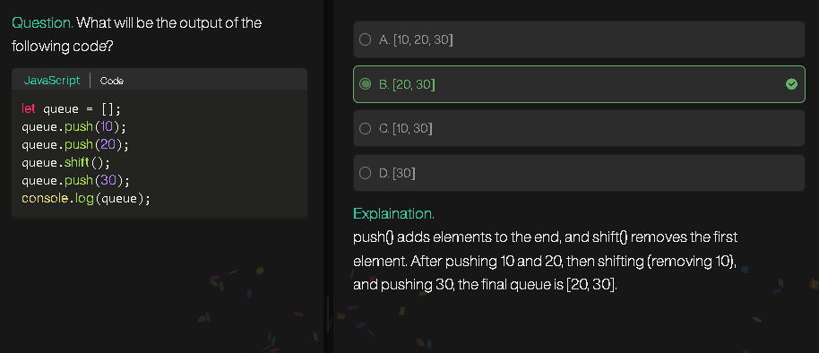
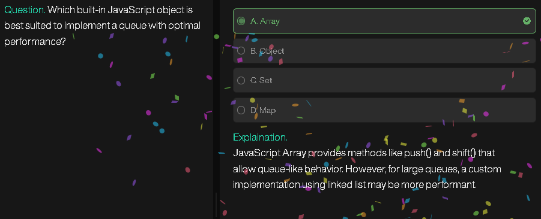
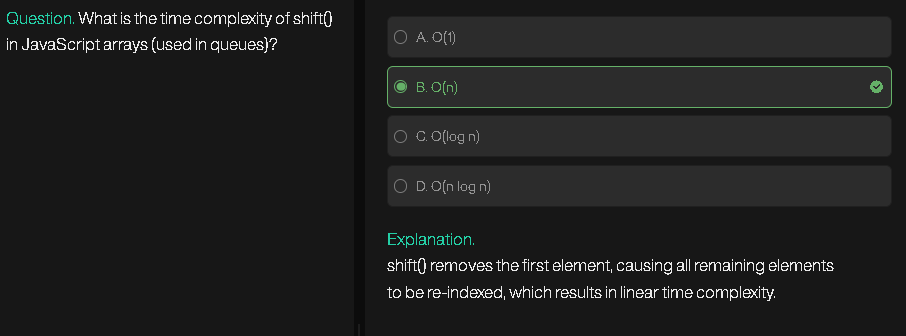
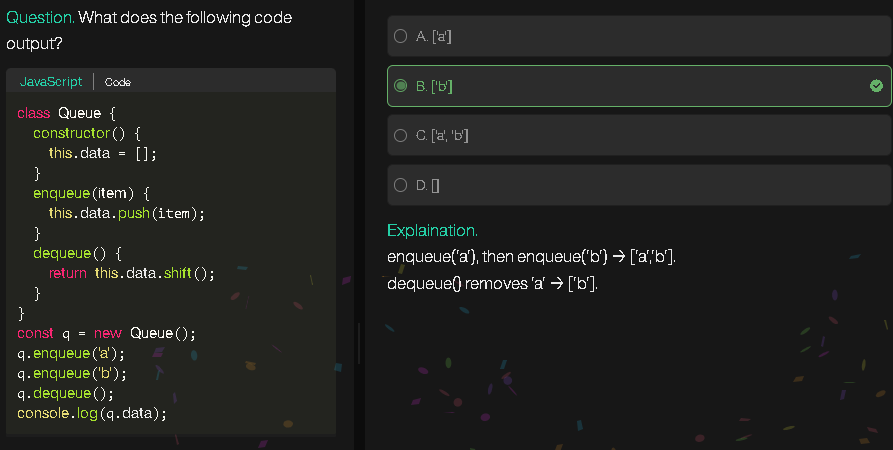
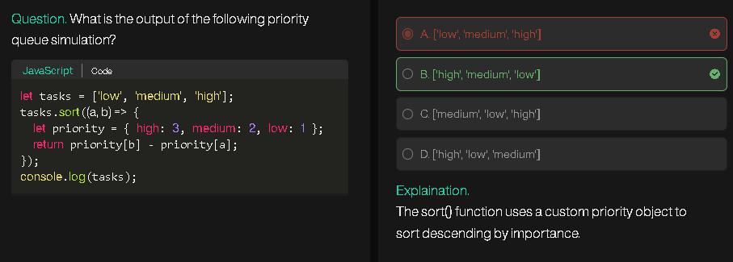

# Queue Reversal

---

### 📘 Explanation

We are given a queue. We need to reverse the order of elements.
The easiest way:

* Remove all elements from the queue and push them into a **stack**.
* A stack works in **LIFO (Last In, First Out)** order, so popping from stack will give elements in reverse order.
* Put those elements back into the queue.

---

### 📝 Algorithm (Step-by-step)

1. Create an empty stack.
2. Traverse the queue and push every element into the stack.
3. Empty the stack by popping elements one by one and putting them back into the queue.
4. The queue will now be reversed.

---

### 🔑 Pseudocode

```
function reverseQueue(queue):
    stack = empty stack
    
    for each element in queue:
        push element into stack
    
    index = 0
    while stack is not empty:
        queue[index] = pop from stack
        index = index + 1
    
    return queue
```

---

### 🧮 Dry Run

Queue: [1, 2, 3, 4, 5]

**Step 1: Push into stack**
stack = [1, 2, 3, 4, 5]

**Step 2: Pop from stack and put back into queue**
Pop 5 → queue[0] = 5 → [5, 2, 3, 4, 5]
Pop 4 → queue[1] = 4 → [5, 4, 3, 4, 5]
Pop 3 → queue[2] = 3 → [5, 4, 3, 4, 5]
Pop 2 → queue[3] = 2 → [5, 4, 3, 2, 5]
Pop 1 → queue[4] = 1 → [5, 4, 3, 2, 1]

✅ Final Queue = [5, 4, 3, 2, 1]

---

### 🖼️ Flowchart

```
          ┌────────────┐
          │ Start       │
          └─────┬──────┘
                │
        ┌───────▼────────┐
        │ Initialize stack│
        └───────┬────────┘
                │
   ┌────────────▼────────────┐
   │ For each element in queue│
   │   push into stack        │
   └────────────┬────────────┘
                │
   ┌────────────▼──────────┐
   │ While stack not empty │
   │   pop element         │
   │   put back in queue   │
   └────────────┬──────────┘
                │
          ┌─────▼─────┐
          │ End/Return │
          └────────────┘
```

---

### 👦 Explanation for a 10-year-old Indian kid

Imagine you have a line of friends standing in order to get ice cream:
👉 [A, B, C, D, E]

Now, you want them to stand **in reverse order**.

Trick:

* Tell each one to sit inside a box one by one (this is the **stack**).
* Since the last person to go inside will come out **first**, they will naturally come out in reverse order.
* Put them back in line, and boom! Line is reversed.

---

### ✨ Easy Second Look (Beginner’s view)

* Queue → Line of people.
* Stack → A box where last person in comes out first.
* Push all from queue to stack → then pop from stack to queue.
* That’s it → Queue reversed!

---


# Next Greater Element

---

### 📘 Explanation

We are given an array. For each element, we need to find the **next greater element** (NGE) to its right.

* If no greater element exists on the right, answer is `-1`.
* Example: For [4, 5, 2, 25] → Output: [5, 25, 25, -1].

We solve this using a **stack** efficiently.

---

### 📝 Algorithm (Step-by-step)

1. Create an empty stack.
2. Traverse array **from right to left**.
3. For each element:

   * Pop elements from stack **smaller or equal** to current element.
   * If stack becomes empty → no greater element → store `-1`.
   * Else → top of stack is the **next greater element**.
   * Push current element into stack.
4. Return the answer array.

---

### 🔑 Pseudocode

```
function nextGreater(arr):
    stack = empty stack
    ans = array of size n
    
    for i = n-1 down to 0:
        while stack not empty AND stack.top() <= arr[i]:
            stack.pop()
        
        if stack is empty:
            ans[i] = -1
        else:
            ans[i] = stack.top()
        
        stack.push(arr[i])
    
    return ans
```

---

### 🧮 Dry Run

Input: [4, 5, 2, 25]

* Start from right →

i=3 → element=25
stack empty → ans[3] = -1 → push 25 → stack=[25]

i=2 → element=2
stack top=25 > 2 → ans[2]=25 → push 2 → stack=[25,2]

i=1 → element=5
pop 2 (≤5), stack top=25 > 5 → ans[1]=25 → push 5 → stack=[25,5]

i=0 → element=4
stack top=5 > 4 → ans[0]=5 → push 4 → stack=[25,5,4]

✅ Output = [5, 25, 25, -1]

---

### 🖼️ Flowchart

```
          ┌────────────┐
          │ Start       │
          └─────┬──────┘
                │
        ┌───────▼───────────┐
        │ Initialize stack   │
        │ Initialize ans[]   │
        └────────┬──────────┘
                 │
   ┌─────────────▼───────────────┐
   │ For i = n-1 down to 0       │
   │   While stack.top <= arr[i] │
   │       Pop stack             │
   └─────────────┬───────────────┘
                 │
   ┌─────────────▼─────────────┐
   │ If stack empty → ans[i]=-1│
   │ Else ans[i]=stack.top     │
   │ Push arr[i] into stack    │
   └─────────────┬─────────────┘
                 │
          ┌──────▼───────┐
          │ Return ans[] │
          └──────────────┘
```

---

### 👦 Explanation for a 10-year-old Indian kid

Imagine you are standing in a line with some height numbers written on people’s shirts.
You want to know for each person: “Who is the **first taller person** standing to my right?”

👉 Steps:

* Start looking from the last person (because no one is to their right).
* Keep a basket (stack) where you store possible taller people.
* If someone is shorter or equal, remove them from the basket.
* The first taller guy left in the basket is the answer.
* If basket empty → answer is `-1`.

---

### ✨ Easy Second Look (Beginner’s view)

* Go from **right to left**.
* Use a **stack** to keep track of “taller people”.
* Pop smaller ones, top is answer.
* If empty → `-1`.

That’s it → Next Greater Element solved easily!

---

# Next Smaller on Left

---

### 📘 Explanation

We are given an array. For each element, we need to find the **nearest smaller element on the left side**.

* If no smaller element exists to the left, answer is `-1`.
* Example: For [1, 6, 4, 10, 2, 5] → Output: [-1, 1, 1, 4, 1, 2].

We use a **stack** to solve this efficiently.

---

### 📝 Algorithm (Step-by-step)

1. Create an empty stack.
2. Traverse array **from left to right**.
3. For each element:

   * Pop elements from stack **greater or equal** to current element.
   * If stack becomes empty → no smaller element on left → store `-1`.
   * Else → top of stack is the **next smaller on left**.
   * Push current element into stack.
4. Return the answer array.

---

### 🔑 Pseudocode

```
function leftSmaller(arr):
    stack = empty stack
    ans = array of size n
    
    for i = 0 to n-1:
        while stack not empty AND stack.top() >= arr[i]:
            stack.pop()
        
        if stack is empty:
            ans[i] = -1
        else:
            ans[i] = stack.top()
        
        stack.push(arr[i])
    
    return ans
```

---

### 🧮 Dry Run

Input: [1, 6, 4, 10, 2, 5]

i=0 → element=1
stack empty → ans[0]=-1 → push 1 → stack=[1]

i=1 → element=6
stack top=1 < 6 → ans[1]=1 → push 6 → stack=[1,6]

i=2 → element=4
stack top=6 ≥ 4 → pop 6
stack top=1 < 4 → ans[2]=1 → push 4 → stack=[1,4]

i=3 → element=10
stack top=4 < 10 → ans[3]=4 → push 10 → stack=[1,4,10]

i=4 → element=2
stack top=10 ≥ 2 → pop 10
stack top=4 ≥ 2 → pop 4
stack top=1 < 2 → ans[4]=1 → push 2 → stack=[1,2]

i=5 → element=5
stack top=2 < 5 → ans[5]=2 → push 5 → stack=[1,2,5]

✅ Output = [-1, 1, 1, 4, 1, 2]

---

### 🖼️ Flowchart

```
          ┌────────────┐
          │ Start       │
          └─────┬──────┘
                │
        ┌───────▼───────────┐
        │ Initialize stack   │
        │ Initialize ans[]   │
        └────────┬──────────┘
                 │
   ┌─────────────▼───────────────┐
   │ For i = 0 to n-1            │
   │   While stack.top >= arr[i] │
   │       Pop stack             │
   └─────────────┬───────────────┘
                 │
   ┌─────────────▼─────────────┐
   │ If stack empty → ans[i]=-1│
   │ Else ans[i]=stack.top     │
   │ Push arr[i] into stack    │
   └─────────────┬─────────────┘
                 │
          ┌──────▼───────┐
          │ Return ans[] │
          └──────────────┘
```

---

### 👦 Explanation for a 10-year-old Indian kid

Think of people standing in a line from **left to right**. Each has a number on their shirt.
For every person, you ask:
👉 “Who is the **first smaller person standing on my left side**?”

How to do it smartly:

* Keep a basket (stack) where you store left-side people.
* If someone is taller or equal, throw them out of basket.
* The person left at the top of basket is your answer.
* If basket empty → no smaller on left → `-1`.

---

### ✨ Easy Second Look (Beginner’s view)

* Traverse from **left to right**.
* Use **stack** for storing smaller elements.
* Pop bigger ones, top is answer.
* If empty → `-1`.

That’s it → Next Smaller on Left done!

---

# Stock Span Problem

---

### 📘 Explanation

We are given stock prices for `n` days. For each day, we need to calculate the **span** → the number of consecutive days before that day (including current day) where stock price was **less than or equal** to today’s price.

Example:
Prices = [100, 80, 60, 70, 60, 75, 85]
Spans = [1, 1, 1, 2, 1, 4, 6]

We solve this using a **stack** of indices.

---

### 📝 Algorithm (Step-by-step)

1. Create an empty stack.
2. Traverse the array from **left to right**.
3. For each day `i`:

   * Pop indices from stack while price at those indices ≤ price[i].
   * If stack becomes empty → span = i+1 (all days before are smaller).
   * Else → span = i - index at top of stack.
   * Push current day’s index into stack.
4. Return spans array.

---

### 🔑 Pseudocode

```
function calculateSpan(prices):
    stack = empty stack
    span = array of size n
    
    for i = 0 to n-1:
        while stack not empty AND prices[stack.top()] <= prices[i]:
            stack.pop()
        
        if stack is empty:
            span[i] = i + 1
        else:
            span[i] = i - stack.top()
        
        stack.push(i)
    
    return span
```

---

### 🧮 Dry Run

Prices = [100, 80, 60, 70, 60, 75, 85]

Day 0: price=100 → stack empty → span=1 → push(0) → stack=[0]
Day 1: price=80 → top=100>80 → span=1 → push(1) → stack=[0,1]
Day 2: price=60 → top=80>60 → span=1 → push(2) → stack=[0,1,2]
Day 3: price=70 → top=60≤70 → pop(2), new top=80>70 → span=3-1=2 → push(3) → stack=[0,1,3]
Day 4: price=60 → top=70>60 → span=1 → push(4) → stack=[0,1,3,4]
Day 5: price=75 → top=60≤75 → pop(4), top=70≤75 → pop(3), top=80>75 → span=5-1=4 → push(5) → stack=[0,1,5]
Day 6: price=85 → top=75≤85 → pop(5), top=80≤85 → pop(1), top=100>85 → span=6-0=6 → push(6) → stack=[0,6]

✅ Spans = [1, 1, 1, 2, 1, 4, 6]

---

### 🖼️ Flowchart

```
          ┌────────────┐
          │ Start       │
          └─────┬──────┘
                │
        ┌───────▼───────────┐
        │ Initialize stack   │
        │ Initialize spans[] │
        └────────┬──────────┘
                 │
   ┌─────────────▼───────────────┐
   │ For i = 0 to n-1            │
   │   While stack not empty AND │
   │   prices[stack.top()]<=p[i] │
   │       Pop stack             │
   └─────────────┬───────────────┘
                 │
   ┌─────────────▼─────────────┐
   │ If stack empty → span=i+1 │
   │ Else span=i-stack.top()   │
   │ Push i into stack         │
   └─────────────┬─────────────┘
                 │
          ┌──────▼───────┐
          │ Return spans │
          └──────────────┘
```

---

### 👦 Explanation for a 10-year-old Indian kid

Imagine stock prices written on a blackboard for each day.
For today’s price, you ask:
👉 “How many days in a row before today (including today) were prices **not bigger** than today’s price?”

Trick:

* Use a basket (stack) to remember earlier days.
* Remove days where prices are **smaller or equal**.
* The nearest bigger price (on left) tells us where span stops.
* If no bigger price → span = all days till today.

---

### ✨ Easy Second Look (Beginner’s view)

* Move **left to right**.
* Use stack to keep track of “previous bigger days”.
* If none → span = i+1.
* Else → span = difference of indices.

That’s it → Stock Span problem solved easily!

---






