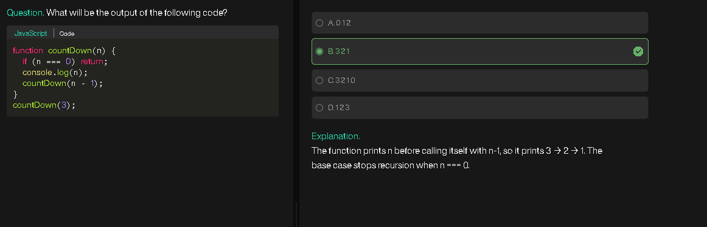
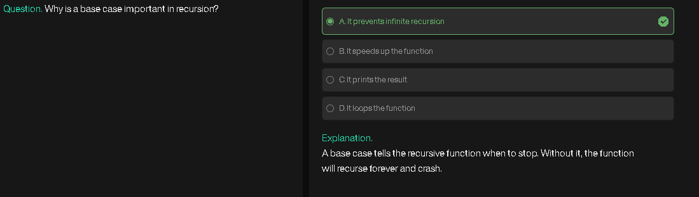
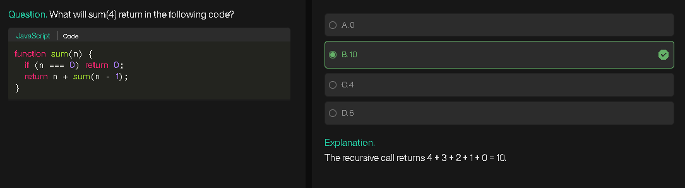
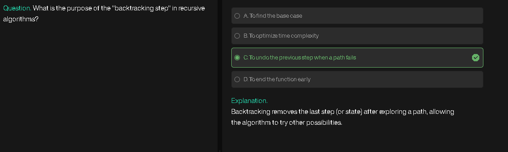
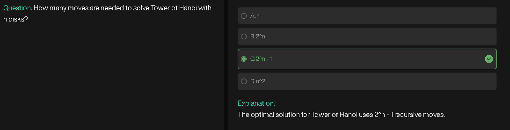

# **Tower of Hanoi** 

## **1. Problem Understanding**

The Tower of Hanoi is a classic recursion problem.
We have:

* **3 rods (pegs)**: `from`, `to`, and `aux`.
* **n disks** of different sizes stacked on the `from` rod (largest at bottom, smallest at top).
  **Goal:** Move all disks from `from` to `to`, following these rules:

1. Only one disk can be moved at a time.
2. A disk can only be placed on top of a larger disk (never on a smaller one).
3. Use the auxiliary rod as a helper.

---

## **2. Approach**

The idea is **divide and conquer with recursion**:

* Move `n-1` disks from `from` → `aux`.
* Move the largest disk (`nth`) directly from `from` → `to`.
* Move the `n-1` disks from `aux` → `to`.

This breaks the problem into **smaller subproblems** until the base case (`n=1`).

---

## **3. Algorithm**

1. **Base case:**
   If `n = 1`:

   * Move disk 1 from `from` to `to`.
   * Done.

2. **Recursive case:**

   * Move `n-1` disks from `from` → `aux` using `to` as helper.
   * Move the `nth` disk from `from` → `to`.
   * Move the `n-1` disks from `aux` → `to` using `from` as helper.

3. **Number of moves:**
   Formula = `2^n - 1`.

---

## **4. Pseudocode**

```
FUNCTION TowerOfHanoi(n, from, to, aux):
    IF n == 1:
        PRINT "Move disk 1 from from → to"
        RETURN
    END IF

    TowerOfHanoi(n-1, from, aux, to)
    PRINT "Move disk n from from → to"
    TowerOfHanoi(n-1, aux, to, from)
END FUNCTION
```

---

## **5. Flowchart**

```
          ┌───────────────┐
          │ TowerOfHanoi  │
          │  (n, from,to,aux) │
          └───────┬───────┘
                  │
          n == 1 ?│───────────────► Yes ──► Print "Move disk 1 from → to"
                  │
                 No
                  │
        ┌────────────────────┐
        │ TowerOfHanoi(n-1,  │
        │ from, aux, to)     │
        └─────────┬──────────┘
                  │
     ┌────────────┴─────────────┐
     │ Print "Move disk n       │
     │ from → to"               │
     └────────────┬─────────────┘
                  │
        ┌────────────────────┐
        │ TowerOfHanoi(n-1,  │
        │ aux, to, from)     │
        └────────────────────┘
```

---

## **6. Dry Run Example (n=3)**

* **Call:** `TowerOfHanoi(3, A, C, B)`

1. Move 2 disks from A → B (using C):

   * Move 1 disk from A → C.
   * Move disk 2 from A → B.
   * Move disk 1 from C → B.

2. Move disk 3 from A → C.

3. Move 2 disks from B → C (using A):

   * Move disk 1 from B → A.
   * Move disk 2 from B → C.
   * Move disk 1 from A → C.

**Output sequence:**

```
Move disk 1 from A → C
Move disk 2 from A → B
Move disk 1 from C → B
Move disk 3 from A → C
Move disk 1 from B → A
Move disk 2 from B → C
Move disk 1 from A → C
```

**Total moves = 7 = 2³ - 1.**

---

# **Josephus Problem**

## **1. Problem Understanding**

The Josephus Problem is a **classic elimination problem**:

* **Setup:** `n` people standing in a circle, numbered `1` to `n`.
* **Process:** Starting from position `1`, every `k`th person is eliminated from the circle.
* **Goal:** Determine the **last remaining person**.

**Example:**
`n = 5, k = 2` → Elimination order: 2, 4, 1, 5 → Winner = 3

---

## **2. Approach**

The solution uses **recursion with an array**:

1. Keep track of people in a list `arr`.
2. Start from an index `i`.
3. Compute the **next person to remove**: `(i + k) % arr.length`.
4. Remove that person from `arr`.
5. Recursively repeat until only one person is left.

---

## **3. Algorithm**

1. Create an array `arr = [1, 2, …, n]`.
2. Convert `k` to zero-based indexing: `k = k - 1`.
3. Initialize `i = 0` (starting index).
4. Recursive function `answer(k, arr, i)`:

   * **Base case:** If `arr.length == 1`, return the only element.
   * Compute next index to remove: `i = (i + k) % arr.length`.
   * Remove `arr[i]`.
   * Recur with updated `arr` and index `i`.
5. Return the final remaining person.

---

## **4. Pseudocode**

```
FUNCTION Josephus(n, k):
    arr = [1, 2, ..., n]
    k = k - 1
    RETURN answer(k, arr, 0)

FUNCTION answer(k, arr, i):
    IF length(arr) == 1:
        RETURN arr[0]
    END IF

    i = (i + k) % length(arr)
    REMOVE arr[i]       // Eliminate person
    RETURN answer(k, arr, i)
END FUNCTION
```

---

## **5. Flowchart**

```
Start Josephus(n, k)
       │
  Create arr[1..n]
       │
    k = k - 1
       │
    Call answer(k, arr, 0)
       │
   ┌───────────────┐
   │ answer(k,arr,i) │
   └───────┬───────┘
           │
    arr.length == 1 ?
       ├── Yes ──► Return arr[0]
       │
       No
       │
 i = (i + k) % arr.length
       │
 Remove arr[i]
       │
 Recur answer(k, arr, i)
```

---

## **6. Dry Run Example**

**Input:** `n = 5, k = 2`
**Initial array:** `[1, 2, 3, 4, 5]`

1. Start at `i=0`, `k=1` (0-based).
   Remove `(0+1)%5 = 1` → Remove `2` → `[1,3,4,5]`
2. `i=1`, Remove `(1+1)%4 = 2` → Remove `4` → `[1,3,5]`
3. `i=2`, Remove `(2+1)%3 = 0` → Remove `1` → `[3,5]`
4. `i=0`, Remove `(0+1)%2 = 1` → Remove `5` → `[3]`
5. Only one person left → Winner = `3`

---

## **7. Key Notes**

* This approach **mimics the circular elimination** using modular arithmetic.
* Time complexity: **O(n²)** (because of array splicing).
* Space complexity: **O(n)** (due to array and recursion stack).
* There’s also a **mathematical O(n) solution** using recursion without arrays, similar to `findTheWinner` in your next code snippet.

---

# **LeetCode 1823: Find the Winner of the Circular Game**

## **1. Problem Understanding**

This problem is essentially the **Josephus problem**, rephrased:

* **n players** arranged in a circle numbered `1` to `n`.
* Starting from player `1`, every `k`th player is **eliminated**.
* Continue until **only one player remains**.
* **Return the winner’s number**.

**Difference from classical Josephus:**

* The solution uses **mathematical recursion** instead of manipulating arrays.

---

## **2. Approach**

The idea is **recursive elimination using index math**:

1. Base case: If only one person remains (`n=1`), return index `0` (0-based).
2. For `n > 1`:

   * Recursively find the winner among `n-1` people.
   * Adjust the winner’s position to account for the eliminated person using:
     `(previous_winner + k) % n`
3. Convert the 0-based index to 1-based index before returning.

This eliminates the need for arrays and reduces time complexity.

---

## **3. Algorithm**

1. Define `answer(n, k)`:

   * If `n == 1`, return `0`.
   * Else, return `(answer(n-1, k) + k) % n`.
2. Call `answer(n, k)` and add `1` to convert 0-based → 1-based.
3. Return the result.

---

## **4. Pseudocode**

```
FUNCTION findTheWinner(n, k):
    winner_index = answer(n, k)
    RETURN winner_index + 1       // Convert 0-based to 1-based

FUNCTION answer(n, k):
    IF n == 1:
        RETURN 0
    END IF
    RETURN (answer(n-1, k) + k) % n
END FUNCTION
```

---

## **5. Flowchart**

```
Start findTheWinner(n, k)
       │
    Call answer(n, k)
       │
  ┌───────────────┐
  │ answer(n,k)   │
  └───────┬───────┘
          │
  n == 1 ?│─────────► Yes ──► Return 0
          │
         No
          │
 Recur answer(n-1, k)
          │
 Return (previous_result + k) % n
          │
Back to findTheWinner
          │
Add 1 to convert index → Return winner
```

---

## **6. Dry Run Example**

**Input:** `n = 5, k = 2`

1. Recursive calls (0-based indexing):

   ```
   answer(5,2)
   └─> (answer(4,2)+2)%5
         └─> (answer(3,2)+2)%4
               └─> (answer(2,2)+2)%3
                     └─> (answer(1,2)) = 0
   ```
2. Resolve step by step:

   ```
   answer(2,2) = (0+2)%2 = 0
   answer(3,2) = (0+2)%3 = 2
   answer(4,2) = (2+2)%4 = 0
   answer(5,2) = (0+2)%5 = 2
   ```
3. Convert to 1-based → Winner = `2 + 1 = 3`.

**Winner:** `3` (same as Josephus example).

---

## **7. Key Notes**

* **Time Complexity:** O(n) → Only one recursion per call.
* **Space Complexity:** O(n) → Recursion stack.
* No array manipulation is required, making it **much faster** than the previous Josephus array solution.
* Directly uses **mathematical index calculation** for circular elimination.

---





