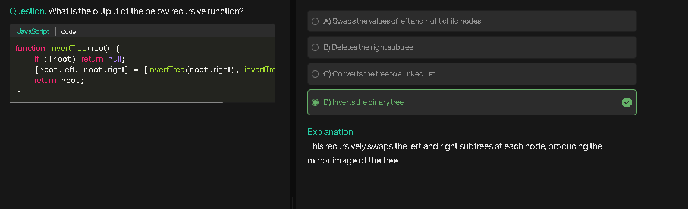
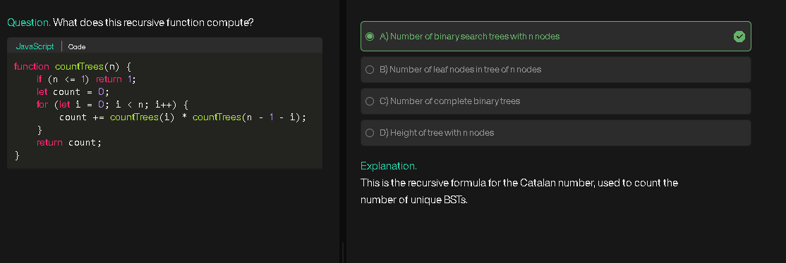
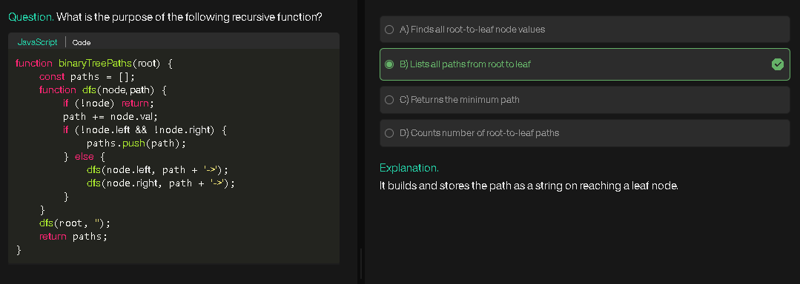
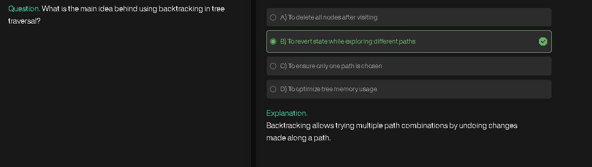
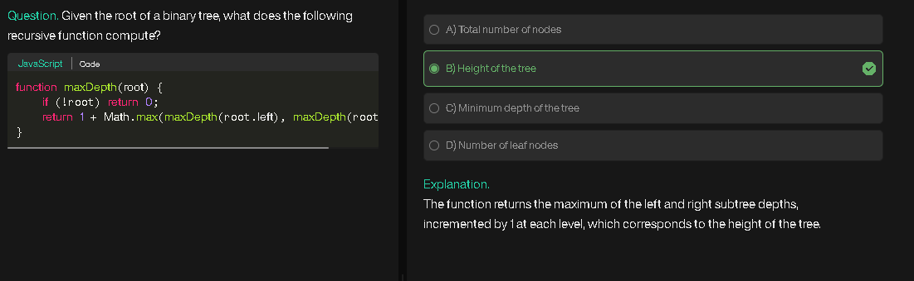

# Building a Binary Tree with Traversals

## Overview

This program allows the user to **build a binary tree interactively** and perform three types of depth-first traversals: **Pre-order, Post-order, and In-order**.

---

## Approach

1. **Tree Construction**

   * Use recursion to build the tree.
   * Each node asks for its value from the user.
   * `-1` is used to indicate a **null node** (no child).

2. **Traversal Methods**

   * **Pre-order:** Root → Left → Right
   * **In-order:** Left → Root → Right
   * **Post-order:** Left → Right → Root

---

## Algorithm

### BuildTree Algorithm:

1. Ask user for a value.
2. If value is `-1`, return `null`.
3. Create a new node with the value.
4. Recursively build the left child.
5. Recursively build the right child.
6. Return the node.

### PreOrder Traversal Algorithm:

1. If node is null, return.
2. Print node value.
3. Traverse left child (recursive call).
4. Traverse right child (recursive call).

### InOrder Traversal Algorithm:

1. If node is null, return.
2. Traverse left child (recursive call).
3. Print node value.
4. Traverse right child (recursive call).

### PostOrder Traversal Algorithm:

1. If node is null, return.
2. Traverse left child (recursive call).
3. Traverse right child (recursive call).
4. Print node value.

---

## Pseudocode

### BuildTree

```
FUNCTION BuildTree():
    PROMPT "Enter Value: "
    READ data
    IF data == -1 THEN
        RETURN NULL
    
    node = CREATE_NODE(data)
    
    PRINT "Enter left data of", node.val
    node.left = BuildTree()  // recursively build left subtree
    
    PRINT "Enter right data of", node.val
    node.right = BuildTree() // recursively build right subtree
    
    RETURN node
```

### PreOrder Traversal

```
FUNCTION PreOrder(node):
    IF node == NULL THEN
        RETURN
    PRINT node.val       // visit root
    PreOrder(node.left)  // visit left subtree
    PreOrder(node.right) // visit right subtree
```

### InOrder Traversal

```
FUNCTION InOrder(node):
    IF node == NULL THEN
        RETURN
    InOrder(node.left)   // visit left subtree
    PRINT node.val       // visit root
    InOrder(node.right)  // visit right subtree
```

### PostOrder Traversal

```
FUNCTION PostOrder(node):
    IF node == NULL THEN
        RETURN
    PostOrder(node.left)   // visit left subtree
    PostOrder(node.right)  // visit right subtree
    PRINT node.val         // visit root
```

---

## Flowchart

```
          [Start]
             |
             v
    [Call BuildTree()]
             |
             v
      [Input value?]---->[-1]---->[Return NULL]
             |
           [Create Node]
             |
      ---------------------
      |                   |
[Build left subtree]   [Build right subtree]
      |                   |
      v                   v
    [Return node with left & right children]
             |
             v
          [Tree Built]
             |
             v
[Call PreOrder/InOrder/PostOrder Traversal]
             |
             v
          [Print values]
             |
             v
           [End]
```

---

## Dry Run Example

Suppose user inputs the following tree values:

```
Root: 1
Left of 1: 2
Left of 2: -1
Right of 2: -1
Right of 1: 3
Left of 3: -1
Right of 3: -1
```

### Constructed Tree:

```
       1
      / \
     2   3
```

### PreOrder Traversal:

```
1 → 2 → 3
```

### InOrder Traversal:

```
2 → 1 → 3
```

### PostOrder Traversal:

```
2 → 3 → 1
```

**Explanation of Dry Run:**

* The recursion goes **deep first** into left children until `-1` is encountered.
* After hitting null, it returns and constructs the right subtree.
* Traversals recursively visit nodes in the specified order.

---

# Binary Tree Inorder Traversal (LeetCode 94)

## Overview

This code snippet demonstrates **recursive inorder traversal** of a binary tree and returns the traversal as an **array**.

* **In-order Traversal:** Left → Root → Right

---

## Approach

1. **Recursive Traversal**

   * Base case: If node is `null`, return an empty array.
   * Recursively traverse the **left subtree** and store results.
   * Recursively traverse the **right subtree** and store results.
   * Combine results: `[left subtree values] + [root value] + [right subtree values]`.

2. **Alternative Approaches**

   * **DFS Recursive (with external array):** Maintain an external array to push values as you visit nodes.
   * **DFS Iterative (using stack):** Traverse iteratively using a stack to simulate recursion.

---

## Algorithm

1. If `root` is `null`, return `[]`.
2. Recursively call `inorderTraversal` on `root.left` and store in `left`.
3. Recursively call `inorderTraversal` on `root.right` and store in `right`.
4. Return combined array: `[...left, root.val, ...right]`.

---

## Pseudocode

```
FUNCTION inorderTraversal(root):
    // Base case: empty subtree
    IF root == NULL THEN
        RETURN empty array []
    
    // Traverse left subtree recursively
    left = inorderTraversal(root.left)
    
    // Traverse right subtree recursively
    right = inorderTraversal(root.right)
    
    // Combine left values, root value, and right values
    RETURN concatenate(left, [root.val], right)
```

**Commentary:**

* `left` holds all values from left subtree in in-order.
* `right` holds all values from right subtree in in-order.
* Using array spread (`...`) combines them into a single array in proper in-order sequence.

---

## Flowchart

```
           [Start: root node]
                  |
        [Is root null?]---Yes--->[Return []]
                  |
                  No
                  |
        [Traverse left subtree]
                  |
          [Traverse right subtree]
                  |
      [Combine left + root.val + right]
                  |
               [Return array]
```

---

## Dry Run Example

Input tree:

```
       1
        \
         2
        /
       3
```

**Step-by-step:**

1. `inorderTraversal(1)`

   * `left = inorderTraversal(null)` → `[]`
   * `right = inorderTraversal(2)`

2. `inorderTraversal(2)`

   * `left = inorderTraversal(3)`
   * `right = inorderTraversal(null)` → `[]`

3. `inorderTraversal(3)`

   * `left = inorderTraversal(null)` → `[]`
   * `right = inorderTraversal(null)` → `[]`
   * Return `[3]`

4. Combine results at 2: `left + [2] + right` → `[3,2]`

5. Combine results at 1: `left + [1] + right` → `[1,3,2]`

**Output:** `[1,3,2]`

This confirms the in-order traversal sequence: Left → Root → Right.

---

# Binary Tree Preorder Traversal (LeetCode 144)

## Overview

This code snippet demonstrates **recursive preorder traversal** of a binary tree and returns the traversal as an **array**.

* **Pre-order Traversal:** Root → Left → Right

---

## Approach

1. **Recursive Traversal**

   * Base case: If node is `null`, return an empty array.
   * Recursively traverse the **left subtree** and store results.
   * Recursively traverse the **right subtree** and store results.
   * Combine results: `[root value] + [left subtree values] + [right subtree values]`.

2. **Alternative Approaches**

   * **DFS Recursive (with external array):** Maintain an external array to push values as you visit nodes.
   * **DFS Iterative (using stack):** Traverse iteratively using a stack to simulate recursion.

---

## Algorithm

1. If `root` is `null`, return `[]`.
2. Recursively call `preorderTraversal` on `root.left` and store in `left`.
3. Recursively call `preorderTraversal` on `root.right` and store in `right`.
4. Return combined array: `[root.val, ...left, ...right]`.

---

## Pseudocode

```
FUNCTION preorderTraversal(root):
    // Base case: empty subtree
    IF root == NULL THEN
        RETURN empty array []
    
    // Traverse left subtree recursively
    left = preorderTraversal(root.left)
    
    // Traverse right subtree recursively
    right = preorderTraversal(root.right)
    
    // Combine root value, left values, and right values
    RETURN concatenate([root.val], left, right)
```

**Commentary:**

* `root.val` is visited **before** its subtrees.
* `left` contains all values from left subtree in pre-order.
* `right` contains all values from right subtree in pre-order.
* Array spread (`...`) merges them in correct order.

---

## Flowchart

```
           [Start: root node]
                  |
        [Is root null?]---Yes--->[Return []]
                  |
                  No
                  |
         [Visit root (store root.val)]
                  |
        [Traverse left subtree]
                  |
        [Traverse right subtree]
                  |
      [Combine root + left + right]
                  |
               [Return array]
```

---

## Dry Run Example

Input tree:

```
       1
        \
         2
        /
       3
```

**Step-by-step:**

1. `preorderTraversal(1)`

   * `root.val = 1`
   * `left = preorderTraversal(null)` → `[]`
   * `right = preorderTraversal(2)`

2. `preorderTraversal(2)`

   * `root.val = 2`
   * `left = preorderTraversal(3)`
   * `right = preorderTraversal(null)` → `[]`

3. `preorderTraversal(3)`

   * `root.val = 3`
   * `left = []`, `right = []`
   * Return `[3]`

4. Combine results at 2: `[2] + [3] + []` → `[2,3]`

5. Combine results at 1: `[1] + [] + [2,3]` → `[1,2,3]`

**Output:** `[1,2,3]`

This confirms the **pre-order traversal** sequence: Root → Left → Right.

---

# Binary Tree Postorder Traversal (LeetCode 145)

## Overview

This code snippet demonstrates **recursive postorder traversal** of a binary tree and returns the traversal as an **array**.

* **Post-order Traversal:** Left → Right → Root

---

## Approach

1. **Recursive Traversal**

   * Base case: If node is `null`, return an empty array.
   * Recursively traverse the **left subtree** and store results.
   * Recursively traverse the **right subtree** and store results.
   * Combine results: `[left subtree values] + [right subtree values] + [root value]`.

2. **Alternative Approaches**

   * **DFS Recursive (with external array):** Maintain an external array to push values in post-order.
   * **DFS Iterative (using stack):** Use a stack to traverse iteratively while simulating recursion.

---

## Algorithm

1. If `root` is `null`, return `[]`.
2. Recursively call `postorderTraversal` on `root.left` and store in `left`.
3. Recursively call `postorderTraversal` on `root.right` and store in `right`.
4. Return combined array: `[...left, ...right, root.val]`.

---

## Pseudocode

```
FUNCTION postorderTraversal(root):
    // Base case: empty subtree
    IF root == NULL THEN
        RETURN empty array []
    
    // Traverse left subtree recursively
    left = postorderTraversal(root.left)
    
    // Traverse right subtree recursively
    right = postorderTraversal(root.right)
    
    // Combine left values, right values, and root value
    RETURN concatenate(left, right, [root.val])
```

**Commentary:**

* Left subtree is processed **first**, then right subtree.
* Root is visited **last**.
* The array spread (`...`) merges the arrays in correct post-order sequence.

---

## Flowchart

```
           [Start: root node]
                  |
        [Is root null?]---Yes--->[Return []]
                  |
                  No
                  |
        [Traverse left subtree]
                  |
        [Traverse right subtree]
                  |
         [Visit root (store root.val)]
                  |
      [Combine left + right + root]
                  |
               [Return array]
```

---

## Dry Run Example

Input tree:

```
       1
        \
         2
        /
       3
```

**Step-by-step:**

1. `postorderTraversal(1)`

   * `left = postorderTraversal(null)` → `[]`
   * `right = postorderTraversal(2)`

2. `postorderTraversal(2)`

   * `left = postorderTraversal(3)`
   * `right = postorderTraversal(null)` → `[]`

3. `postorderTraversal(3)`

   * `left = []`, `right = []`
   * Return `[3]`

4. Combine results at 2: `left + right + root.val` → `[] + [3] + [2]` → `[3,2]`

5. Combine results at 1: `left + right + root.val` → `[] + [3,2] + [1]` → `[3,2,1]`

**Output:** `[3,2,1]`

This confirms the **post-order traversal** sequence: Left → Right → Root.

---

# Maximum Depth of Binary Tree (LeetCode 104)

## Overview

This code snippet calculates the **maximum depth (height)** of a binary tree using recursion.

* **Maximum depth:** The length of the longest path from the root node down to a leaf node.

---

## Approach

1. **Recursive Depth Calculation**

   * Base case: If node is `null`, depth is `0`.
   * Recursively compute the depth of the left subtree.
   * Recursively compute the depth of the right subtree.
   * The depth at the current node is `1 + max(leftDepth, rightDepth)`.

2. **Alternative Approaches**

   * **DFS recursive with external tracker:** Pass depth as a parameter and update a global max.
   * **DFS iterative using stack:** Use a stack to traverse nodes along with current depth.
   * **BFS (Level Order Traversal):** Count levels using a queue; the number of levels equals maximum depth.

---

## Algorithm

1. If `root` is `null`, return `0`.
2. Compute `left = maxDepth(root.left)`.
3. Compute `right = maxDepth(root.right)`.
4. Return `1 + max(left, right)`.

---

## Pseudocode

```
FUNCTION maxDepth(root):
    // Base case: empty node contributes 0 depth
    IF root == NULL THEN
        RETURN 0
    
    // Compute depth of left subtree recursively
    leftDepth = maxDepth(root.left)
    
    // Compute depth of right subtree recursively
    rightDepth = maxDepth(root.right)
    
    // Current node depth = 1 + maximum of left and right depths
    RETURN 1 + MAX(leftDepth, rightDepth)
```

**Commentary:**

* The `1` accounts for the current node.
* The `MAX(left, right)` ensures that the deepest path is considered.
* Recursion naturally propagates depths from leaves up to the root.

---

## Flowchart

```
           [Start: root node]
                  |
        [Is root null?]---Yes--->[Return 0]
                  |
                  No
                  |
        [Compute left subtree depth]
                  |
        [Compute right subtree depth]
                  |
     [Take maximum of left & right depths]
                  |
        [Add 1 for current node]
                  |
               [Return depth]
```

---

## Dry Run Example

Input tree:

```
       1
      / \
     2   3
    / 
   4
```

**Step-by-step:**

1. `maxDepth(1)`

   * `left = maxDepth(2)`
   * `right = maxDepth(3)`

2. `maxDepth(2)`

   * `left = maxDepth(4)`
   * `right = maxDepth(null)` → `0`

3. `maxDepth(4)`

   * `left = maxDepth(null)` → `0`
   * `right = maxDepth(null)` → `0`
   * Return `1 + max(0,0)` → `1`

4. Combine at 2: `1 + max(1,0)` → `2`

5. Combine at 3: `1 + max(0,0)` → `1`

6. Combine at 1: `1 + max(2,1)` → `3`

**Output:** `3`

This confirms that the **maximum depth of the tree is 3**.
