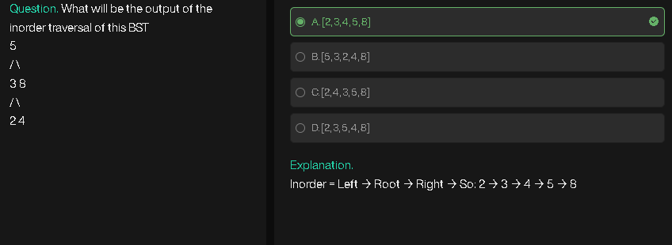
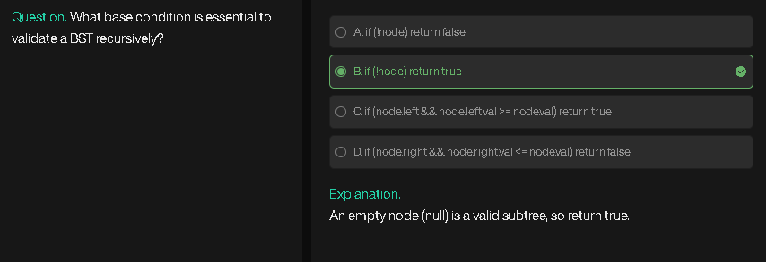
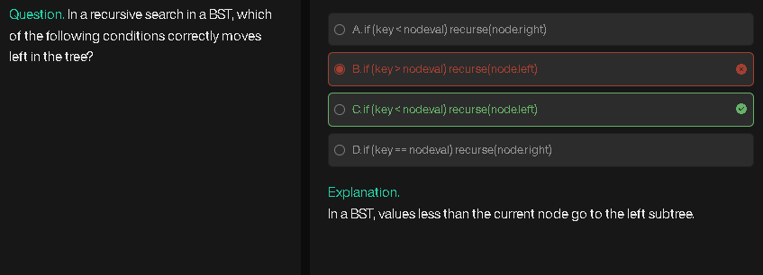
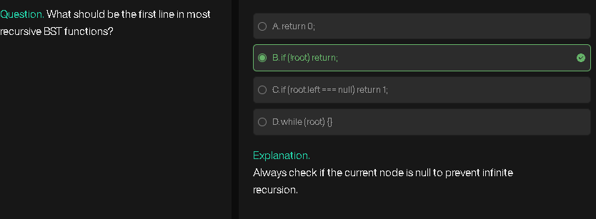
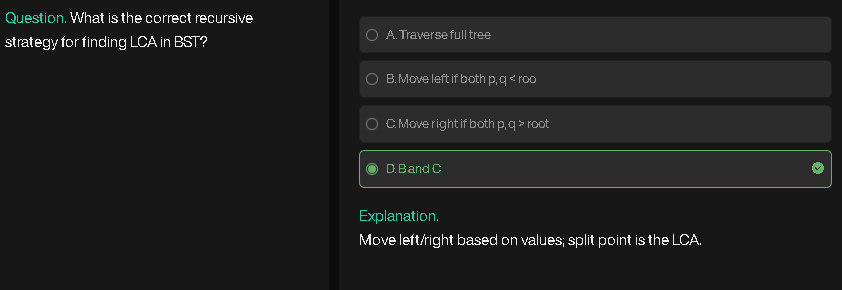

# Binary Search Tree (BST)

## Overview

A **Binary Search Tree (BST)** is a **special type of binary tree** with the following properties:

1. Each node has **at most two children**: left and right.
2. **Left subtree** of a node contains **only nodes with values less than the node's value**.
3. **Right subtree** of a node contains **only nodes with values greater than the node's value**.
4. Both left and right subtrees are **themselves BSTs**.

---

## Key Features

* **Efficient search:** Because of the ordering, you can quickly find elements in **O(log n)** time on average.
* **Inorder traversal:** Produces the node values in **sorted order**.
* **Duplicates:** Usually not allowed, or stored in a consistent rule (e.g., duplicates go to the right).

---

## Example

```
        8
       / \
      3   10
     / \    \
    1   6    14
       / \   /
      4   7 13
```

* Left subtree of 8 → all < 8
* Right subtree of 8 → all > 8
* Inorder traversal → `[1,3,4,6,7,8,10,13,14]` (sorted)

---

## Operations

1. **Search:**

   * Start at root.
   * If value < root → go left
   * If value > root → go right
   * Repeat until found or null

2. **Insertion:**

   * Same as search → find the correct null position → insert node

3. **Deletion:**

   * Three cases:

     * Node is leaf → remove directly
     * Node has one child → replace node with child
     * Node has two children → replace node with **inorder successor** or **predecessor**, then delete successor/predecessor

---

## Time Complexity

| Operation | Average Case | Worst Case |
| --------- | ------------ | ---------- |
| Search    | O(log n)     | O(n)       |
| Insert    | O(log n)     | O(n)       |
| Delete    | O(log n)     | O(n)       |

* Worst case occurs when BST becomes **skewed** (like a linked list).

---

## Summary

* BST is **ordered**, which makes **search, insert, and delete efficient**.
* Inorder traversal of BST → **sorted sequence**.
* Not all binary trees are BSTs; BST is a **special structured binary tree**.

---

# Insertion in a Binary Search Tree (BST)

## Overview

Insertion in a BST means **adding a new node** while maintaining the BST property:

* Left subtree nodes < parent node
* Right subtree nodes > parent node

---

## Approach

1. **Start at root**.
2. **Compare value to insert with current node**:

   * If value < current node → move to left child
   * If value > current node → move to right child
3. **Repeat** until a null position is found.
4. **Insert new node** at that position.

---

## Algorithm

1. If root is `null` → create a new node and return it.
2. If `value < root.val` → `root.left = insert(root.left, value)`
3. Else → `root.right = insert(root.right, value)`
4. Return root

---

## Pseudocode

```
FUNCTION insert(root, value):
    IF root == NULL:
        CREATE new node with value
        RETURN node

    IF value < root.val:
        root.left = insert(root.left, value)
    ELSE:
        root.right = insert(root.right, value)

    RETURN root
```

**Commentary:**

* Recursion ensures we reach the **correct leaf position** for insertion.
* Time Complexity: **O(h)** where `h` is tree height.

  * Average: O(log n)
  * Worst case (skewed tree): O(n)

---

## Dry Run Example

Insert sequence: `[8, 3, 10, 1, 6, 14, 4]`

1. Insert 8 → root is null → 8 becomes root
2. Insert 3 → 3 < 8 → go left → insert as left child of 8
3. Insert 10 → 10 > 8 → go right → insert as right child of 8
4. Insert 1 → 1 < 8 → go left to 3 → 1 < 3 → insert left of 3
5. Insert 6 → 6 < 8 → left to 3 → 6 > 3 → insert right of 3
6. Insert 14 → 14 > 8 → right to 10 → 14 > 10 → insert right of 10
7. Insert 4 → left to 3 → right to 6 → 4 < 6 → insert left of 6

**BST after insertions:**

```
        8
       / \
      3   10
     / \    \
    1   6    14
       /
      4
```

---

## Code (Recursive)

```javascript
class TreeNode {
    constructor(val) {
        this.val = val;
        this.left = null;
        this.right = null;
    }
}

function insert(root, value) {
    if(root === null) return new TreeNode(value);

    if(value < root.val) {
        root.left = insert(root.left, value);
    } else {
        root.right = insert(root.right, value);
    }

    return root;
}
```

This ensures **BST properties are maintained** after each insertion.

---

# Deletion in a Binary Search Tree (BST)

## Overview

Deleting a node in a BST must **maintain the BST property**:

* Left subtree nodes < parent node
* Right subtree nodes > parent node

There are **three main cases** depending on the node to delete:

---

## Cases

1. **Node is a leaf** (no children)

   * Simply remove the node.

2. **Node has one child**

   * Replace the node with its child.

3. **Node has two children**

   * Replace the node’s value with either:

     * **Inorder successor** (smallest value in right subtree)
     * **Inorder predecessor** (largest value in left subtree)
   * Delete the successor/predecessor node recursively.

---

## Approach

1. Start at root.
2. Search for the node to delete:

   * If `key < root.val` → go left
   * If `key > root.val` → go right
   * Else → node found
3. Handle according to the **three cases above**.
4. Return the modified root.

---

## Algorithm / Pseudocode

```
FUNCTION deleteNode(root, key):
    IF root == NULL:
        RETURN NULL

    IF key < root.val:
        root.left = deleteNode(root.left, key)
    ELSE IF key > root.val:
        root.right = deleteNode(root.right, key)
    ELSE:
        // Node found
        IF root.left == NULL AND root.right == NULL:
            RETURN NULL
        ELSE IF root.left == NULL:
            RETURN root.right
        ELSE IF root.right == NULL:
            RETURN root.left
        ELSE:
            // Node with two children
            successor = findMin(root.right)
            root.val = successor.val
            root.right = deleteNode(root.right, successor.val)

    RETURN root

FUNCTION findMin(node):
    WHILE node.left != NULL:
        node = node.left
    RETURN node
```

**Commentary:**

* `findMin` finds the **inorder successor**.
* After replacing value, the successor node is deleted to prevent duplicates.
* Time Complexity: **O(h)** → average O(log n), worst O(n) for skewed tree.

---

## Dry Run Example

Delete 10 from BST:

```
        8
       / \
      3   10
     / \    \
    1   6    14
       / \
      4   7
```

1. Node 10 found → has one child (14)
2. Replace 10 with 14 → 10 is deleted
3. New BST:

```
        8
       / \
      3   14
     / \
    1   6
       / \
      4   7
```

---

## Code (Recursive)

```javascript
function findMin(node){
    while(node.left !== null) node = node.left;
    return node;
}

function deleteNode(root, key){
    if(root === null) return null;

    if(key < root.val){
        root.left = deleteNode(root.left, key);
    } else if(key > root.val){
        root.right = deleteNode(root.right, key);
    } else {
        // Node found
        if(root.left === null && root.right === null){
            return null;
        } else if(root.left === null){
            return root.right;
        } else if(root.right === null){
            return root.left;
        } else {
            let successor = findMin(root.right);
            root.val = successor.val;
            root.right = deleteNode(root.right, successor.val);
        }
    }
    return root;
}
```

This handles **all three deletion cases** while preserving BST properties.

---

# Search in a Binary Search Tree (BST)

## Overview

Searching in a BST leverages its **ordered property**:

* Left subtree nodes < parent node
* Right subtree nodes > parent node

Because of this ordering, **searching is more efficient** than in a normal binary tree.

---

## Approach

1. Start at **root**.
2. Compare **key** with `root.val`:

   * If key == root.val → node found, return node (or true)
   * If key < root.val → search in **left subtree**
   * If key > root.val → search in **right subtree**
3. Repeat recursively until node is found or **null** is reached.

---

## Algorithm / Pseudocode

```
FUNCTION searchBST(root, key):
    IF root == NULL:
        RETURN false   // not found

    IF key == root.val:
        RETURN true    // found

    ELSE IF key < root.val:
        RETURN searchBST(root.left, key)

    ELSE:
        RETURN searchBST(root.right, key)
```

**Iterative Version:**

```
FUNCTION searchBST(root, key):
    current = root
    WHILE current != NULL:
        IF key == current.val:
            RETURN true
        ELSE IF key < current.val:
            current = current.left
        ELSE:
            current = current.right
    RETURN false
```

---

## Dry Run Example

BST:

```
        8
       / \
      3   10
     / \    \
    1   6    14
       / \
      4   7
```

Search for key = 7:

1. Start at 8 → 7 < 8 → move left to 3
2. 7 > 3 → move right to 6
3. 7 > 6 → move right to 7 → found!

---

## Code (Recursive)

```javascript
function searchBST(root, key){
    if(root === null) return false;
    if(root.val === key) return true;
    if(key < root.val) return searchBST(root.left, key);
    else return searchBST(root.right, key);
}
```

## Code (Iterative)

```javascript
function searchBST(root, key){
    let current = root;
    while(current !== null){
        if(current.val === key) return true;
        else if(key < current.val) current = current.left;
        else current = current.right;
    }
    return false;
}
```

* **Time Complexity:** O(h) → average O(log n), worst case O(n)
* **Space Complexity:** Recursive → O(h), Iterative → O(1)

This efficiently searches for a value in a BST.

---

# Traversal in a Binary Search Tree (BST)

## Overview

BST traversal is similar to any binary tree traversal because a BST is still a binary tree.
Traversals help in **visiting all nodes** systematically. Common types:

1. **Inorder (Left, Root, Right)** → Produces **sorted order** in BST
2. **Preorder (Root, Left, Right)**
3. **Postorder (Left, Right, Root)**
4. **Level-order (BFS)** → Visit level by level

---

## 1. Inorder Traversal

### Approach

* Visit **left subtree**
* Visit **root node**
* Visit **right subtree**

### Property in BST

* Produces **nodes in ascending order**.

### Pseudocode

```
FUNCTION inorder(node):
    IF node == NULL: RETURN
    inorder(node.left)
    PRINT node.val
    inorder(node.right)
```

---

## 2. Preorder Traversal

### Approach

* Visit **root node**
* Visit **left subtree**
* Visit **right subtree**

### Pseudocode

```
FUNCTION preorder(node):
    IF node == NULL: RETURN
    PRINT node.val
    preorder(node.left)
    preorder(node.right)
```

---

## 3. Postorder Traversal

### Approach

* Visit **left subtree**
* Visit **right subtree**
* Visit **root node**

### Pseudocode

```
FUNCTION postorder(node):
    IF node == NULL: RETURN
    postorder(node.left)
    postorder(node.right)
    PRINT node.val
```

---

## 4. Level-order Traversal (BFS)

### Approach

* Use a **queue**
* Start with root in the queue
* While queue is not empty:

  * Pop a node, print value
  * Push **left** child if exists
  * Push **right** child if exists

### Pseudocode

```
FUNCTION levelOrder(root):
    IF root == NULL: RETURN
    QUEUE q
    q.enqueue(root)
    WHILE q is not empty:
        node = q.dequeue()
        PRINT node.val
        IF node.left != NULL: q.enqueue(node.left)
        IF node.right != NULL: q.enqueue(node.right)
```

---

## Dry Run Example

BST:

```
        8
       / \
      3   10
     / \    \
    1   6    14
       / \
      4   7
```

* **Inorder:** 1, 3, 4, 6, 7, 8, 10, 14 (sorted)
* **Preorder:** 8, 3, 1, 6, 4, 7, 10, 14
* **Postorder:** 1, 4, 7, 6, 3, 14, 10, 8
* **Level-order:** 8, 3, 10, 1, 6, 14, 4, 7

---

## Code (Recursive Traversals)

```javascript
function inorder(node){
    if(node === null) return;
    inorder(node.left);
    console.log(node.val);
    inorder(node.right);
}

function preorder(node){
    if(node === null) return;
    console.log(node.val);
    preorder(node.left);
    preorder(node.right);
}

function postorder(node){
    if(node === null) return;
    postorder(node.left);
    postorder(node.right);
    console.log(node.val);
}
```

## Code (Level-order Traversal)

```javascript
function levelOrder(root){
    if(root === null) return;
    let q = [root];
    while(q.length){
        let node = q.shift();
        console.log(node.val);
        if(node.left) q.push(node.left);
        if(node.right) q.push(node.right);
    }
}
```

* **Inorder traversal is most important for BST** as it gives sorted output.
* **Time Complexity:** O(n) for all traversals
* **Space Complexity:**

  * Recursive → O(h)
  * Level-order → O(n) for queue

---

# Complete BST with All Operations

We will construct a **BST class** with **all basic operations**:

1. **Insertion**
2. **Deletion**
3. **Search**
4. **Traversals** (Inorder, Preorder, Postorder, Level-order)
5. **Build Complete BST** (from an array)

---

## Classes Structure

### 1. TreeNode Class

* Each node has: `val`, `left`, `right`

### 2. BST Class

* **Properties:** `root`
* **Operations:**

  1. `insert(val)` → Insert a single node
  2. `delete(val)` → Delete a node
  3. `search(val)` → Search a node
  4. `inorder()`, `preorder()`, `postorder()`, `levelOrder()` → Traversals
  5. `buildCompleteBST(arr)` → Create a height-balanced complete BST from array

---

## Algorithm / Pseudocode

### Insertion

```
FUNCTION insert(node, val):
    IF node == NULL:
        RETURN new TreeNode(val)
    IF val < node.val:
        node.left = insert(node.left, val)
    ELSE:
        node.right = insert(node.right, val)
    RETURN node
```

### Deletion

```
FUNCTION deleteNode(node, val):
    IF node == NULL: RETURN NULL
    IF val < node.val: node.left = deleteNode(node.left, val)
    ELSE IF val > node.val: node.right = deleteNode(node.right, val)
    ELSE:
        // Node found
        IF node.left == NULL: RETURN node.right
        ELSE IF node.right == NULL: RETURN node.left
        ELSE:
            successor = findMin(node.right)
            node.val = successor.val
            node.right = deleteNode(node.right, successor.val)
    RETURN node
```

### Search

```
FUNCTION search(node, val):
    IF node == NULL: RETURN false
    IF val == node.val: RETURN true
    IF val < node.val: RETURN search(node.left, val)
    ELSE: RETURN search(node.right, val)
```

### Traversals

```
Inorder(node): Left, Root, Right
Preorder(node): Root, Left, Right
Postorder(node): Left, Right, Root
LevelOrder(root): BFS using queue
```

### Build Complete BST from Array

```
FUNCTION buildCompleteBST(arr):
    SORT arr
    RETURN build(arr, 0, arr.length-1)

FUNCTION build(arr, start, end):
    IF start > end: RETURN NULL
    mid = (start + end) / 2
    node = new TreeNode(arr[mid])
    node.left = build(arr, start, mid-1)
    node.right = build(arr, mid+1, end)
    RETURN node
```

---

## Dry Run Example

Array for complete BST: `[3,1,4,2,5]`

1. Sort → `[1,2,3,4,5]`
2. Mid element 3 → root
3. Left → `[1,2]` → mid 2 → left subtree
4. Right → `[4,5]` → mid 4 → right subtree

BST:

```
        3
       / \
      2   4
     /     \
    1       5
```

Operations:

* **Insert 6** → goes to right of 5
* **Search 4** → found
* **Delete 2** → node with one child → 1 takes its place
* **Inorder traversal** → `[1,3,4,5,6]`

---

## Complete JavaScript Implementation

```javascript
class TreeNode {
    constructor(val){
        this.val = val;
        this.left = null;
        this.right = null;
    }
}

class BST {
    constructor(){
        this.root = null;
    }

    // Insertion
    insert(val){
        this.root = this.insertHelper(this.root, val);
    }

    insertHelper(node, val){
        if(node === null) return new TreeNode(val);
        if(val < node.val) node.left = this.insertHelper(node.left, val);
        else node.right = this.insertHelper(node.right, val);
        return node;
    }

    // Search
    search(val){
        return this.searchHelper(this.root, val);
    }

    searchHelper(node, val){
        if(node === null) return false;
        if(node.val === val) return true;
        if(val < node.val) return this.searchHelper(node.left, val);
        else return this.searchHelper(node.right, val);
    }

    // Find minimum node
    findMin(node){
        while(node.left !== null) node = node.left;
        return node;
    }

    // Deletion
    delete(val){
        this.root = this.deleteHelper(this.root, val);
    }

    deleteHelper(node, val){
        if(node === null) return null;

        if(val < node.val) node.left = this.deleteHelper(node.left, val);
        else if(val > node.val) node.right = this.deleteHelper(node.right, val);
        else {
            if(node.left === null) return node.right;
            else if(node.right === null) return node.left;
            else {
                let successor = this.findMin(node.right);
                node.val = successor.val;
                node.right = this.deleteHelper(node.right, successor.val);
            }
        }
        return node;
    }

    // Traversals
    inorder(node = this.root){
        if(node === null) return;
        this.inorder(node.left);
        console.log(node.val);
        this.inorder(node.right);
    }

    preorder(node = this.root){
        if(node === null) return;
        console.log(node.val);
        this.preorder(node.left);
        this.preorder(node.right);
    }

    postorder(node = this.root){
        if(node === null) return;
        this.postorder(node.left);
        this.postorder(node.right);
        console.log(node.val);
    }

    levelOrder(){
        if(this.root === null) return;
        let q = [this.root];
        while(q.length){
            let node = q.shift();
            console.log(node.val);
            if(node.left) q.push(node.left);
            if(node.right) q.push(node.right);
        }
    }

    // Build Complete BST
    buildCompleteBST(arr){
        arr.sort((a,b)=>a-b);
        this.root = this.build(arr, 0, arr.length-1);
    }

    build(arr, start, end){
        if(start > end) return null;
        let mid = Math.floor((start + end)/2);
        let node = new TreeNode(arr[mid]);
        node.left = this.build(arr, start, mid-1);
        node.right = this.build(arr, mid+1, end);
        return node;
    }
}
```

---

* **All operations are included**: insert, delete, search, traversals, complete BST building.
* **Traversals** can be used to verify BST structure.
* **Complete BST** is built from an array using middle element recursion.

This is a **full-featured BST class** ready for practical use.

